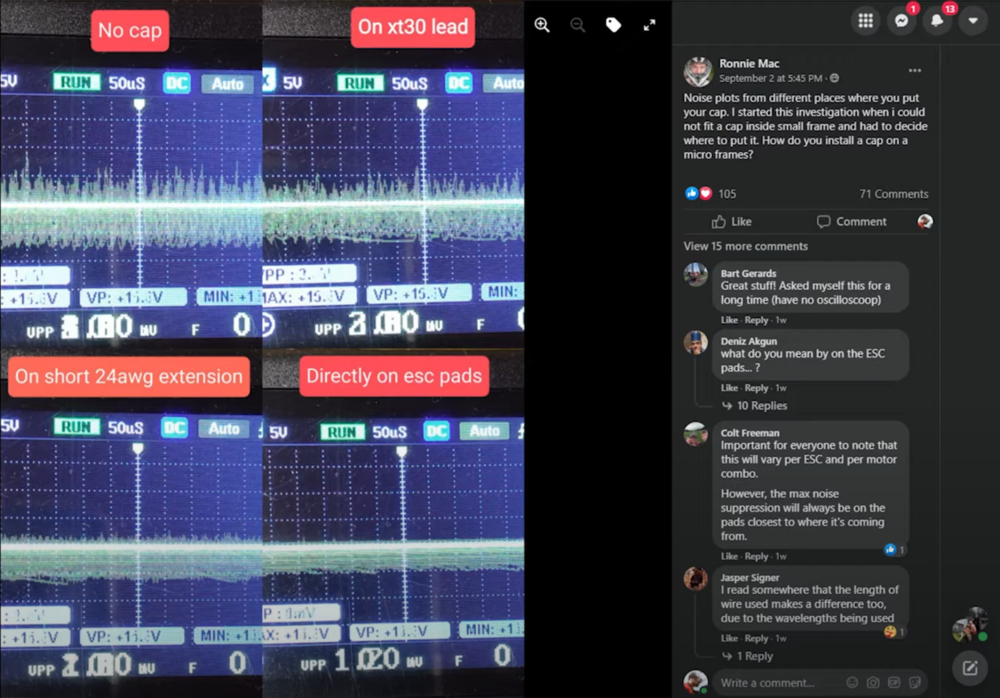

Good sites/channels:

* <https://oscarliang.com/>
* <https://www.youtube.com/@JoshuaBardwell/>
* <https://www.youtube.com/@ChrisRosser>
* <https://www.youtube.com/@Painless360>

---

PX4 Holybro QAV250 + Pixhawk 4 Mini Build: <https://docs.px4.io/main/en/frames_multicopter/holybro_qav250_pixhawk4_mini.html>

Oscar Liang review of the Kakute H7 V2 and Tekko32 F4 Metal 50A 4in1 ESC: <https://oscarliang.com/holybro-kakute-h7-bt-fc-tekko32-f4-50a-65a-esc/>  
Includes notes on using the built-in Bluetooth with Speedybee smartphone app. And notes on using the SD card for blackbox recording.

Great "building a freestyle FPV drone" playlist from Joshua Bardwell: <https://www.youtube.com/playlist?list=PLwoDb7WF6c8neIAQBkchfiXf-C8KbzG5M>

A full 2 hours of Mr. Steele doing a build: <https://www.youtube.com/watch?v=17RaCAcFh4A>

See, at 1h 56m where he shows how he ties down the battery _and_ the battery lead with 250mm and 230mm straps.

---

Briefer "perfect" build video from Chris Rosser: <https://www.youtube.com/watch?v=TRsxdoK7dQ8>

Note: he uses a TVS diode in combination with a capacitor but the consensus seems to be it adds nothing: <https://www.youtube.com/watch?v=IOVsnoSR-Qw>

He does shield his gyro etc. from electrical noise - see 4m 10s mark.

Isolation board: <https://www.getfpv.com/diatone-mamba-interference-isolation-board-v2-2-pcs.html>  
Important: the board itself has to be grounded, i.e. attach it to a ground pin on the ESC.

Also interesting Mu-metal:

* Painless360 - RC Quick Tips: What is MuMetal? - <https://www.youtube.com/watch?v=bOf6zfDSO6E>
* Wikipedia - <https://en.wikipedia.org/wiki/Mu-metal>

However, this discussion seems to suggest Mu-metal itself can cause issues - <https://diydrones.com/profiles/blogs/mumetal-testing> but author says 20mm separation is enough to avoid the issue of the Mu-metals own magnetic field (actually, it's unclear what he's saying - maybe a few mm is enough).

Painless360 says to buy it on eBay, avoid the foil and buy sheets that are at least 0.5mm thick.

---

At the 7m 13s mark, Drone Mesh says newer FCs have dropped back to the MPU6000 because it doesn't make sense to use the higher sensitivity ICM gyros as Betaflight has capped the update frequency at 8kHz: <https://youtu.be/OlsFnWkb_0M?t=433>

This _seems_ to be at odd at odd with the IMU section of Betaflight design guidelines where they mention ICM gyros but don't mention them being pointless: <https://betaflight.com/docs/manufacturer/manufacturer-design-guidelines>

---

Walksnail is Painless360's favorite digital system (but he says he's not looking for super low-latency). And it's the only system with goggles in the sub-US$600 category.

GetFPV: <https://www.getfpv.com/walksnail-avatar-hd-kit-v2-8gb-no-gyro.html>
GetFPV (with gyro): <https://www.getfpv.com/walksnail-avatar-hd-kit-v2-32gb-w-gyro.html>

Walksnail release two new cameras - the v2 and the pro, for a comparison, see <https://oscarliang.com/walksnail-avatar-hd-pro-v2-kit/> - basically the pro are better at night and v2 better if you don't paan on flying at night.

The v2 come with and without gyro - the gyro is only important is you want to stablize captured video later with <https://gyroflow.xyz/>

Fat shark Recon HD: <https://www.getfpv.com/fat-shark-recon-hd-fpv-goggles.html>
Unfortunately they've no option for diopter insets but Joshua Bardwell points out you may be in luck if you're short sighted - try removing the lens they have to make the screens feel closer.
He also runs them at 700mW - he says many goggles start performing poorly if you set them to their max - 1W in this case.

See, [`recon-hd-nose-piece.png`](recon-hd-nose-piece.png) for how to attach nose piece (screenshot taken from this [video](https://www.youtube.com/watch?v=94wQDKCCVI8) by KremerFPV).

**Note:** both new cameras have a 4:3 image sensor instead of 16:9 as in the previous version. If you use 16:9 in the goggles (currently the default settings), you will get less field of view, so make sure to set it to 4:3.

Painless360 has a setup video for googles and recevier (including wiring to FC) <https://www.youtube.com/watch?v=ATLZLxGSSJg> - basic points:

* Update firmware on both.
* Binding can take between 1 and 5 minutes.
* Keep the RX cool with a fan during these 5 minutes (and whenever it's not being cooled by flight airflow).
* Make sure to select right aspect ratio in Betaflight (I guess this is so OSD doesn't assum 4:3).
* Configure in the googles whether you're using Betaflight or ArduPilot.
* Greyed out bits in the goggle UI mean you have to have the camera on for these.

**Important:** he adds an additional connector between VTX board and the power it's getting from the FC so, it can be plugged in just before takeoff rather than overheating while you e.g. wait for GPS lock.
Hmm... actually, those tiny two pin connectors are so fiddly, I think you'd end up ripping out the wires eventually plugging one in and out.
And in Oscar Liang's more comprehensive guide, he seems to imply its unnecessary as the VTX will stay in standby more (25mW) until the FC is armed.
So, maybe only relevant for planes and setups with an FC. If you really want a switch then use one controlled via TX and FC:

* TinyLED RealPit HD: <https://tinysleds.com/products/realpit-hd-vtx-power-switch>
* Xilo Pit Pal: <https://www.getfpv.com/xilo-pit-pal-vtx-power-switch.html> (note: unlike the RealPit HD, this may not be suitable for HD systems pulling more than 1A).

Note: the Kakute H7 V2 feature a pit switch pin - see:

* <https://holybro.com/collections/autopilot-flight-controllers/products/kakute-h7-v2>
* <https://docs.holybro.com/fpv-flight-controller/kakute-h7-v2/pinout>

Oscar's Avatar setup page: <https://oscarliang.com/setup-avatar-fpv-system/>
He repeats Painless360's 700mA suggestion.

Oscar Liang's page on the Walksnail Avatar system: <https://oscarliang.com/walksnail-avatar-digital-fpv-system>

Note: Walksnail is from Caddx.

Do I also need an antenna: <https://www.getfpv.com/fpv/antennas/walksnail-avatar-vtx-antenna-v2.html>

For more expensive googles, you can get opthalmic insets (made by German company RHO-Lens who ship worldwide) for ~EUR70: <https://www.rho-lens.com/>

This glasses expert - <https://www.youtube.com/watch?v=1yaEAVwtpxs> - says adjusting IPD on googles that have it is actually really hard to do right and even then this doesn't address issues like astigmatism.

**Note:** see the details they need for e.g. their FPL-v2 lenses (used with most Fatshark googles): <https://www.rho-lens.com/product/fpl-v2/> - they need your _distance_ vision values. I'd have assumed the opposite.

So, maybe cheap rimless glass with light wire or plastic arms might be an option for googles that can't take these insets?
Something like these tactical glasses: <https://swisseye-tactical.com/en/products/all-products/tactical-glasses/lancer/>

Note: the Recon's don't have HDMI in so, unfortunately, can't be used with a simulator. It seems fairly random which goggles have HDMI input and which don't e.g. many analog ones have it (e.g. Skyzone Cobra X) while expensive digital ones may or may not (e.g. Walksnail Avatar Digital HD don't while _some_ members of the Fatshark Dominator range do).

---

Best analog goggles: <https://www.getfpv.com/fpv/video-goggles/skyzone-cobra-x-v2-5-8ghz-fpv-goggles-w-steadyview-receiver.html>

---

Why do competitive pilots want 120fps on digital systems when everyone was happy with 30fps for analog systems?

It turns out it's not about fps but about latency - with analog theres basically no processing, the pixels are reads from the camera sensor pumped out through analog circuitry on the VTX, over the air and the reverse happens on the other side.

With digital there's lots of processing (h2.65 for Walksnail) and this increases latency. If you reduce the image size, from 1020p to 720p, you've got less to process so less delay and can pump over more images in the same time, and so you go from 60fps to 120fps. But essentially the higher fps is just a side effect of what you really want - reducing the time between the image data being captured and it being displayed in your goggles, i.e. it's all about reducing latency.

Note: HDZero's selling point is no compression and so far less latency - presumably this comes at the cost of inferior image quality. See <https://oscarliang.com/fpv-system/>

---

For a cheaper alternative to a GoPro: <https://oscarliang.com/caddx-walnut/>

---

Adafruit gyro comparison: <https://learn.adafruit.com/adafruit-sensorlab-gyroscope-calibration/comparing-gyroscopes>

The LSM6DSOX seems to be their modern IMU of choice for everyday use (they also have a more expensive version called the ISM330DHC).

And they have the MPU-6050 which they describe as an "an oldie but goodie": <https://www.adafruit.com/product/3886>

---

**Update:** why not to buy the DYS Samguk in 2023 - conversation between ItsBlunty and Joshua Bardwell at 25m 31s mark  <https://youtu.be/ZZOXVKH7NHA?t=1531>:

> JB: First of all the king of $14 motors that you should totally buy is the Emax Eco II - excellent budget motors, well proven
> we've recommended them many times and they come right in at that $14/15 price point for this size of motor but the
> main reason that I personally would stay away from Flash Hobby, no offense Flash Hobby, is that they come out of DYS
> and ... when DYS Samguk motors sold for $8, they were worth buying because like one out of every five or six would just be worthless but for
> $8 a motor you just buy eight of them and hope you get four or five good ones
> and then once, I don't know the actual history here, DYS went out of business and then...
>
> IB: Flash Hobby  bought the rights to DYS motors to produce DYS's motors. DYS went bankrupt, filed bankruptcy.
>
> JB: ... Why would they why would they do that though because ... the Samguk motors at least were not very good. Did DYS make any good motors.
>
> IB: I mean if you don't know how to make motors and you want to use something that you know has been produced and people have used it in the past, yeah I'm
> gonna assume you just buy the bankrupt company's motor designs and use them, right. I can't imagine they're very expensive
>
> IB: Did they buy their employees to let them know how to run the machines and... I don't know, I just I feel like the whole sort of
> brand is a little bit tainted. Again Samguk were okay for $8 but at the $14 price point Emax
> Eco are so freaking solid and there are a few other solid options.

2300kv DYS Samguk Wei 2207: <https://www.getfpv.com/motors/mini-quad-motors/dys-samguk-series-wei-2207-2300kv-motor.html>

Apparently, DYS are now branding their products Flash Hobby in the cheapest worth having section of <https://oscarliang.com/best-motors-props> 

He suggests:

* 2450kv Flash Hobby Sun fun 2207: <https://www.getfpv.com/dys-sunfun-2207-motor.html>
* 2400kv EMAX ECO II Series 2207: <https://www.getfpv.com/emax-eco-ii-series-2207-motor-1700kv-1900kv-2400kv.html>

Note: 2306 and 2207 are essentially the same: <https://oscarliang.com/2306-2207-mini-quad-motor/>

**So**: the ECOs it is.

---

Holybro SiK radios: <https://holybro.com/products/sik-telemetry-radio-v3>

Note: I don't know why but for whatever reason 433MHz and 915MHz antennas are only available with a bulky plastic shell around the antenna (unlike the antenna used for TXs and VTXs). To confirm, just try searching the DigiKey [RF antenna category](https://www.digikey.com/en/products/filter/rf-antennas/875) for 433MHz and 915MHz antennas with any SMA or RP-SMA connector type.

---

The 10-pin GPS connectors are 10-pin JST GH connectors, I'd like to have found a correspond cabled female connector for break out but didn't - looks like you'll have to cut off the connector.

GPS: <https://holybro.com/collections/gps/products/m8n-gps>

For the voltages of the individual pins see: <https://github.com/pixhawk/Pixhawk-Standards/blob/master/DS-009%20Pixhawk%20Connector%20Standard.pdf>

But which variant - does one have a buzzer, look at corresponding Pixhawk port, what does the other variant gain by being connected to I2C?

Or the M9N: <https://holybro.com/collections/gps/products/m9n-gps>

M9N from Banggood: <https://www.banggood.com/Holybro-M9N-GPS-Module-for-Pixhawk-or-Pix32-or-F3-F4-F7-Flight-Controller-w-or-GHR1_25mm-10Pin-or-6Pin-or-Molex1_25mm-Plug-for-RC-Drone-Multirotor-Multicopter-p-1910090.html>

The m9 increases the number of GNSS constellations that can be tracked at any given time from three to four.

For what this means in practice, see here: <https://www.u-blox.com/en/blogs/tech/gps-accuracy-four-gnss-constellations>

A corresponding suitable female cable, to make it easier to break out the pins, would be nice.

An interesting alternative (unlike many smaller GPSs, it does also have a compass): <https://www.getfpv.com/mateksys-m10-5883-gnss-compass.html>

The m10 isn't the next gen beyound the m9, it's more like the m9's low-power sibling but low-power comes with some constraints, e.g unlike the m9, it's firmware is _apparently_ in ROM so, it can't be updated.

Considering, I've never seen consumer firmware updates for a GPS, I don't think the ROM aspect of things is an issue. Even Adafruit have said that firmware updates for their Ultimate GPS board are a non-endure thing.

Interestingly, JB shows how you can interact with an M10 GPS using Betaflight passthru: <https://www.youtube.com/watch?v=5fBDqeAoqvI&t=98s>

This does just seem to be about downloading Almanac data so you don't have a super slow first start.

The video also points out that Betaflight by default auto-configures your GPS for best performance - see <https://betaflight.com/docs/development/Gps#gps-auto-configuration> (but as of late May, 2023, it only supports m8n but they're working on m10).

M10 issue: <https://github.com/betaflight/betaflight/pull/12799> - it looks like this will land in BF 4.5 - some of the PR review comments are quite heated!

In the meantime, see JB's video above (the "passthru" one).

Also, I was wondering what the small battery was that you can see on the underside of the Matek GPS (see here <http://www.mateksys.com/?portfolio=m10-5883>).

It's about maintaining time and other GPS relevant data so that after the first start, it should start much quicker.

Note: GPS apparently isn't great for determining height so, without input from a barometer, the GPS on its own won't make a great job of this. Many small FCs don't have a barometer, the Kakute H7 v2 does.

Note: mount your GPS _flat_ - find reference for this but definitely saw that it's bad to mount at an angle (probably Painless360).

See here for m8 vs m9 vs m10: <https://www.u-blox.com/en/technologies/standard-precision-positioning>

Find if there's a neopixel and compass on the the GPS I2C bus by scanning the bus for addresses: <https://learn.adafruit.com/scanning-i2c-addresses?view=all>

---

Silicone o-rings and standoffs for M2 and M3 from Diatone official store: <https://www.aliexpress.com/item/4001264267019.html>

---

XT60 pigtail: <https://www.getfpv.com/xt60-lipo-pigtail-12awg-5pcs.html>

See parts used in the PX4 reference build: <https://docs.px4.io/main/en/frames_multicopter/holybro_qav250_pixhawk4_mini.html>

Amass are the patent holders for the XT60, the XT60H is the nice new variant with a protective cap over the solder joints.

TME and Premium-Modellbau seem to have the genuine article:

* <https://www.tme.eu/ch/details/xt60h-f/dc-steckverbinder/amass/>
* <https://www.premium-modellbau.de/xt60h-buchse-mit-schutzkappe>

---

Battery choice (see decision process below): <https://www.gensace.de/tattu-2200mah-14-8v-75c-4s1p-lipo-battery-pack-with-xt60-long-range-version.html>

Note: you pay a lot for the 75C rating on this battery, the 20C version is almost half the price. From googling, 20C is considered far too low.

QAV250 kit page says: "Recommended Battery Specification: 4S 2200~3000mAh Lipo" but PX4 build uses a much smaller 4S 1300mAh battery.

You seem to be able to choose between short and fat vs longer and slightly narrower, e.g.:

* 75X34X34mm: <https://www.gensace.de/tattu-2200mah-14-8v-75c-4s1p-lipo-battery-pack-with-xt60-long-range-version.html>
* 76*33*33mm: <https://www.gensace.de/gens-ace-soaring-mini-2200mah-14-8v-20c-4s1p-lipo-battery-pack-with-xt60-plug.html>

* 107*35*27mm: <https://www.gensace.de/gens-ace-soaring-2200mah-14-8v-30c-4s1p-lipo-battery-pack-with-xt60-plug-2250.html>
* 105X33X28mm: <https://www.gensace.de/tattu-2300mah-14-8v-75c-4s1p-lipo-battery-pack-with-xt60.html>

The PX4 build uses a short fat battery rather than a longer. And from the build picture, long looks like it would be a bad choice.

So, my choice above is the fat-short model at the lower end of Holybro's suggested range but much higher than the PX4 build.

For reference the main part of the battery pad on the Lumenier QAV-R 2 is 90mm long and in total its 105mm long so, it certainly _could_ take the longer format batteries.

In the most watched QAV-R 2 build video, he uses a 75mm long battery, see [here](https://www.youtube.com/watch?v=OcpguW2v5es&t=2743s) at the 45m 43s mark - they're [Lumenier N2O Extreme 1350mAh 4s 150c](https://www.getfpv.com/lumenier-n2o-extreme-1350mah-4s-150c-lipo-battery.html) batteries.

Note: the highest mAh 4S battery from Gens Ace / Tattu is 2300mAh (and its a long format battery). You have to go to 6S for 2500mAh or 2800mAh and they're seriously large. The 3000mAh batteries are seriously expensive and don't come in XT60 variants.

Note: there seems to be a gradually switch from 4S to 6S - for some explanation, see: <https://www.getfpv.com/learn/fpv-essentials/making-the-move-from-4s-to-6s/>

I like the idea that voltage sag is less noticeably towards the end of the flight.

Look at Tattu, the highest mAh 6S (before the prices get crazy) is 1550mAh: <https://www.gensace.de/tattu-r-line-version-4-0-1550mah-22-2v-130c-6s1p-lipo-battery-pack-with-xt60-plug.html>

Hmm... given the higher voltage, how does a 6S 1550mAh compare to a 2200mAh 4S?

Answer: each cell is 3.7V so, a 6S is 22.2V and a 4S is 14.8, so a 1550mAh 6S = 1.55 * 22.2 = 34.41Wh. And 34.41Wh / 14.8V = 2.325Ah, i.e. a 2325mAh 4S battery.

And if you compare it with a similar 4S, the price is much the same: <https://www.gensace.de/tattu-r-line-version-3-0-2000mah-14-8v-120c-4s1p-lipo-battery-pack-with-xt60-plug-2235.html>

But these Tattu batteries are R-line which is noticeably more expensive than their non-R-line batteries.

They do have non-R-line 6S batteries but they only seem to come in long (116X34X29mm) format: <https://www.gensace.de/gens-ace-1450mah-22-2v-45c-6s1p-lipo-battery-pack-2276.html>

Note: there seem to be a confusing number of brands from the one company: Fun Fly, Gens Ace, Tattu, R-Line.

As the GetFPV page explains, if you move from 4S to 6S, you have to change the motors - all other components stay the same.

E.g. 1700KV for 6S vs 2400KV for 4S.

Update: actually, it seems you can "scale" 4S motors for use with 6S batteries - see <https://www.youtube.com/shorts/7hReUs7IF2Q>

---

For free-style and racing, the 2200mAh battery above would be beyond the upper end of the typically used capacities (and has a somewhat lower C-rating than commonly used while still being well above what's needed for all but the most aggressive flying).

Around 1500mAh is the typical upper end:

* Tattu R-Line Version 4.0 1550mAh 130C 4S1P - <https://www.gensace.de/tattu-r-line-version-4-0-1550mah-14-8v-130c-4s1p-lipo-battery-pack-with-xt60-plug.html>

In North America, the Tattus should be available but it may be easier to go for something like:

* RDQ Series 4S 1500mAh 100C - <https://www.racedayquads.com/products/rdq-series-14-8v-4s-1500mah-100c-lipo-battery-xt60> - Oscar Liang rates these as the best mid-range brand while describing the Tattu R-Line as premium.
* Lumenier 1500mAh 4s 95c - <https://www.getfpv.com/batteries/mini-quad-batteries/lumenier-1500mah-4s-95c-lipo-battery-xt60.html>

Oscar Liang lists various reliable brands [here](https://oscarliang.com/lipo-battery-guide/#Choosing-the-Right-LiPo-Battery), including Tattu, RDQ and Lumenier. However, none of them, besides Tattu, is widly available outside North America.

Note: Tattu produce various ranges of batteries, the R-Line is their premium range while Funfly is their budget range and the Tattu 75C range in-between.

---

Holybro QAV250 frame kit: <https://holybro.com/products/qav250-kit?variant=41576363786429>
Kakute H7 V2: <https://holybro.com/collections/fpv-electronics/products/kakute-h7-v2>
Tekko32 F4 4in1 50A ESC: <https://holybro.com/collections/autopilot-peripherals/products/tekko32-f4-4in1-50a-esc>

From Premium Modellbau: <https://www.premium-modellbau.de/holybro-qav250-fpv-quadcopter-rahmen>

Stacks: <https://holybro.com/collections/fpv-stack/products/kakute-h7-v2-stacks>

Note: a 250mm drone is a 6" drone according to Oscar Liang's table: <https://oscarliang.com/fpv-drone-frames/>

The propellers and motors are here: <https://holybro.com/collections/multicopter-kit/products/spare-parts-qav250-kit>

The propellers are Dalprop T5040C:

* <http://www.dalprop.com/T5040C-Pro-g-85.html> - zero useful information.
* Sole distributor is Foxeer: <https://www.foxeer.com/dalprop-cyclone-t5040c-pro-freestyle-props-10-pairs-g-247> (has proper specs).

Aliexpress: <https://www.aliexpress.com/item/1005002382236030.html>

Oscar Liang actually recommends them (for durability): <https://oscarliang.com/propellers/> (tho' at one point he says T5040C and at another T5045C0.

But recommends others for racing and smooth flying. For smooth flying he recommends HQProp 5.1X2.5X3:

* <https://www.hqprop.com/hqprop-51x25x3-grey-2cw2ccw-poly-carbonate-p0285.html>
* <https://www.getfpv.com/hqprop-5-1x2-5x3-3-blade-propeller-set-of-4.html>
* <https://www.aliexpress.com/item/1005002459551321.html>
* <https://www.aliexpress.com/item/1005002459606176.html>

Chris Rossler (after testing 40 5" propellers from all the major manufacturers) chose the HQProp 5.1X2.5X3 - see 12m 34s marks: <https://youtu.be/7QFDeFxe2aw?t=754>

So, I'm choosing this.

**Update:** as a video - https://www.youtube.com/watch?v=RSaPPGa626c - recommended brightly color props (the opposite of the grey HQProp 5.1X2.5X3) for initial LoS practice, I also ordered:

* Gemfan 51466 V2 (mixed colors): <https://www.aliexpress.com/item/32990552395.html> (also recommended by Rossler).
* DALPROP CYCLONE T5045C PRO (mixed colors): <https://www.aliexpress.com/item/32841991315.html> (recommended by OL as "robust").

Actually, it seems to be Dalprop propellers that come with the kit but the replacement part Holybro sell is, oddly, Gemfan Hurricane 51499-3: <https://www.gemfanhobby.com/show.aspx?id=180&cid=47>

For Gemfan propellers on AliExpress, see:

* <https://feiyingrc.ar.aliexpress.com/store/group/Gemfan/3623124_512803113.html>
* <https://www.aliexpress.com/store/group/GEMFAN/912458300_40000002055544.html>

And JB recommends these: <https://www.fpvknowitall.com/fpv-shopping-list-five-inch-freestyle/#props>

So, basically, all these propellers (i.e. Dalprop, HQProp and Gemfan) are all good.

<https://www.premium-modellbau.de/holybro-qav250-propeller-ersatzpropeller-t5040-2-paar>

For propellars etc. look at recommended parts for frames down below. See if there's a clearer list of parts for the Holybro QAV250 kits.

---

Note: Diatone and iFlight also produce H7 FCs that can be uses with ArduPilot but they seem either less readily available or have serious issues (e.g. one of the iFlight FCs can't use a compass).

See: <https://ardupilot.org/copter/docs/common-autopilots.html>

---

IMPORTANT: the 45A 4in1 is described as "mini" so, even if it's not needed the 50A or 65A one would be much easier to solder. Maybe the QAV250 ARF motors and individual ESCs are the way to go.

The ESCs in the QAV250 ARF kit are 20A.

It's not clear to me if 4in1 ESCs "are rated on a per motor basis. So a 30amp esc means 30amp per motor."

This Reddit poster claims this is so: <https://www.reddit.com/r/Multicopter/comments/ezfft5/comment/fgna6sq/?utm_source=share&utm_medium=web3x>

And I suspect it must be as otherwise it would seem most 4in1 ESCs handle very low ampage compared to individual ESCs, e.g. Holybro's has 4in1s rated for 15A, 45A, 50A and 65A. So, none would be equivalent to four of the basic Holybro 20A ESCs if they weren't rated as described above.

Holybro ESC page: <https://holybro.com/collections/autopilot-peripherals/ESC>

**Update:** looking at the Holybro specs seems to confirm that the rating is per motor - the specs show e.g. 50Ax4. And Oscar Liang's page on ESCs - <https://oscarliang.com/esc/> - says a 50A 4in1 can deliver 200A.

The 65A Tekko32 4in1 is his choice for best 4in1 but his review says its overkill for most people so, perhaps the 50A version makes more sense.

Oscar Liang - "Why Capacitors Are Important": <https://oscarliang.com/capacitors-mini-quad/>

There he says:

> If you don’t have space, you can shorten the legs of the cap, then solder some flexible silicone wires for extension and place the cap somewhere else inside the frame. But make sure to keep the wires as short as possible to minimize resistance, and use larger wires (e.g. for 6S 5″ 20AWG or even 18AWG is a good choice).

If you look at the discussion, the issue seems to be that the capacitors legs are fairly poor conductors, so keep them short and if you must extend then extend with a conductor, i.e. a low AWG wire.

JB with actual data on how mounting affect effectiveness of capacitor: <https://www.youtube.com/watch?v=kdPfiZ37nKs>

Unfortunately, Ronnie Mac seems to no longer be a member of the group and I can't find the conversation there anymore.

Team BlackSheep LOUNGE: <https://www.facebook.com/groups/BlackSheepLOUNGE/media>

Screen captures from video showing noise by location of cap: 

TLDR; mount directly to the ESC pads if possible.

---

OL's capacitors page says a 35V 1000uF capacitor will cover 4S 5"/6"/7" builds.

This is almost certainly the Panasonic cap sold by GetFPV - it's also FC series and 25x12.5mm:

* FC-A 35V 1000uF - EEUFC1V102 - <https://www.reichelt.com/ch/de/elko-radial-1000-f-35-v-105-c-low-esr-12-5-x-25-mm-rm-5-rad-fc-1-000-35-p84697.html>

You can get an even lower impedence version with the same form factor (but 1/3 more expensive):

* FM-A 35V 1000uF - EEUFM1V102 - <https://www.reichelt.com/ch/de/elko-radial-1000-f-35-v-105-c-low-esr-12-5-x-25-mm-rm-5-fm-a-1-0m-35-p200072.html>

And you can get a miniturized version - 16x15mm:

* FK-A 35V 1000uF - EEUFK1V102S - <https://www.reichelt.com/ch/de/elko-radial-1-0-mf-35-v-105-c-low-esr-aec-q200-fk-a-1-0m-35b-p200001.html>

However, it's not clear (to me) from the EEUFK1V102S datasheet if the lead spacing is 5mm (as recommended by OL).

---

XT60 pigtail with capacitor attached to XT60: <https://www.getfpv.com/black-xt60-lipo-pigtail-w-35v-1000uf-capacitor-12awg-3pcs.html>

This looks like it's save a lot of hassle, i.e. soldering two things to the same pads on the ESC.

However, OL wasn't too impressed by an similar product for Lantian <https://oscarliang.com/lantian-xt60-pigtail-capacitor-3d-holder/>

As he says:

> For maximum effectiveness though, you should soldering the capacitor(s) as close to the source of noise as possible (in which case, the ESC and motors). So having the cap this far away from the ESC’s, it’s going to take some of the effectiveness away.

And the data (see elsewhere on page) seems to back him up.

Note: unlike the Lantian version, the Lumenier version probably has caps from a good brand like Panasonic.

---

USB power adapters capable of 9V:

* 28W - <https://www.reichelt.com/ch/de/usb-ladegeraet-5-12-v-3-a-qc-3-0-28-w-schwarz-goobay-44960-p288920.html>
* 45W - <https://www.reichelt.com/ch/de/usb-pd-ladegeraet-5-20-v-3-a-45-w-usb-c-schwarz-goobay-61742-p341670.html>

Note: the 28W is actually 10W on one USB-A connector and 18W of the USB-C one - so it can handle 2A at 9V, i.e. 18W.

I bought the 28W one and compared to a normal adapter, it's fairly chunky - as I'd expect for something that can support more than the 18W typical for phone chargers.

The 45W one only provides 45W when using 20V, at 9V it can handle 3A, i.e. 27W. The dimensions are actually substantially smaller than for the 28W one which seems surprising (even if it uses GaN - which isn't mentioned in its specs) so, I'd be a little worried about trying to pull 45W from such a small device over a long period.

---

Important: ExpressLRS has a different default channel to ArduPilot's default, see how to address this and other ArduPilot setup issues here: <https://www.expresslrs.org/quick-start/ardupilot-setup/>

Oscar Liange ExpressLRS setup page (both RX and TX): <https://oscarliang.com/setup-expresslrs-2-4ghz>

Joshua Bardwell's:

* ExpressLRS getting started guide (RX and TX as well) - very good: <https://www.youtube.com/watch?v=J3Hg2f7RL1A>
* ExpressLRS setup shot take: <https://www.youtube.com/watch?v=MFFUsN9ZHSU>
* ExpressLRS model match: <https://www.youtube.com/watch?v=3S6eUWCqvUY>

Good list of pretty much every ExpressLRS TX and module: <http://www.multirotorguide.com/news/list-of-expresslrs-hardware-transmitters-and-receivers/>

Mateksys ELRS receiver: <https://www.aliexpress.com/item/1005005223532107.html>
GetFPV: <https://www.getfpv.com/radios/receivers/mateksys-expresslrs-2-4ghz-receiver-elrs-r24-d.html>

Note: this is the Mateksys Aliexpress store listed on the Mateksys site: <http://www.mateksys.com/?page_id=1212#tab-id-6>

**Important:** are there US and EU variants of the Mateksys RX?

Note: there is an issue with temperature variation and ExpressLRS RXs - see: <https://www.expresslrs.org/hardware/crystal-frequency-error/> (particularly the graph comparing many different RX models).

The Mateksys shows as _OKish_.

An RX that uses the TCXO oscillator (and the ESP32 rather than the ESP8285 uses by the Mateksys and most other RXs): <https://betafpv.com/products/superd-elrs-2-4g-diversity-receiver>

But maybe switch these U.FL 2.4GHz antennas:

* Radiomaster 15cm - <https://www.getfpv.com/radios/radio-antennas/radiomaster-receiver-antenna-4-pcs-r84-r86-r86c-r88-r161.html>
* radiomaster 6cm: <https://www.getfpv.com/radios/radio-antennas/radiomaster-receiver-antenna-4-pcs-r81.html>
* TBS 15cm with sleeve (see below about sleeves): <https://www.getfpv.com/radios/radio-antennas/tbs-tracer-sleeve-dipole-rx-antenna-2pcs.html>

I'm inclined towards the TBS one or one of the FrSKY ones below.

Or one with a ceramic receiver: <https://www.radiomasterrc.com/collections/elrs-receivers/products/rp2-expresslrs-2-4ghz-nano-receiver>

TODO: ask the following on <https://github.com/ExpressLRS/ExpressLRS/discussions>:

> Can one see from [`targets`](https://github.com/ExpressLRS/ExpressLRS/tree/master/src/targets) if an RX has TCXO or uses the ESP32 vs 8285.
>
> Or you have to look at the specs page, look at the photos for oscillator.
>
> There aren't zillions of RXes out there - so, I guess someone probably has a good idea of which ones have TCXO oscillators.

Best comparison of different antenna types for ExpressLRS: <https://www.youtube.com/watch?v=Ymiemv_XG4s>
Basically, it looks like a small 62mm antenna should be fine and he also points out that diversity is pointless if both antennas are pointing the same direction, so try for a 90&deg; angle between them
And follow-up showing true diversity is even (slightly) better - <https://www.youtube.com/post/Ugkx6d1z6Ii0bLVrIHCxSZZDzsJNMXkVMqfl>

GetFPV shows a really neat mounting idea for a 90&deg; angle (and shows why you might want a few extra cm to work with): <https://www.getfpv.com/learn/fpv-essentials/fpv-drone-antenna-mounting-guide/>

Oscar Liang also has lots of info: <https://oscarliang.com/antenna-positioning/>

But JB basically goes don't over think it, a fairly simple setup will work well enough (he uses the GetFPV 90&deg; approach and just extends the VTX antenna straight out backwards): <https://www.youtube.com/watch?v=KA2OLTBIjKk>

Note: Painless360 says _definitely_ don't go for a TPU mount that covers the antenna (it's not as RF transparent as you'd think): <https://www.youtube.com/watch?v=9JZJ9X4eYvA>

2.4GHz antenna lengths:

* 1/2 wavelength: 62.5mm
* 1/4 wavelength: 31.25mm

U.fl and IPEX are compatible, they're just brand names

Note: there are smaller MHF4/IPEX4 antennas - that the German Wikipedia pages seems to suggest are a terrible idea - <https://de.wikipedia.org/wiki/U.FL>

FrSKY have these for 2.4GHz with IPEX1:

* 80mm - <https://www.horusrc.com/en/frsky-8cm-ipex1-antenna.html>
* 150mm - <https://www.horusrc.com/en/frsky-150mm-ipex1-antenna.html>

Note: the ones with a fatter bit are what I think are called "sleeved baluns" where a copper tube covers some of the antenna and should improve performance over a basic one like this:

* 148mm - <https://www.horusrc.com/en/frsky-2-4g-receiver-antenna-15cm.html>

Note: FrSKY sell antennas like this with up to 600mm length, I'm assuming most of this isn't the actual antenna but is e.g. for situations where the RX is a long way from where you want the antenna part.

Sparkfun have a nice page about carefully attaching and (more imporant) removing such antenna connectors with breaking them in the process: <https://learn.sparkfun.com/tutorials/three-quick-tips-about-using-ufl/all>

For more than you want to know about the antennas used on drones, see: <https://www.rchelicopterfun.com/rc-antenna.html>

It covers:

* Wavenlengths
* That sleeved is only really important with telemetry, i.e. receive and transmit setups.
* Only the last 31mm needs to be kept straight, you can do what you want with the bendy initial segment.
* Keep diversity antenna at 90&deg; to each other.

---

ELRS variant of RadioMaster TX16S MKII: <https://www.getfpv.com/radiomaster-tx16s-mkii-2-4ghz-16ch-radio-transmitter-elrs-w-hall-gimbals-v4-0.html>  
JB variant: <https://www.getfpv.com/radiomaster-tx16s-mkii-max-radio-transmitter-joshua-bardwell-edition-elrs.html>

Note: the JB version comes with a folding handle.

Folding handle: <https://www.getfpv.com/radiomaster-tx16s-cnc-aluminum-folding-handle.html>

Carrying case: <https://www.getfpv.com/radiomaster-tx16s-radio-transmitter-carrying-case-medium.html> (requires folding handle).

RadioMaster Boxer: <https://www.getfpv.com/radiomaster-boxer-radio-transmitter-4-in-1-multi-protocol-cc2500-elrs-2-ghz.html>  
Oddly the Boxer comes with case and gimbal protectors included while the TX16S MKII doesn't.
Note: it doesn't come with a neck strap - you have to buy that separately - <https://www.radiomasterrc.com/products/radiomaster-deluxe-neck-strap-adjustable-for-transmitter>

Oscar has a good page on setting up your Boxer well: <https://oscarliang.com/radiomaster-boxer/>

Global RadioMaster store: <https://www.radiomasterrc.com/products/tx16s-mark-ii-radio->  
[ Prices are in USD/RMB but from the shipping page it looks as if items ship from China - and you can get FCC and LBT variants. ]

Update: according to OL - when reviewing the pocket here <https://oscarliang.com/radiomaster-pocket/> - _for the ExpressLRS variant_, switching between FCC and LBT is simply a matter of flashing the approriate firmware.

EU store (items ship from the Netherlands): <https://www.radiomasterrc.eu/shop/transmitters/tx16s/radiomaster-tx16s-mark-ii/>

Both global and EU store will ship TXs with 18650 batteries.

Also interesting: the Zorro - <https://www.radiomasterrc.com/collections/zorro-radio-control-series/products/zorro-radio-controller>
If you look at Painless360's video, you'll see it actually seems to have all the buttons (except the flight mode ones) to the Boxer: <https://www.youtube.com/watch?v=P0rtfkQdFF4>
Note: it doesn't come with case or neck strap.
The lack of flight mode switches is _perhaps_ a deal breaker if using with ArduCopter.

Unlike the FrSKY Q7, you toggle on and off recentering via screws on the front of the gimals (rather than opening up the TX): <https://youtu.be/6bFq3t6g0YI?t=310>

EdgeTX page for RadioMaster TX16S Mark II etc.: <https://edgetx.gitbook.io/edgetx-user-manual/edgetx-user-manual/user-manual-for-color-screen-radios>

Batteries:

* <https://www.reichelt.com/ch/en/industrial-cell-18650-3-6-v-3350-mah-unprotected-xcell-18650-35e-p333849.html>
* <https://www.conrad.ch/de/p/murata-sony-us18650vtc5-spezial-akku-18650-hochstromfaehig-flat-top-li-ion-3-7-v-2600-mah-1499576.html>

GetFPV: <https://www.getfpv.com/batteries/18650-batteries/sony-vtc5a-18650-2600mah-3-7v-li-ion-battery-2pcs.html>

Or Panasonic cells from:

* Nkon: <https://eu.nkon.nl/rechargeable/li-ion/18650-size/panasonic-ncr18650a.html>
* Brack: <https://www.brack.ch/oem-akku-panasonic-ncr18650a-3-6-v-3100-mah-1025419>

Samsung cell for 3-times the price from Digitec: <https://www.digitec.ch/en/s1/product/samsung-battery-inr18650-25r-unprotected-18650-2500-mah-rechargeable-battery-rechargeable-batteries--12723951>

---

USB 2x18650 etc. charger: <https://www.reichelt.com/ch/en/fast-charger-3-a-micro-usb-li-ion-2-slot-xtar-sc2-p248022.html>
Similar from Nitecore: <https://www.digitec.ch/en/s1/product/nitecore-ui2-1-pcs-14500-16340-18650-chargers-without-battery-rechargeable-batteries-chargers-12850518>

Xtar X4 4 battery mains charger: <https://www.reichelt.com/ch/en/fast-charger-li-ion-ni-mh-4-slot-xtar-x4-p248027.html>  
Foletti has it cheaper: <https://superstore.foletti.com/de/products/6998336>

Varta 4 battery mains charger: <https://www.brack.ch/varta-ladegeraet-lcd-dual-tech-charger-872025>

Conrad Voltcraft 4 battery mains charger: <https://www.conrad.ch/de/p/voltcraft-cc-2-rundzellen-ladegeraet-nimh-nicd-liion-mignon-aa-micro-aaa-baby-c-sub-c-26650-26500-18650-17-1613311.html>

Note: you can charge the RadioMaster TX batteries via the TX.

---

Coding a quadcopter from scratch: <http://www.brokking.net/ymfc-32_auto_main.html>

---

Other frames:

Knock offs of the GEP-MARK4 HD7 and the ImpulseRC Apex 5" are the most popular frames on Banggood and Aliexpress.

The originals:

GEP-MARK4 HD7:
* <https://geprc.com/product/gep-mark4-hd7-dji-fpv-freestyle-frame-kits/>
* <https://www.getfpv.com/geprc-gep-mark4-5-frame-kit.html>

ImpulseRC Apex 5": <https://www.getfpv.com/impulserc-apex-5-hd-frame-kit.html>

The TBS Source One frame is interesting because its a very cheap TBS frame: <https://www.getfpv.com/multi-rotor-frames/5-quad-frames/tbs-source-one-v5-5-frame-kit.html>

Note: the Source One is an open source frame so its not fair to call versions from other manufacturers knock offs.

Readytosky knock offs:

* Mark 4: <https://www.aliexpress.com/item/4000494450966.html>
* Apex: <https://www.aliexpress.com/item/1005004552679419.html>
* Source One: <https://www.aliexpress.com/item/32999637166.html> (barely cheaper than the original)

Popular Banggood frames:

* <https://www.banggood.com/HSKRC-XL5-or-6-or-7-or-8-or-9-232-or-283-or-294-or-360-or-390mm-Carbon-Fiber-FPV-Racing-Frame-kit-for-RC-Drone-p-1478432.html>
* <https://www.banggood.com/STEELE-5-220mm-Wheelbase-5mm-Arm-Thickness-Carbon-Fiber-X-Type-5-Inch-Freestyle-Frame-Kit-Support-Caddx-Vista-HD-System-for-RC-Drone-FPV-Racing-p-1720420.html>
* <https://www.banggood.com/New-ZMR250-250mm-Wheelbase-Carbon-Fiber-FPV-Racing-Frame-Kit-for-RC-Drone-p-1305898.html>

Note: many frames also have a DC (dead cat) variant where the front arms are pushed back so the front propellers don't appear in your video feed.

---

Frames that _appear_ to have more in-body space...

Lunenier QAV-R 2 Deadcat - <https://www.getfpv.com/multi-rotor-frames/6-quad-frames/lumenier-qav-r-2-deadcat-freestyle-quadcopter-frame-5-6-7.html>
Making video: <https://www.youtube.com/watch?v=P3TvvqX3dTg>
See also: <https://rotorbuilds.com/build/24690>
See also: <https://www.youtube.com/watch?v=OcpguW2v5es>

Interesting: SF PV suggests covering the ESC with masking tape if you're nervous of getting splashes of solder onto the rest of the board while soldering motors to ESC.

OL has a great page on soldering - he uses Kapton tape, i.e. high temperature polyimide tape and has lots of other great advice: <https://oscarliang.com/soldering-guide/>

OL actually says he favors masking tape over Kapton and I agree - I switched to it later - it's just easier to work with (and much easier to get hold of in whatever width you want).

ImpulseRC ApexDC frame - <https://www.getfpv.com/impulserc-apexdc-fpv-frame.html>

GEP-MK5D O3 DeadCat frame - <https://geprc.com/product/gep-mk5d-o3-frame/>

FLYWOO Mr.Croc 225mm (doesn't have DC in the name but camera can't see props): <https://flywoo.net/products/flywoo-mr-croc-225mm-5inch-6inch-7inch-fpv-freestyle-racing-frame-kit>

HGLRC Sector 6" frame - <https://www.hglrc.com/collections/sector-frames/products/hglrc-sector-v5-hd-freestyle-3k-carbon-fiber-frame-kit-for-rc-drone-fpv>

XILO Phreakstyle 6" frame - <https://www.getfpv.com/multi-rotor-frames/6-quad-frames/xilo-phreakstyle-freestyle-quadcopter-frame-kit.html>

I think I'd be inclined towards the Mr. Croc for a frame with lots of space. For a nice review, see <https://www.youtube.com/watch?v=yJyLcFjVGpo>

---

From OL's wiring guide - <https://oscarliang.com/wires-connectors/>

* 14AWG for Battery XT60 Pigtail
* 18AWG-20AWG for ESC and Motor power wires
* 28AWG for other low power components and signals

---

Mission Planner:

* On Mac: <https://discuss.ardupilot.org/t/ground-control-on-a-mac/77176>
* On Raspberry Pi: <https://discuss.ardupilot.org/t/how-to-guide-mission-planner-on-raspberry-pi/60889/82>
* On Linux: <https://ardupilot.org/planner/docs/mission-planner-installation.html#mission-planner-on-linux>

---

For parts, see GEPRC's Mark5 bind-and-fly setup: <https://geprc.com/product/geprc-mark5-dc-hd-o3-fpv/>

Ditto - Freestyle Beginner DIY Drone Kit - Joshua Bardwell Edition V2: <https://www.getfpv.com/fpv-quad-kits/diy-drone-kits/freestyle-beginner-diy-drone-kit-joshua-bardwell-edition-v2-analog.html>

[ This is the kit for which JB does a great build playlist, see up above ]

---

Smoke stopper: [VIFLY ShortSaver 2](https://www.getfpv.com/vifly-shortsaver-2-smart-smoke-stopper-xt60-xt30.html)

---

* Flywoo M3 hardware pack:
  * [GetFPV](https://www.getfpv.com/accessories-390/parts-hardware/flywoo-m3-hardware-pack.html)
  * [Flywoo](https://flywoo.net/products/flywoo-m3-hardware-pack-meet-all-fpv-building)

Flywoo also have:

* A nice small buzzer and LEDx4 combo: <https://flywoo.net/products/flywoo-chasers-buzzer-led-kit>
* The ToolkitRC Q4AC: <https://flywoo.net/products/new-toolkitrc-q4ac-4x50w-4-port-ac-dc-smart-charger>

Small ImpulseRC hardware pack: <https://www.getfpv.com/impulserc-reverb-screw-pack-high-tensile.html> (includes soft mounts).

---

LED strips from GetFPV:

* 8 LED strip: <https://www.getfpv.com/diatone-rgb-led-board-with-8x-leds.html>
* Flywoo buzzer and LEDx4 combo: <https://www.getfpv.com/flywoo-chasers-buzzer-and-led-kit.html> (same as above)
* 4 LED rectangle: <https://www.getfpv.com/betafpv-led-board-2-pcs.html>

Note: the Flywoo buzzer is actually a generic buzzer sold by many AliExpress stores.

HGLRC buzzer and LEDx2 combo: <https://www.hglrc.com/products/hglrc-super-mini-1-38g-ws2812-colorful-led-w-5v-active-alarm-buzzer-support-cleanflight-betaflight> (I got one from FeiYing).

Adafruit single Neopixel: <https://www.adafruit.com/product/1312> (seems to be a Neopixel despite mislabeled schmatic).

Matek used to produce buzzer and LED combos but now they just sell:

* A buzzer: <http://www.mateksys.com/?portfolio=dbuz5v>
* An 8 LED strip: <http://www.mateksys.com/?portfolio=2812-8slim>

For a buzzer that can beep long after the main quad battery has died: <https://www.getfpv.com/vifly-finder-2-drone-buzzer.html>

For a buzzer/LED combo that actually seems to be available: <https://www.hglrc.com/products/hglrc-super-mini-1-38g-ws2812-colorful-led-w-5v-active-alarm-buzzer-support-cleanflight-betaflight> (I bought one from FeiYing RC on AliExpress).

Holybro produce a buzzer/LED combo but it wasn't in-stock anywhere when I was looking:

* Banggood: <https://usa.banggood.com/Holybro-Kopis-1-FPV-Racing-Drone-Spare-Part-LED-Board-Taillight-Tail-LED-Light-with-Loud-Buzzer-p-1199623.html> (official store item)
* GetFPV: <https://www.getfpv.com/holybro-led-board-kopis-1.html>

---

If you want a self-powered buzzer that can survive even the main battery being ejected and carry on beeping for at least a day:

* HellGate - <https://www.getfpv.com/hellgate-fpv-buzzer-w-built-in-lipo.html>
* VIFLY - <https://www.getfpv.com/vifly-finder-2-drone-buzzer.html>
* Flywoo - <https://www.getfpv.com/flywoo-finder-v1-0-w-led-buzzer.html>

Note: these buzzer make things a bit more fiddly as they sometimes have to be turned off independently of the quad itself.

---

This is the battery checker that OL recommends (and which he says has been around since forever): <https://www.getfpv.com/ev-peak-cellmeter-7-battery-capacity-checker.html>

It's available for 1/4 the GetFPV price from FeiYing (a store where I bought other parts) - <https://www.aliexpress.com/item/32960108660.html>

---

Chargers:

* The poor QAed ToolkitRC Q4AC:
  * <https://www.toolkitrc.com/q4ac>
  * <https://www.banggood.com/ToolkitRC-Q4AC-4x50W-5A-AC-100W-4-Ports-DC-Smart-Charger-Discharger-XT60-for-1-4S-Lipo-Battery-p-1943650.html>
  For more on QA see e.g. <https://www.youtube.com/watch?v=LyWxj0bZkgY>
* Painless360 reviewed Gens Ace IMARS D300: <https://www.gensace.de/gens-ace-imars-d300-g-tech-channel-ac-dc-300w-700w-rc-battery-charger-eu-black.html> (also available in white).
* SkyRC S65 (no banana plugs): <https://www.skyrc.com/Charger/s65>
* HOTA D6 Pro: <https://www.banggood.com/HOTA-D6-Pro-AC-200W-DC-650W-15A+2-Dual-Channel-Lipo-Charger-With-Wireless-Charging-for-NiZn-or-Nicd-or-NiMH-Battery-p-1480536.html>
* ISDT D2 Mark II:
  * Banggood: <https://www.banggood.com/ISDT-D2-mark2-Upgrade-Version-200W-24A-AC-Dual-Channel-Output-Smart-Battery-Balance-Charger-Upgrade-Version-p-1143529.html>
  * GetFPV: <https://www.getfpv.com/isdt-d2-mark-ii-smart-balance-charger.html>
  * Blacksheep have the previous version on serious discount: <https://www.team-blacksheep.com/products/prod:isdt_d2_200w>

Oscar Liang recommends HOTA and ISDT: <https://oscarliang.com/choose-lipo-battery-charger-power-supply/>

Note: Hota have brought out a slightly more expensive 400W model: <https://oscarliang.com/hota-s6/> (but this seems excessive unless you do huge parallel charging runs).

There don't yet seem to be many G-Tech batteries with the smart connector yet:

* EU store: <https://www.gensace.de/g-tech-smart-battery>
* US store: <https://genstattu.com/gens-ace-g-tech-battery>

Parallel charging looks like a pain but...

* Oscar Liang's guide: <https://oscarliang.com/parallel-charging-multiple-lipo/>
* HGLRC Thor Pro 6-port balance charging board: <https://www.getfpv.com/hglrc-thor-pro-6-port-balance-charger-board.html>

---

The CellMeter-7 battery checker seems to be ubiquitous - you can find it for almost nothing at lots of AliExpress stores - where (if branded at all), it generally has the Build-Power brand.
                                                                                                       
The CellMeter-8 is an AOKoda product (and includes an additional servo test function that's probably of little interest to most people).
                                                                                                       
The design of th CellMeter-7 and 8 is identical. I can't find anything about Build-Power on the web but AOKoda does have a [website](http://www.aokoda.com/).

---

Discharging via a normal charger is extremely slow. The larger the load the discharger can bring to bear the quicker the discharging.

The ultimate discharger is something like this: <https://www.isdt.co/fd200.html> but at US$76 it's a hefty price for some extra discharge speed.

Much cheaper is the AOKoda discharger that uses three bulbs to provide a load: <http://www.aokoda.com/eproducts/75.html>

Buy here: <https://www.aliexpress.com/item/1005003532430860.html>

AOKoda also produce the [CellMeter 8](http://www.aokoda.com/eproducts/67.html) which seems to be an upgrade of the ubiquitous (and generally unbranded) [CellMeter 7](https://www.getfpv.com/ev-peak-cellmeter-7-battery-capacity-checker.html).

It's also possible to get the AOKoda discharger setup with the CellMeter 8 rather than the chunkier Battery Balancer unit. As far as I can see, the main difference is that the Battery Balancer unit can be used on its own, providing a load of just 5W (rather than 150W when used in combination with the external set of three bulbs), whereas the CellMeter 8 can only discharge if connected to an external load.

The manual for the Battery Balancer can be found [here](http://www.aokoda.com/uploadfile/download/2017681035351359.pdf) while the far more detailed one for the CellMeter 7 can be found [here](http://www.aokoda.com/uploadfile/download/2017681042267138.pdf) (though the English is so bad that I got better results getting ChatGPT to translate the Chinese version [here](http://www.aokoda.com/uploadfile/download/201768104456343.pdf) - ChatGPT seems to currently do a better job than Google Translate, I suspect because it "understands" the context far better).

**Update:** Banggood were the only people selling the AOKoda CellMeter 8 variant of the 150W discharger and now show it as discontinued.

[3D-printable case](https://www.thingiverse.com/thing:5738559) for AOKoda 150W discharger - avoid bulbs toppling over and setting fire to things. Sticking them down on a piece of wood or metal is probably just as good but the case avoids strains on the all the very cheap connectors in the setup.

Videos showing it in use:

* [Inexpensive Lipo Discharger That Works!](https://www.youtube.com/watch?v=5bolZKQpFfY) by TripleThreatRC.
* [Cheap (15$) and Fast LiPo discharge (150 Watt)](https://www.youtube.com/watch?v=g1Vnx0d6bFQ) by Maarten O - m00st (features CellMeter 8 rather than Battery Balancer unit).

Both videos feature an older version that used a Deans connector - it now ships with an XT60 connector.

Thread on RG Groups from friend of TripleThreatRC, showing how he mounted it - [Mounting your 3 in 1 Battery Balancer, Voltage Indicator and Discharger](https://www.rcgroups.com/forums/showthread.php?2315958-Mounting-your-3-in-1-Battery-Balancer-Voltage-Indicator-and-Discharger).

From a company with better brand recognition, are these from Vifly: <https://viflydrone.com/collections/lipro-battery-charger/products/vifly-storesafe-lipro-battery-discharger>

They don't provide a big load so are far slower but I buy the argument of John Cuppi - <https://www.youtube.com/watch?v=4uujThuAnwA> - that just being able to buy a few of them and bring everything down to storage at the same time, e.g. after a rain day washes out your flying and you're left with a whole load of fully charged batteries, is very convenient and the time aspect is secondary.

**Update:** the discharge rate for these things is so low that I'm now unconvince that they're worth the trouble.

To bring your battery down to zero for disposal only, there's a zero tech solution (just large resistors): <https://www.banggood.com/3-in-1-DIY-Resistor-Discharger-for-Draining-Disposing-Battery-p-1418862.html>

This is a knockoff of a design by OL: <https://oscarliang.com/resistor-discharger-lipo/>

As he notes, even these big resistors are slower than halogen light bulbs but its a much simpler build.

You could buy suitable resistors from e.g. [here](https://www.aliexpress.us/item/1005001983691262.html) on AliExpress.

---

Some manuals are terrible translations from Chinese. I got way better results using ChatGPT to translate Chinese manuals into English than using e.g. DeepL. It really seemed to be using context to make much better translations.

---

Neoprene landing pads: <https://www.getfpv.com/accessories/parts-hardware/neoprene-landing-pads-4-pack.html>

---

In short, don't use non-silicone coated wire and don't buy single core wire.

Silicone coated wires - 12AWG to 26AWG: <https://www.getfpv.com/accessories-390/wire.html>  
See also Ethix cable set: <https://www.getfpv.com/accessories/wire/ethix-quad-builder-cable-set.html>

The Ethix set implies 14AWG, 18AWG and 26AWG covers all needs. The cable-set if a huge quantity of cable for US$17. ~US$6 would get you 1m of each.

---

Practice soldering boards: <https://www.getfpv.com/catalogsearch/result/?q=Practice%20soldering>

---

Non-slip battery pad:

* 1.5mm: <https://www.getfpv.com/ummagrip-lite-universal-sticky-pad-blue.html>
* 3mm: <https://www.getfpv.com/ummagrip-universal-sticky-battery-pad.html>

Note: JB uses the 3mm version at the 3m 9s mark in this video <https://youtu.be/H2lASI21Su8?t=189>

And he also says you should use rubberized battery straps and mentions some go further and use Kevlar ones (but says the Kevlar ones are a bit bulky).

Rubberized straps: <https://www.getfpv.com/ethix-lipo-strap-4pcs.html>
Kevlar ones: <https://www.getfpv.com/lumenier-indestructible-kevlar-lipo-strap-10x180mm-3pcs.html>

GetFPV have Kevlar ones in sizes from 180 to 500mm but only seem to have the rubberized in 250mm.

iFlight site: <https://shop.iflight-rc.com/20mm-Microfiber-Rubber-Battery-Straps-5pcs-Pro1639>
iFlight branded (but don't correspond to anything on iFlight website): <https://www.banggood.com/5Pcs-iFlight-15x200-or-250mm-Microfiber-PU-Leather-Lipo-Battery-Strap-for-FPV-Racing-RC-Drone-p-1786206.html>
iFlight where to buy: <https://www.iflight-rc.com/en-wheretobuy.html>

Bizarrely, a blank page shows up if you access their AliExpress page in English, any other language seems fine.
E.g. German: <https://de.aliexpress.com/store/5836311?spm=a2g0o.best.1000002.3.36512f18Kq83Gp> (actually, clicking on anything produces a blank page).

RJX basic silicon straps: <https://www.rjxhobby.com/rjxhobby-non-slip-silicone-battery-straps-%E2%80%93-4pack-width-20mm-length-200-250-300mm>
RJX has no obvious major distributors. You can find some RJX "branded" straps on Banggood:

* <https://www.banggood.com/4pcs-RJX-20mm-Fiber-High-Strength-Battery-Straps-350-400mm-for-RC-Multirotor-FPV-RC-Model-p-1220680.html>
* <https://www.banggood.com/2Pcs-RJX-FPV-AF-250x20mm-3M-Fiber-Black-PlasticMetal-Buckle-Battery-Straps-p-1313767.html>
* <https://www.banggood.com/2Pcs-RJX-Non-Slip-Battery-Straps-Metal-Buckle-100-250mm-for-RC-Drone-p-1377350.html>

Note: The Ethix ones are cheaper than the iFlight or RJX ones (except the basic silicone ones).

Holybro have these straps: <https://holybro.com/products/strap20-200mm-battery-strap2pcs> (I bought a pair and they came with metal buckles rather than the plastic ones shown in the picture).

Flywoo have various lengths and widths [here](https://flywoo.net/products/5pcs-fflywoo-15x180mm-15x250mm-battery-strap-golden-metal-buckle-patent-leather-for-rc-lipo-battery-1).

---

### Anti-vibration

Anti-Vibration stadoffs: <https://www.getfpv.com/anti-vibration-flight-controller-standoff-7mm.html>

I don't believe these are necessary _if_ your flight controller has the oversized holes that take rubber gummies meaning there's rubber between it and the  bolt holding the stack together.

What is important is the golden nut: <https://youtu.be/EZUF6uDokuY?t=91>

iFlight Flight controller rubber dampers: <https://www.getfpv.com/iflight-m3-rubber-damper-balls-for-f4-f7-flight-controller-20-pcs.html>  
Note: the Flywoo hardware pack contains similar dampers.

Oscar Liang on soft mounting (note, he gave up on soft mounting motors): <https://oscarliang.com/soft-mounting-fc-motors/>

---

Helping hands:

* PanaVise compatible version: <https://www.quadhands.com/collections/all/products/quadhands-base>
* Classic version: <https://www.quadhands.com/collections/all/products/quadhands>

---

### Tools

Decision: just use existing socket set (I've actually got two: Banggood one or iFixit one) and if you don't have one, go for the Ethix set.

* Toolkit: <https://www.getfpv.com/ethix-tool-case.html>
* Wrench and screw drivers: <https://www.getfpv.com/tbs-ethix-multi-purpose-prop-tool.html>

Wera Joker SW 8 SB: <https://www.brack.ch/wera-ringgabel-ratschenschluessel-joker-sw-8-sb-770085>

Note: Gemfan sell a ratchet wrench: <https://www.gemfanhobby.com/show.aspx?id=217&cid=65>
* From AliExpress: Fr. 4.82: <https://www.aliexpress.com/item/4000202920545.html>

I guess this style gives you more clearance from the propellars themselves. but GetFPV's only [wrench](https://www.getfpv.com/accessories-390/tools/prop-removal-tool-6mm-8mm-wrench.html) is the same style as the Joker so, I guess it's not a huge issue. And Ethix sell a Joker style one too.

Wera have the socket style but it's seriously expensive:

* Fr. 35 for the ratchet: <https://www.galaxus.ch/en/s4/product/wera-reversible-ratchet-14-63-mm-14-14-ratchets-8507570>
* Fr. 7 for 8mm socket: <https://www.conrad.ch/de/p/wera-8790-hma-05003723001-aussen-sechskant-steckschluesseleinsatz-8-mm-1-4-6-3-mm-1628366.html>

---

### Open source head tracker

<https://headtracker.gitbook.io/head-tracker/>

Board: <https://www.banggood.com/DTQSYS-Head-Tracker-Supports-2S-6S-Input-For-RC-Drone-FPV-Goggles-p-1982155.html>

Pan and tilt mount: <https://fpvdogfight.com/products/motionsic-b-a-g-badass-gimbal>

Painless360 also shows how to 3D print and build one.

---

JB has a nice lipo safety video: <https://www.youtube.com/watch?v=n3urBpFIBgY>

He has some nice suggestions for those of us who can't charge our lipos outside on concrete:

Charge the batteries on a a fireproof insulation board like this - <https://www.youtube.com/watch?v=n3urBpFIBgY>
Note: the highest rated suff seems to be fairly expensive, e.g ~US$60 for 400x600x25mm panels.
But your local hardware store probably has something much cheaper.
E.g. Hornbach has huge 2600x600x12.5mm "feuerschutz" panels for CHF8 - <https://www.hornbach.ch/de/p/gipskartonplatte-feuerschutz-knauf-2600x600x12-5-mm/7655120/>

Note: a very big dinner tray is max 40x60cm so, you probably don't want a panel bigger than that or e.g. 60x60cm.

You can get a small fire extinguisher for less than US$30, e.g.:

* <https://www.jumbo.ch/de/wohnen-licht/sicherheit/ueberwachung-sicherheit/ueberwachung/pulverfeuerloescher-1kg-ps1-p/p/5838807>
* <https://www.hornbach.ch/de/p/feuerloescher-pm1-inkl-manometer-und-halterung-1-kg/7789627/?marketNo=756>

Note: you need an extiguisher with class A/B/C (A and B seem the most important but most such extinguishers cover all three). Some people claim the extiguisher should also be class D but class D is meant for lithium _metal_ fires - and the lithium in Li-ion and LiPo batteries the lithium is not in base metal form.

His other suggestion is welder gloves for when you have to pick up the battery (and throw it out a window).
They're surprisingly cheap (and oddly, only come in one size - huge), e.g. Fortis welding gloves for EUR9 - <https://www.fortis-arbeitsschutz.de/artikel.php?artnr=2239590050>

Welding gloves:

* Fortis from Digitec: <https://www.galaxus.ch/de/s4/product/fortis-schweisserhandschuhe-10-arbeitshandschuhe-gartenhandschuhe-15299343>
* Cheaper CFH gloves from Reichelt: <https://www.reichelt.com/ch/en/welder-s-gloves-sh-596-cfh-52596-p346442.html>

An expensive-ish solution is the Bat-Safe (mentioned in JB's video) - US$70: <https://www.bat-safe.com/product-page/bat-safe>

A fire blanket like this for lipo fires would be nice - <https://www.avdfire.com/products/battery-fire-blanket/> - but I can't find it sold anywhere and standard fireblankets _seem_ unsuitable.

Maybe just charge in a fireproof lipo battery pounch like this - US$30 - <https://www.getfpv.com/torvol-lipo-safe-pouch.html> or this [bag](https://www.getfpv.com/batteries/battery-accessories/runcam-lipo-guard-bag.html) - US$16.

---

JB in this video - <https://www.youtube.com/watch?v=FEhfbb9QqM4> - says:

* Spend at least 10 hours in a smulator with your TX.
* Don't learn in auto-level - start in acro so as not to pickup bad habits.

Oscar Liang says create a profile on your Boxer to turn off the internal TX and use this when using a simulator.
You just plug the Boxer into your PC via USB on the top of the TX.

Best free: Orqa FPV.Skydive (also has good beginner intro) - also supports Linux and Mac: <https://store.steampowered.com/app/1278060/FPV_SkyDive__FPV_Drone_Simulator/>
Best freestyle paid: Uncrashed (not particularly beginner friendly) - also supports Mac: <https://store.steampowered.com/app/1682970/Uncrashed__FPV_Drone_Simulator/>
Also beginner friendly: Liftoff - also supports Mac and Linux: <https://store.steampowered.com/app/410340/Liftoff_FPV_Drone_Racing/>

JB and Roto Riot use Liftoff in their "Learn To Fly FPV In Under 24 Hours!" video - <https://www.youtube.com/watch?v=Ou5i9zdyqn0>

---

BETAFPV Meteor75 Pro - Whoop with Walksnail: <https://www.aliexpress.com/item/1005004791518181.html>

Oscars page on it: <https://oscarliang.com/meteor75-walksnail-avatar/>

Note: one of the comments warns to cool the VTX while not in motion, e.g. while updating. Hmm... so is it in standby 25mW mode and is it heating up even in standby?

Charge 6 1S batteries at a time - Vifly WhoopStor V2 - <https://oscarliang.com/choose-lipo-battery-charger-power-supply/>

---

3D printing services - I found the following two gave OK-ish prices:

* <https://www.treatstock.com/my/print-model3d/printers>
* <https://craftcloud3d.com/material/offer>

If choosing between PLA, PETG and ABS - the choice for price and durability seems to be PETG.

Remember to specify 100% inflill for the strongest parts.

Both connect you with local 3D printing services.

I'd gotten good prices from Sculpteo previously but nowdays, they don't want orders less than EUR50 and have high shipping rates. It's similar of worse with Shapeways and Hubs.com.

---

You can get cables and adapters with built in e-mark chips - the chip tells the power source to deliver a particular voltage and/or current.

A Chinese company called Witrn produces USB-C to 5.5x2.5mm cables that you can find in lots of AliExpress stores and [here](https://www.adafruit.com/product/5449) on Adafruit.

Adapters and cables where the inside of the jack is 2.1mm rather than 2.5mm seem to far less common.

However, that's what Fatshark and other goggles use. And the input voltage for these goggle must be at least 7V.

So, you want either a 9V or 12V adapter or cable (9V and 12V being the next voltages up once you go above the default 5V).

Here you can find USB-C to 5.5x2.1mm adapters with 9V e-mark chips:

* Speeding and Running Digital Store AliExpress store - <https://www.aliexpress.com/item/1005004565389799.html> (note, it's only from the markings in the photos that you can see that they're 9V).
* Wonder ccc09 Store AliExpress store - <https://www.aliexpress.com/item/1005005033001370.html> (rather more clearly shown as 9V - you want the 5521 variant).

You can also get cables:

* Speeding and Running Digital Store AliExpress store - <https://www.aliexpress.com/item/1005003888179200.html>
* Wonder ccc09 Store AliExpress store - <https://www.aliexpress.com/item/1005001459762594.html>

But from the comments, the cables are only middling quality - so the adapters with a cable of your choice seems like a better option.

The original manufacturer seems to be a company called OOTDTY but they've only been running a store on AliExpress since 2022 and their layout isn't great:

* adapters - <https://www.aliexpress.com/item/1005004965059337.html> (as above, you want the 5521 variant)
* cables - <https://www.aliexpress.com/item/1005004477437199.html>

Note: the cable included with the Fatshark goggles is about 120cm long (if you include the XT60 connector in the length).

---

The e-mark chip just tells the power source to provide 9V _if it can_. Many laptop wall adapters with USB-C out can but its not so common for battery power banks.

Manufacturers don't go out of their way to make clear if a particular power bank can or can't provide 9V if asked.

E.g. Belkin have two identical capacity power banks both called BoostCharge and nothing on their product pages (see [here](https://www.belkin.com/power-bank-10k/P-BPB011.html) and [here](https://www.belkin.com/usb-c-pd-power-bank-10k-usb-c-cable/P-BPB001.html)) indicates that one supports 9V output and the other doesn't.

The cheaper one with model name BPB011 does not and the slightly more expensive one with model name BPB001 does. You only find this out by finding their support pages - [BPB011](https://www.belkin.com/support-article/?articleNum=333639) and [BPB001](https://www.belkin.com/support-article/?articleNum=317011).

If it's not a feature that they use to distinguish models when selling them, one wonders why any provide anything other than the basic default 5V.

Models I found that _probably_ provide 9V:

* Xiaomi Mi 3 Ultra Compact - <https://www.galaxus.ch/de/s1/product/xiaomi-mi-3-ultra-compact-10000-mah-2250-w-powerbank-20584937>
* Samsung PD Super Fast - <https://www.galaxus.ch/de/s1/product/samsung-pd-super-fast-10000-mah-25-w-powerbank-24532084>
* Aukey PB-Y36 - <https://www.galaxus.ch/de/s1/product/aukey-pb-y36-10000-mah-20-w-powerbank-13121230>
* Belkin Boost Charge (the BPB001 one) - <https://www.galaxus.ch/de/s1/product/belkin-boost-charge-10000-mah-18-w-powerbank-13489778>

All but Anker's most expensive power banks seem to just provide at most 5V.

Suitable cables:

* <https://www.galaxus.ch/de/s1/product/samsung-usb-c-usb-c-1-m-usb-kabel-11583637>
* <https://www.galaxus.ch/de/s1/product/belkin-boost-charge-usb-c-usb-c-1-m-usb-kabel-13690488>

Update: looking for power banks that provide at least 27W is probably a good indicator that they can provide 9V. The USB-C standard specifies a maximum current of 3A at 5V so, anything that provides more than 15W is probably capable of higher voltages - however, some devices can charge two devices at the same time so the wattage is the combined total with neither device getting more that 5V. 27W is a common wattage and generally implies a device capable of providing 3A at 9V.

---

Alternatively, if you've already got an 18650 charger - the Fatshark 18650 battery case:

* <https://www.aliexpress.com/item/1005004564024247.html>
* <https://www.getfpv.com/drone-brands/fatshark/fatshark-fsv1814-battery-case.html>

For more on this and other options, see: <https://oscarliang.com/power-fpv-goggles/>

---

The consensus seems to be that abusing your goggle battery isn't as terrible as doing the same to a flight battery as you're not interested in maintaining the high discharge rate.

So, a low C-rating budget battery is probably good enough. So, the 20C Soaring Mini 2200mAh:

* <https://www.gensace.de/gens-ace-soaring-mini-2200mah-7-4v-20c-2s1p-lipo-battery-pack-with-xt60-plug.html>

It's just 106g.

* <https://www.gensace.de/gens-ace-1600mah-7-4v-45c-2s1p-lipo-battery-pack-with-xt60-plug-2303.html>

You could even combine such a battery with its own dedicated charger (e.g. the ToolkitRC M4AC at ~US$30) for a total price similar to or less than a power back like the Xiaomi Mi 3 Ultra Compact (and that power bank is one of the lighter ones but still over twice the weight of the 20C Soaring Mini 2200mAh).

Note: anything cheaper than the M4AC either doesn't support storage voltage or requires an external power supply that takes the price above that of the M4AC.

You could probably just always charge the battery to storage voltage to around 50% (the high end of storage voltage) and still get more than 2 hours flight time.

Hmm... that calculation is based on going to 0% but really 5% is the absolute limit and many people don't go below 30% (when battery sag starts to kick in).

Some people suggest 70% as an upper limit for storage so, maybe always just charge to 70%.

Why am I over thinking this?!?

---

Cheap chargers:

* ~US$9 - iSDT UC2 - charges via balance leads
* ~US$15 - iSDT PD60
* ~US$28 - ToolkitRC M4
* ~US$30 - iSDT Q6 Nano

The first two don't support charging to storage voltage. All of the above require an external power adapter - and remember even if the charger says 60W, even good USB power adapters provide nothing like that.

The cheapest charger that take AC input seems to be:

* ~$US30 - ToolkitRC M4AC

---

Gaffer tape or duct tape should both work for taping down wires are such like. Both are disctinct from basic electrical tape in that they both cloth backed.

I prefer to use gaffer tape as it's designed not to leave a sticky residue if you ever have to peal it off.

E.g. something like <https://www.tesa.com/en/consumer/tesa-extra-power-perfect.html>

---

If you've got room, you might want to mount something like your ELRS TX on-top of your VTX or FC stack but can't because the TX doesn't have the necessary mounting holes.

One possibility is to mount it on a clear plastic insulation board that's designed to be added onto a stack.

E.g.:

* From the GepRC AliExpress store (this is their official store): <https://www.aliexpress.com/item/1005005452708402.html>
* Unbranded: <https://www.aliexpress.com/item/1005001839329124.html>

Or non-transparent from Flywoo:

* <https://flywoo.net/products/10-pcs-20x20mm-30-5x30-5mm-insulation-board-short-circuit-protection-for-f3-f4-f7-flight-controller-esc> (also available from GetFPV and others)

You might be tempted to use an adapter board like these:

* <https://www.aliexpress.com/i/1005003580787977.html>
* <https://www.aliexpress.com/item/1005002589808018.html>

But they're cut from carbon-fiber so, with its conductivity, this doesn't seem great (and not great IMHO as a material for their intended use as adapters either).

---

Cooling fan - in this video - https://www.youtube.com/watch?v=Z8ztDFvQt88 - JB recommends this:

<https://www.youtube.com/watch?v=Z8ztDFvQt88>

I looked for a version with a 12V supply on AliExpress, even by AliExpress's standards there seem to be a lot of people doing complete replications of whatever original store provides this. The fans _seem_ to come from Younuon but they've sold none of them themselves: <https://www.aliexpress.com/item/1005004276419122.html>

The oldest store with a high rating that I could find, selling them: <https://www.aliexpress.com/item/32626023064.html>

---

Mounting RX on top of digital VTX: <https://www.youtube.com/watch?v=a2qHDb7LZqo>

So, he and Ummagawd find this an OK approach (Jan 12, 2022).

But in this Jun 7, 2022 video at the 59m 24s mark - <https://www.youtube.com/watch?v=2T_JC4v5T3E&list=PLwoDb7WF6c8neIAQBkchfiXf-C8KbzG5M&t=3564s> - he worries about mounting the RX on top of the VTX but I think the real issue is with the RX having a tiny ceramic antenna that would be entirely masked by the VTX.

---

Balance extension leads:

* 20cm - <https://www.getfpv.com/balance-lead-extension-cable-4s-jst-xh.html>
* 20cm - <https://www.aliexpress.com/item/4000007952841.html>
* 20cm - <https://www.aliexpress.com/item/32238535012.html>
* 10/15cm - <https://www.aliexpress.com/item/32962722046.html>
* 10cm - <https://www.aliexpress.com/item/32579755092.html>
* 10/15cm - <https://www.aliexpress.com/item/1005004733063820.html>

I went with the [first one](https://www.aliexpress.com/item/4000007952841.html) from U-Angel-1988 as _from the pictures_ it looks like they're the only ones using female connectors designed for cables (while the rest have used female connectors that are meant to be connected to a PCB and soldered the PCB facing pins to the wires and then covered the connection with heat shrink).

---

HDMI capture:

The MS2130 seems to the chip to look out for. This seems to be the most popular form <https://www.aliexpress.com/item/1005004990708725.html>

I however went with a USB-C variant: <https://www.aliexpress.com/item/1005005117882668.html> - they is the 60Hz variant (they also have a 30Hz variant).

If the one I ordered works with <https://obsproject.com/> then it's _probably_ MS2130 based - and perhaps OBS Studio can even display details about the capture hardware.

---

Sketchfab quad models:

* <https://sketchfab.com/3d-models/drone-skeletal-mesh-6249a0faf569407096d0928a86910f52> - 30.3k triangles. Downloadable.
* <https://sketchfab.com/3d-models/eachine-e58-pocket-drone-game-ready-asset-95c15555467b455ea9e2e923904e9b60> - 20.8k triangles. Downloadable.
* <https://sketchfab.com/3d-models/fpv-racing-drone-22f2ba667d6a4b7eaebd05539cb9ffb9> - 272.2k triangles. Downloadable.
* <https://sketchfab.com/3d-models/qav-r-220-racing-drone-fpv-77d8a33f004a47098c4687048bd8ef1d> - 176.9k triangles.
* <https://sketchfab.com/3d-models/fpv-drone-aef4945ce78145b3974a60ba366db931> - 52.1k triangles.
* <https://sketchfab.com/3d-models/fpv-drone-1f649ce7207543889ef9532dffd467d8> - 141.1k triangles.
* <https://sketchfab.com/3d-models/fpv-drone-b7b303bbfc7f4b7ca566f9f80fda162d> - 226.9k triangles.
* <https://sketchfab.com/3d-models/drone-quadcopter-model-8ed42e11236e4da6a83d5e1fa6ab109f> - 1.2m triangles.

So, there's quite a range of triangles - from 20.8k to 1.2m and the number doesn't correlatte much with visual appeal - my favorite ones have 176k, 30k and 20k.

---

I [this video](https://www.youtube.com/watch?v=0CoHRuJ5OxQ), JB recommends the [Dewalt DCF682N1 inline gyroscopic screwdriver](https://www.dewalt.com/product/dcf682n1/8v-max-gyroscopic-inline-screwdriver?tid=578601) as the best piece of FPV equipment he's got despite it's US$90 price tag.

Dewalt is US based and while you can get the same screwdriver in the UK (with model no. [DCF682G1-GB](https://www.dewalt.co.uk/product/dcf682g1-gb/motion-activated-inline-screwdriver-1-x-72v)), you only seem to be able to buy the more expensive [DCF680](https://www.dewalt.com/product/dcf680n1/8v-max-gyroscopic-screwdriver-1-battery-kit) in the EU (it seems identical except that it's got a twist grip, so you can switch between inline and pistol grip and its got LEDs to illuminate your target) - it's sold with the model no. DCF680N1 in the US and DCF680G2 in Germany and Switzerland (around EUR 140).

JB recommends the following bits to go with it:

* [Hobbyfire hex drivers](https://www.amazon.de/dp/B09QSL7RMS)
* [Utoolmart nut driver](https://www.amazon.de/dp/B07V6B555B)

---

