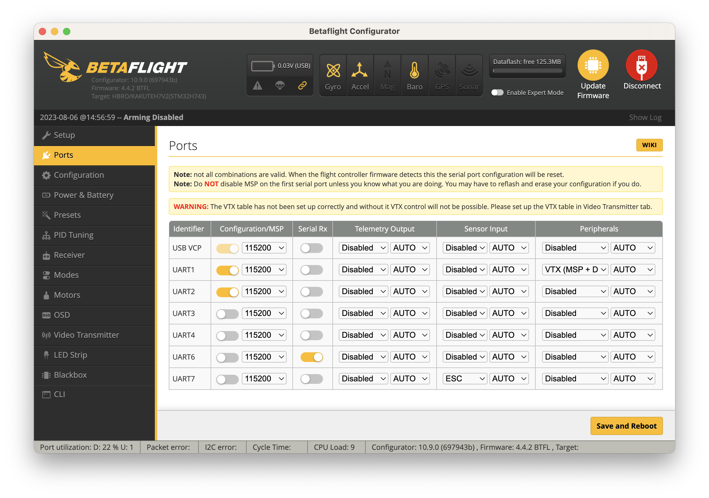
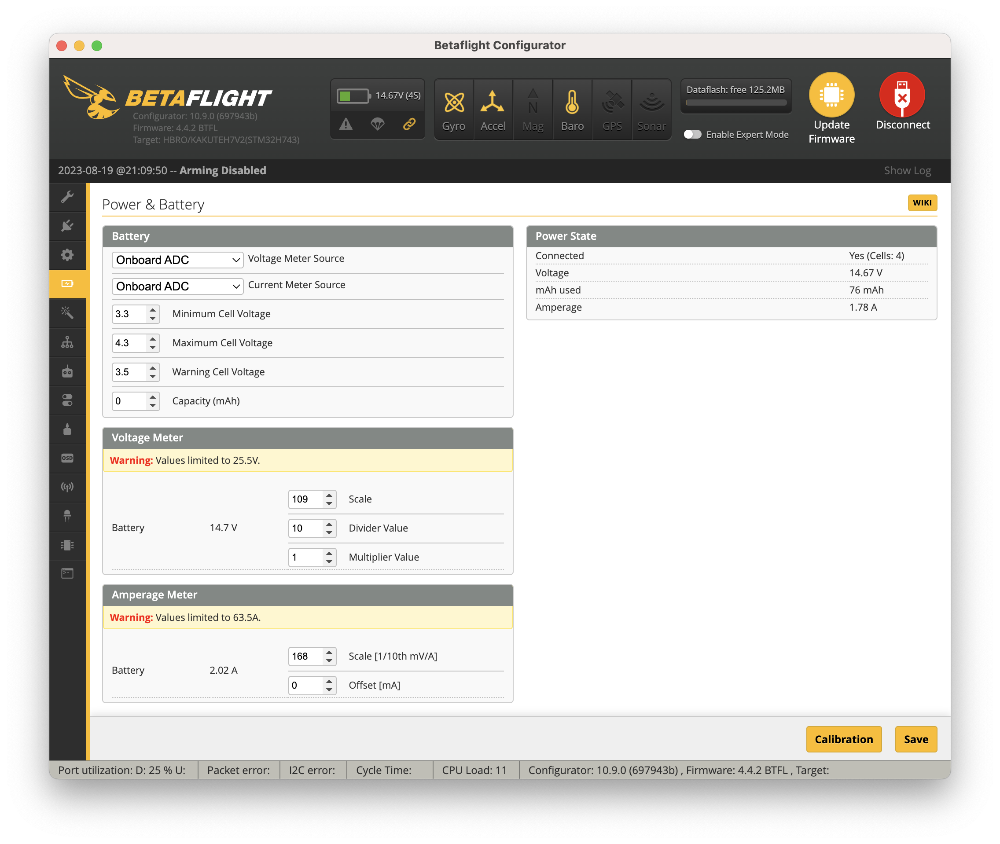

Mini quad 2023 build log
========================

There's no instruction manual either online or with the frame fro the QAV-R 2 DC.

DrainMan FPV build of non-DC variant - <https://www.youtube.com/watch?v=npAWcTUKCpU>

At 8m 47s, he refers to the the two sets of slots at the back of the upper plate as zip-tie holes for the antenna.

Slots for camera mark front of bottom plate.

Lock nuts face into body of quad.

The M3x8mm 28pcs are for motors.

M3x30mm are for the center stack.

The M3x14mm are for the places where there are stadoffs.

And the M3x12mm are for where there aren't stadoffs.

---

More detailed build from SF PV - <https://www.youtube.com/watch?v=OcpguW2v5es>

He notes the middle screw is different from all the others but the DC doesn't seem to come with a one off special screw.

He uses race wire - see README.

Mr. Steele uses wire protectors (see 46m 18s in video below) which looks simpler. And he attaches them with two wraps of electrical tape.

He trims off 2mm from ends of motor wires before attaching to ESC.

Tape over ESC with Kapton tape.

---

Huginn FPV - <https://www.youtube.com/watch?v=P3TvvqX3dTg> (with page on rotobuilds with more details and photos [here](https://rotorbuilds.com/build/24690)).

Actual builds the DC variant.

He says the odd little plastic pieces are for mounting micro cameras if you don't want to use the carbon fiber side plates. And indeed you can find lots of images of this style of mounting:


Oddly, his middle small X hsa different width arms (front two for front arms are narrower), but for mine all arms are the same width.

He just uses a "medium" screw (the 12mm, I guess) for the middle hole.

All the stadoffs just go thru one layer of carbon fiber - so, he only uses the longer (14mm) ones for the two standoffs at the back of the triple layers of carbon fiber.

He puts the rubber o-rings at the bottom of the stack bolts.

---

Mr. Steele - <https://www.youtube.com/watch?v=17RaCAcFh4A>

At 32m 14s he cuts down the pigtail to 55mm.

Then he cuts the red 5mm shorter - he wants it to come out the right-hand side.

He pushes in an unreal amount of solder when tinning.

He uses neddle pliers rather than tweezers.

He only puts on stadoffs etc. once he's soldered up the ESC.

He puts an isolation plate beneath the VTX. But if you use metal screws this is a bit pointless (he uses nylon).

He sticks his RX to the top of his VTX - see notes on JB and Ummagawd doings this in README.

---

JB 2022 Freestyle FPV Drone Build:

<https://www.youtube.com/watch?v=2T_JC4v5T3E&list=PLwoDb7WF6c8neIAQBkchfiXf-C8KbzG5M>

At the 2m 50s mark, he comments he uses Gemfan Hurricance 51477 fans - I got the 51466 variant - I don't know what the difference is.

[ The [SpeedyBee Master 5 V2](https://www.speedybee.com/speedybee-master-5-v2-hd-dji-o3-air-unit-fpv-5-freestyle-drone/) comes with 51466, i.e. the same ones I have. ]

If you look at JB's video, you can see the o-rings make sense if you ESC has short gummies but the Tekko have tall gummies.

He does reduce motor slack at the ESC end rather than the motor end due to fear of the cable being cut by the props.

Twisting cables to stop them splaying.

Mounting the XT60 pigtail at 90&deg; looks like your only option

Or you rotate the ESC 180&deg; - but you can't flip it upside down - otherwise you can't get at the ESC pads.

---

When putting in motor screws make sure screws don't push into motor body and make sure not to overtighten and strip aluminium threads of motor.

The motors come with their own screws for 3mm, 4mm and 5mm thick arms - my calipers says the arms aren't a consistent thickness - they vary between 4.55mm and 4.74mm.

---

Put the cap on the opposite side of ESC to XT60 pigtain?

---

My build
========

Is it "bolt" or "screw"? Be consistent.

I started by loosely screwing down the X between the small plate and the bottom plate. I used thread locker for the following screws but not for this first one.

Note: you don't have to be quick with thread locker - see this picture <https://iflight.oss-cn-hongkong.aliyuncs.com/store/product/FPV-Motor/XING2-2207/2207-02.png>

Then I put in one of the back arms, got it to engage with one of the arms of the X and swivilled things until all the appropriate holes lined up.

I emptied the 12mm bolts into a tiny dish.

There are three holes for the back arm but only two have press nuts on the opposite side of the main bottom plate. The center one is for the main stack - I left the stack holes for all arms until later.

I just screwed a bolt into the hole that had a press nut and wasn't for the stack.

Then I did the same for the other back leg.

Then I inserted the front legs - in their case both the holes to either side of the center stack hole have press nuts so, I screwed bolts into both these holes.

Then once everything was secure, I backed out the center nut, applied thread locker and screwed it back in.

See in the photo that the bolts are not quite flush with the press nuts - they'd have to be about 11mm for this. And see that there are two bolts screwed in for each of the front arms but only one for each of the back arms.

Don't overdo things when tightening the bolts - the rule-of-thumb I've heard is never screw things in more tightly that you can do with comfortably with thumb and forefinger.

For each screw, I just applied a tiny drop of thread locker to the end of the screw (i.e. the bit that would end up in the press nut) and rotated the screw, using glue nozel to spread the the blob thinly around the bolt.

Then I took out the 30mm screws - here it was a little trickier to work out which bit of the bolt would end up in the press nut and apply the threadlocker there.

Gummis
------

I found inserting the first gummy difficult and looked for tips for how to do it on YouTube. Some people clearly had way more trouble than I did and came up with solutions involving pliers and other tools. I don't think that's necessary. After one or two I found I could do it fairly easily - by pushing one side of the gummy up through the hole, then once it was through, twisting it around (while also pushing upwards) until the rest was through.

TODO
----

Plan all cabling for ESC before you start soldering.

Which side of main VTX unit is the top.

Weirdly, the QAV R-2 doesn't come with nuts of any kind for top of stack.

Soldering
---------

Practicing with the practice solder boards is boring but probably worth it to warm up if one hasn't soldered for a long time. My final solder joints were way better than my initial ones so I wish I'd warmed up on a practice board rather than the real thing.

The main trick was to hold everything in place (with my Panavice or bluetack), hold the wires in place with hands, use tweasers or pliers to push wires down when soldering and:

**rest both elbows on something so that both hands are as stable as possible**.

ESC wiring
----------

JB almost has his XT60 lead pointing back into the ESC rather than away - that seems likely to result in the wires knocking against the stack and causing vibration.

Mr. Steele creates the pigtail, then cuts the length of cable extending beyond the connector down to 55mm, then cuts 5mm off the red one so that it when soldered down it protrudes at 45&deg;.

So, I cut 5mm off the black one as my ESC is pointing the opposite direction.

So:

| 4mm bare wire | 4mm inside hood | 55mm

Second time around, I switched to:

| 4mm bare wire | 4mm inside hood | 60mm sheathed | 4mm bare wire

And chopped the shorter wire down by 8mm.

---

Once the XT60 and the cap is connected, you can test out everything - create a stack with just the ESC and FC, connect the 2 with the 8-pin cable and do a mini-continuity check (there's not much that can be miswired at this stage) and connect up the ShortSaver and battery.

Then you can do the initial BF setup and upgrade BLHeli_32.

---

I decided I wanted my cable, when twisted, to be about 3cm longer than the untwisted length of the longer of the two supplied ready to plug cables.

So, I twisted the the ESC to FC wire and then cut it down to 95mm, not including header, i.e. 95mm of cable extending out of the header.

Then I untwisted the wire and the length of wire was about 107mm.

On untwisting them, one wire turned out to be noticeably shorter than the others - so the sensible thing would have been to cut just one of the wires when twisted then untwist and cut the rest.

Then I used the smallest setting on my clipper thingy to remove about 2mm from the end of each wire.

Unlike JB, he tins all the pads and attaches the XT60 leads before installing in the frame.

---

Soldering up the ESC didn't work out very well.

Soldering on the connection to the FC was very stressful.

Despite my cool soldering iron, the solder didn't go down well on the large negative and positive pads.

The cap is fat and needs to be bent upwards substantially before it'll clear the bottom plate.

Even with 5 or 6mm clearance for the cap, the leads still intersect with it - if doing again, I'd go with JB's straight out sideways rather than Mr. Steele's 45&deg;

But I think that'd be hard to combine with the cap on the underside - I think I'd go with it on the top - solder them in first then tin the pads.

I did redo it - with the cap on the top-side, I completely over compensated for having been too near the first time and moved the cap so far away from the FC that I might as well have used a tall cap.

---

Note for future - you can plug the ESC into the FC at this point and do a wiring continuity check (see below) and smoke test and then check that everything's good with the ESC as in <https://www.youtube.com/watch?v=5ke6LabvtGM&list=PLwoDb7WF6c8neIAQBkchfiXf-C8KbzG5M&index=4> before doing the FC wiring.

If I'd done that, I'd have found an ESC issue before all the other wiring made it far more complex to diagnose and address.

---

If redoing the wiring, I'd do the tinning as JB does in his soldering into video.

I let solder wick way too far into the wires making the solid and unbendy - JB holds the iron in place, dabs a little solder on the end then, while feeding solder, draws the wire over it so you end at the tip.

---

The motors come with three sets of screws - for arms that are 3mm, 4mm and 5mm thick.

The 5mm thick ones are the same size as the 8mm screws that come with the frame so, I used them rather than the ones that came with the motors.

----

Unbelieveably annoyingly, the motor wires for the rear arms were too short so I had to add extenstions.

---

I screwed in the bolts for the motors very loosely initially and only once all four were in place did I tighten them up. Here in particular, you don't want to overtighten due to the risk of stripping the aluminium threads in the motor - the thread locker should keep things in place.

Wires
-----

I chopped off one end of the GPS cable.

I took the JST-GH to DF13 SiK cable and chopped off the DF13 end 

FC wiring
---------

**Update:** if the idea is to avoid things bumping against the FC then my wiring approach was very bad - I wired everything thru the holes on the FC so that the wires hang down underneath the FC towards the ESC - even when bent outwards away from the FC, this arrangement maximizes the chance some wire will bump against the ESC. If doing again, I'd:

* Either treat the thru whole pads as if they had no hole and treat them as a plain pad and solder the wires to the _top_ side (this is what JB does - see 35m 8s mark of [video 1](https://youtu.be/2T_JC4v5T3E?list=PLwoDb7WF6c8neIAQBkchfiXf-C8KbzG5M&t=2108)).
* But this would get hard for the double row of pads - so for these maybe the trick is to use the thru holes but end up with the wires facing up rather than down.

I looked at JB and Mr. Steele's videos and OL's soldering guide but couldn't see any where one can see how they deal with double rows. In fact if I didn't have a GPS and the telemetry radio, the double row would hardly be used. And I googled a lot but found nothing high quality - if you find something tell me.

For the moment, I'm inclined towards treating them as flat pads where possible and connecting the wires facing upwards for the double row of pads. Or, even better, get an FC where everything is connected using connectors rather than soldering like the SpeedyBee F7 V3 FC:

<https://cdn11.bigcommerce.com/s-fhxxhuiq8q/images/stencil/1280x1280/products/193/1011/F7V3_4__42245.1685366926.jpg>

The connectors are on the understand but they're angled such that the wires will point outward from the FC rather than down.

[ You'd still need to solder the telemetry radio. ]

Treating them like pads allow you to have the wires going outsideways - but it's hard for the double row of pads. Going up still risks bumping against battery strap and top plate but probably less risk that down to very close ESC. Perhaps taping the wire down to the board (so, it's pointing outward) rather than using a helping hand would help get such wires going at right-angles to the bit of the wire going through the hole, i.e. do this while the wire is still flexible before it's wicked in solder. Do outer row first so holes aren't blocked by wires of inner row. And perhaps make the exposed bit of wire a little longer, i.e. instead of a tiny fiddly length poking thru the hole, I longer lenth that's cut down a bit after soldering.

TODO: add a section at the very end to cover any points like this that you _didn't_ correct but would have liked to.

---

The FC side, the plastic coating of the wire of  VTX connector could be stripped with the 28AWG hole (26AWG almost worked but sometimes slipped).

For the VTX side, with silicone coating, I nipped off the ends with my nails - using even 30AWG with the wire stripper sometimes just took the whole end off.

I cut the VTX side down to 70mm plus 3mm bare wire.

I cut the FC side down 2cm plus 3mm bare wire.

Don't forget to put shrink wrap on before soldering wires together.

I cut the buzzer wires down to 110mm plues 2mm bare wire at both ends - I tinned the ends that were later soldered to the buzzer.

For no good reason, I soldered the wires to the buzzer before soldering them to the FC - for everything else I soldered the wires to the FC first.

I didn't chop down the RX wires - at 65mm they already felt short enough. Using 28AWG, I exposed a bit more wire on both ends so they'd poke thru the PDB holes (the FC it thicker than the FC so, one end needs more exposed wire than the other). I didn't trim off the ends and can't honestly tell if they're tinned or not.

I did not retin them - it's just too fiddly when trying to push them thru holes afterwards.

I cut the GPS wire down to 140mm plus 3mm of bare wire. Again, I used the 28AWG gauge when stripping. I didn't tin them.

I cut the SiK wires down to 70mm plus 3mm of bare wire - I gave up on using my nails to strip them, it's easier with 28AWG on the wire stripper. The plastic on the wires definitely isn't silicone, it shrivelled near heat and it stuck to the solder tip like stringy cheese.

---

In retrospect, I'd install the VTX and camera before the ESC - detaching the camera connector from the VTX was stressful and I wouldn't recommend it.

**Update:** I did do this - make sure the camera cables is where you want it (I wanted mine off to the side of the ESC rather than running under it) and that it doesn't end up to the wrong side of any cables when e.g. soldering down the motor wires. Also, I covered the VTX cable in masking tape to protect it (mainly from just being marked with flux - I assume it's coated with silicone and would survice contact with the soldering iron) but the tape was hard to remove after everything was soldered in place - so, avoid wrapping it around the cable such that the tape sticks to itself.

**Update 2:** I don't know why I ran the cable to the side of the ESC, if doing again I'd run it under the ESC and tape it down with gaffer tape.

Unlike the antenna side (which is super simple), the little latch on the camera side of the VTX is stuck down with a little pad but just ease it off (it won't pull anything else with it). To remove the camera connector, go in under the cable with somthing thin and narrow and pry the connector up from its center.

You can see someone making it look easy (working with the same kind of camera connector but on a DJI VTX module) at around the 24s mark in this [video](https://www.youtube.com/watch?v=r9Yb4ThHNGA).

I then used the shortest screws (there was a set of 8 

8 x 4mm M2 screws
4 x 5mm M2 screws
4 x 6mm M2 screws
4 x 14mm M2 screws
4 x 0.5mm M2 washers (0.5mm thick, 5mm outer diameter)

And I used the 6mm ones for attaching the board that the RX sits on. Pulling the back off the double-sided tape was a  pain.

---

Smoke check
-----------

<https://www.youtube.com/watch?v=8gQpO5jTHP4&list=PLwoDb7WF6c8neIAQBkchfiXf-C8KbzG5M&index=2>

On checking the XT60, I got a very slight beep on first contact (when JB got) none - then I got the long-ish beep on reversing the prongs (as expected due to the cap) and got a similar long beep each time I reversed the prongs after that (i.e. a beep each way, not just on one particular "side").

My FC has no VBAT pad so, I used B+ on ESC port 1 - holding the probe to the point where the pin enters the connector lead to a much better beep than touching the pin where it connects to the FC PCB.

My VTX is powered off a 9V BEC on the FC so, I can't check it for VBAT continuity.

For ground, I found (oddly) that most of the outside of the USB connector responded poorly - for whatever reason, touching the probe off the edge around the main opening of the connector gave the best results. Using a GND pad also worked well.

On watching JB again, I noticed he touches the probe to one of the little indentations on the top of the USB connector - this worked very well too.

Checking the antenna connector for GND also worked. I couldn't check the RX's GND pin itself as I'd already shrink wrapped it.

Then I got to the smoke stopper part - for this you need a charged battery (see next section).

JB reminds you - when powering up any device that has an antenna, e.g. the RX on your quad, your TX or your goggles, make sure the antenna is connected before you power it up or you may damage the device - really!

I plugged the battery into the smoke stopper - the yellow LED went on. Then I plugged the smoke stopper into the quad, the LED stayed yellow - so, all good so far.

There's two buttons on the ShortSaver - ignore the one at the edge of the boards - it's for changing the current that it'll allow to flow (useful if you want a bit more current while doing more than basic smoke testing).

Just short press the other button (long pressing lets you adjust the sensitivity, again a feature we don't need for basic short testing).

On pressing it, the LED went green and the FC beeped and LEDs went on on the RX, FC and GPS. The one on the RX was annoyingly bright - I find [Light Dim stickers](https://www.lightdims.com/store.htm) work very well (the web site is quite cheesy but they work way better than e.g. using black electrical tape).

For more details on the ShortSaver see OL's [page](https://oscarliang.com/vifly-short-saver-2/) and for a short intro (including using the other button and adjusting sensitivity), see Mads Tech's [video](https://www.youtube.com/watch?v=RT_5AQTq5Ig).

The ShortSaver is also really nice as it allows you to turn on and off the quad without prising the XT60 connectors apart - if you leave the quad powered up most of the components will get hot and some will get very hot (they rely on being cooled by moving air when in flight).

Note: the one horrible feature of the ShortSaver is that it has a weird XT60 that gives you almost nothing to grip and so makes unplugging it even more trouble that a normal XT60 (I found it easier gripping the connector with a dish cloth).

Audio recording:

* FC buzzer without motors: <https://recorder.google.com/62948947-fd73-4b91-924d-a22aa38556c9>
* FC buzzer with morots: <https://recorder.google.com/593cc8f4-82de-4ebf-9db1-831010462c46>

Charging batteries
------------------

The fan is super noticeable on the charger.

Note: the HOTA D6 Pro and the Hobbymate D6 Duo Pro are the same product - Hobbymate's site has out-of-date firmware so, HOTA seems the place to go.

My charger came with 1.0.46 but 1.0.47 came out in mid 2023.

### Updating the firmware

Sources: TweetFPV's ["Hota, Hobbymate D6 Duo Pro Firmware update"](https://www.youtube.com/watch?v=SUoooEZjDCY) video and JB's ["Every LiPo Charger Needs To Add This Feature"](https://www.youtube.com/watch?v=XIf8cKKiGJg).

The instructions, as is fairly common with Chinese instructions, are more midleading than helpful - TweetFPV and JB's videos show how to successfully upgrade a Hota charger.

JB video also discusses a new HOTA firmware feature called "continuous work" which may be useful if you're charging lots of batteries and want to make the process of switching from one pair of batteries to the next as swift as possible.

Unfortunately, the HOTA firmware updater is a Windows only program so, you need to use a Windows VM for this process.

---

The charger must be connected to your laptop via the Micro-B USB connector (the larger USB-A connector cannot be used) _before_ you power it up.

Some tutorials say you must use DC, i.e. power the charger off a battery. This isn't the case - using the normal AC cable and plug works fine.

Hold the _CH_ button down while you connect the charger to power.

It'll stay dark and beep for about 5 seconds - it's only during this short period that it's in firmware update mode, after that it just continues and starts up normally.

In your Windows VM, go to [Hota support](http://www.hota-exp.com/index.php/service_l_2.html?t=en) (yes, it really is a plain non-secured `http` site with no `https` version) and in the _Firmware Download_ section, download both _HTLoader_ and _D6 Pro Firmware_.

Unpack the resulting two `.zip` files and you end up with `HTLoader.exe` and `HOTA+D6Pro+V1.0.47.prg` (or whatever the latest version is now).

Run _HTLoader_ and open the `.prg` file.

With the charger connected via USB, power it up again with the _CH_ button held down.

You've got almost no time to first click the button that _VMWare Fusion_ pops up asking you if you want to connect the USB device to the VM (obviously, you do) and switch to the VM and press the _Update_ in _HTLoader_. I was too slow the first time but second time it worked perfectly.

When the charger reboots, long press the scroll wheel, go to _System info_ and confirm that the _SW_ field shows the expected new firmware version.

### Basic usage

On the support page (linked to above), you can also find the _D6 Pro Manual_ PDF.

Basics:

* There's a _CH_ button on the left and a scroll whell on the right.
* Long press it to get to settings (scroll to the bottom to get to the _Back_ option).
* Press the button to switch between the left and right channels (i.e. the connections for the left and right batteries).
* When you've plugged in batteries, press the _CH_ button to select the first channel and then short press the scroll wheel to get to what HOTA call the task options.

The balance leads are so short that it's quite tricky to plug them in after plugging in the main lead. It _might_ be worth getting an extension lead - <https://www.getfpv.com/balance-lead-extension-cable-4s-jst-xh.html>

The balance connectors will take different size balance leads (anything from a 2S to a 6S lead) so make sure your 4S balance lead is plugged in all the way to the right (so that the connector pins to the left are empty and the right most pin of your lead is under the negative minus symbol on the charger's connector). You can't plug the lead in upside down and if you accidentally connect the lead so that it's not all the way to the right the charger will warn you.

OL and others say connect the main lead first then the balance charger.

Once both batteries were plugged in, I pressed the _CH_ button and then short pressed the scroll wheel to get to the task options. Everything, defaulted to the correct values:

* Task: _Charge_
* Battery type: _LiPo_
* Cell voltage: 4.2V
* Cell count: 4S (14.8V)

The only thing I had to change was the current setting, set this to match the mAh value of your battery - mine are 2200mAh batteries so I set the current to 2.2A.

Then scroll down to _Start task_ and short press the scroll wheel to start the charging process.

Press the _CH_ button again and do the same for the second battery (it copied across the current setting so, I didn't have to set it again).

Once you've started the charging process for the second battery, press _CH_ again to watch both batteries charging.

You may notice that the battery capacity is in Ah while the selected current is in A - charging a 2200mAh battery and 2.2A means you're charging it at 1C which is considered the safe level at which to charge batteries - many batteries will handle higher C values but 1C is always safe. The 75C or higher value shown on your battery is a _discharge_ rate and unrelated to how fast you can safely charge the battery.

Charging any capacity battery (from their recommended lower voltage bound) at 1C should take about an hour. See <https://oscarliang.com/lipo-battery-guide/>

Charging my batteries (which came from the factory at storage voltage) took 36m.

Do not leave the batteries charging unattended - even though the fan noise is quite annoying don't leave them charging in another room as LiPos can be dangerous and may spontaneously combust.

And if you think the fan was loud when you first plugged in the charger, it'll get really loud later in the charging process (around the 15m mark for my batteries).

When the charging is finished, it'll beep and the side of the screen for the battery that's finished well go green, this means it's completed and that the maximum cell voltage difference is 20mV. Let it run a little longer and it'll beep again and it'll go from green to blue - this means it's balanced things out even more and the maximum difference is now 10mV.

I chopped off the large _DO NOT PULL_ stickers on the main leads of my batteries. It's there to remind you not to disconnect the battery from the charger (or your quad) by pulling on the leads - instead hold the connector and wiggle it out.

Once finished, I didn't press anything on the charger, for each battery, I just disconnected the balance lead first and then the main lead.

For a nice intro to the HOTA D6 Pro, see Matt Pochwat's ["What Makes a Great LiPo Charger?"](https://www.youtube.com/watch?v=No0sv3GgwdE) video.

For a more detailed look at getting started with charging batteries, see Supa FPV's ["The ONLY Battery Charger You'll Need!"](https://www.youtube.com/watch?v=eM4VlJTtARQ) - there's a rather rambling start, so just jump to the 11m 3s mark where he actually shows how to use the charger. Flitetest have a more detailed [overview](https://www.youtube.com/watch?v=1LBTmiaRQK0), where they go into C ratings etc. and how to use the charger but they don't show this bit in quite as much details as Supa FPV's video.

The other nice feature of the D6 Pro is that you can use it as a desktop power supply, i.e. if you had a XT60 female to Xt60 female cable, you can switch the task (see above) _Power supply_ and adjust this tasks output voltage setting to 14.8V (or whatever voltage you want), then use it to power your quad rather than a battery, e.g. while testing things on your desk. When doing this you can also adjust the maximum current down to e.g. 5A to make sure you never provide enough power to accidentally spin up the props or anything else dangerous. It also has short circuit protection which means if you do short anything it _should_ shut down very quickly. However, for smoke testing,  people still seem to favor a specialized smoke stopper like the VIFLY one.

Note: when I stop the _Power supply_ task, it always momentarily warns "Battery polarity connected wrong!" - I think this is just the charger seeing the voltage across the capacitor that we soldered to the ESC (and which looks the wrong way around from the charger's perspective) and this isn't a real issue.

---

Putting batteries to storage voltage is dead simple - just select _Storage_ as the _Task_ rather than _Charge_ and put in the current as before (2.2A for my 2200mAh batteries).

Unlike charging, when it reaches green it's finished (there's no additional blue phase) and it starts beeping every minute or so to tell you it's done.

As expected, discharging is _way_ slower than charging. That's why there are purpose made dischargers.

Hmm... looking at <https://oscarliang.com/vifly-storesafe/> and the times stated (10 hours!!!) maybe the VIFLY ones are pointless, I should have tried with the battery I had.

Wiring setup
------------

| Device | UART |
|--------|------|
| VTX    | UART1 |
| Bluetooth | UART2 |
| Telemetry radio | UART3 |
| GPS    | UART4 |
| RX     | UART6 |
| ESC    | UART7 |

Notes:

* UART2 is reserved for the FC's Bluetooth module and should be left alone (in BF, under ports, it should show with MSP enabled but everything else as toggled off or _Disabled_).
* UART7 is reserved for the FC's connection with the ESC.
* The above UART assignments for VTX, GPS and RX are the ones recommended by Holybro.
* Holybro list UART3 and 4 as spare - I used 3 for the telemetry radio (which will only be used if using ArduPilot rather than BF).

FC configuration
----------------

Important: always connect USB before connecting the battery - connecting the battery first results results in the FC ignoring the USB connection if you connect if afterwards.

TODO: check this is always the case.

Go to <https://betaflight.com/download>, click _Latest configurator releases_ and download `betaflight-configurator_10.9.0_macOS.dmg` or whatever the latest version currently is for Mac.

Install it, open the _Applications_ folder, find it there, right click it and select _Open_ (just for the first time you use it to get past your Mac trying to protect you against applications that macOS can't verify). It's extremely slow to load so, I presume they're still just building x86_64 binaries and macOS is converting it for M1 or M2 chips.

JB powers his quad from a battery while doing all this - I did not, 

For the first steps you just need the USB power from the laptop is enough (and doing this meant everything except the RX stayed cooler than with the battery).

[ JB initially shows a setup with the battery also connected but it's clear later that you should only connect it when you need it to test the motors. Easiest is just to connect the ShortSaver and leave it turned off until you need battery power. ]

Once the Configurator is running, connect the FC to your laptop using its USB-C connector (macOS will ask you if you want to allow the device to connect). The FC and other components power on but it doesn't beep when there's no battery connected. Surprisingly, it's the motors that make the beeps and without the battery the ESC and the motors aren't powered.

Update: actually the buzzer also emits some noises too - but it too only does so if there's battery power - it's silect when using just USB power.

See <https://recorder.google.com/> for comparison of buzzer only startup and buzzer with motors startup.

You get a very scary warning for the Configurator on first connecting (see images/betaflight folder).

It auto-connects, so go to the _Presets_ tab and click _Save Backup_ - when it's done it quickly disconnects and reconnects (and you see the scary warning again).

Looking at the save `BTFL_cli_backup_20230727_144658.txt`, there's absolutely no changes from the defaults except for:

```
feature -RX_PARALLEL_PWM
```

[ This disables support for parallel PWN receivers - see <https://betaflight.com/docs/development/Rx> ]

I don't see any value in replicating this later when reflashing the firmware - as we're not using a PWM RX and disabling features that you don't use doesn't typically gain anything.

The files does show some useful information:

```
# Betaflight / STM32H743 (SH74) 4.3.1 Jul 13 2022 / 03:37:48 (8d4f005) MSP API: 1.44
# config: manufacturer_id: HBRO, board_name: KAKUTEH7V2, version: cd183ad2, date: 2022-06-08T04:12:46Z
```

So, it came with Betaflight 4.3.1 and the board name is `KAKUTEH7V2`.

So now click the _Disconnect_ button (upper right) in the Configurator, then select the _Firmware Flasher_ tab (left side) and click the _Auto-detect_ button (upper-left panel).

It correctly detects `KAKUTEH7V2` and shows the latest firmware version (4.4.2 at the time of writing).

Unlike JB, I didn't select _Show unstable releases_ as the current latest version was fine.

Click _Load Firmware [Online]_ (lower right) and then _Flash Firmware_ - it'll actually switch the FC into a special DFU mode so, to macOS it'll look like a new device and it'll ask you again if you want to allow it to connect.

Once the flashing is finished, click the _Connect_ button - it'll ask you if you want to apply custom defauls - you do so, select this. The same scary warning appears again.

The custom defaults don't add anything to the normal configuration besides these slightly odd changes:

```
set osd_canvas_width = 30
set osd_canvas_height = 13
```

So... Let's fix that warning...

It should go to the _Setup_ tab - place the quad flat on the table and click _Calibrate Accelerometer_ - this just takes a second.

Note: it's probably a good idea to put on landing pads later and redo this step when the quad can lie flatter better (without them, the antennas under the back legs cause the quad to tip forward slightly).

I hoped it might detect the compass in the GPS but the _Calibrate Magnetometer_ is greyed out.

Then I went to the _Motors_ tab and selected _DSHOT600_ in the _ESC/Motor Features_ panel (the H7 is a powerful MCU and can support _DSHOT600_).

NOTE: the Tekko32 product page says it supports DSHOT1200 - but it turns out that Betaflight removed DSHOT1200 support back in late 2019 (see this [post](https://intofpv.com/t-dshot1200-removed-from-betaflight-4-1)) so, _DSHOT600_ is as good as it gets.

Then I selected _Bidirectional DSHOT_ and agreed to the warning that popped up.

Then I clicked _Save and Reboot_.

Once it reconnects, go back to the _Motors_ tab - you'll see "E: 100%" (errors at 100% which means bidirectional DSHOT is enabled but the ESC isn't powered up).

Now's the time to plug in the battery (it'd be good to have a small desktop fan to keep air moving over everything and help keep things cool). So, I folded over two strips of black electrical tape and hid them under them.

Once plugged in the _E_ values should go to 0%.

At this point I found one of my motors wasn't working - one of the _E_ values stayed at 100%. Resolving this involved a lot of resoldering, work with my multimeter and eventually a new ESC.

### Reorder motors

Now, click _Reorder motors_, enable the _I understand the risks_ option and click _Start_.

### Motor direction

Now, click _Motor directions_, enable the _I understand the risks_ option and click _Wizard_.

Note: if you try this with the ShortSaver in place, it'll cut the power to ESC as spinning up a motor beyond the minimum will bring you above the default 1A ShortSaver limit.

It turns out a bug introduced in 4.4.2 has broken changing motor direction via BF - see [issue #12860](https://github.com/betaflight/betaflight/issues/12860) - the fix will be included in 4.4.3 and 4.5 whenever they come out.

So, instead first work out which motors are turning in the wrong direction. I found it easiest not to use the _Wizard_ and clicked _Individually_ instead.

Note: doing things _Individually_ rather than with the _Wizard_ also has the advantage that it doesn't draw enough current to trip the ShortSaver if you've got it connected as only one motor runs at a time.

Here you can e.g. click 3 to start motor 3 and then determine if it's turning the same way as shown. The motors turn far to fast to see which direction they're turning - people use different approaches:

* Attach a small piece of tape to the shaft or body of the motor to act as a flag.
* Hold a small piece of card against the turning motor to feel if it's dragged one way or another.
* Gently touch your finder against the body of the turning motor.

I found using my finger the easiest way (and it's the way Mr. Steele suggests).

In my case the upper-right and lower-left motors were turning in the wrong direction. Now, you have to map those to the numbering used by the ESC:


So, these motors are M2 and M3 (when the ESC is oriented, as in this setup, with the XT60 connector pointing forward).

I then reversed the direction of these motors as described below in the section on BLHeli_32.

Note: if you leave the battery plugged in too long without doing anything with the FC, the buzzer will eventually start beeping to remind you that maybe you should diconnect the battery.

# Pitch, roll and yaw

As the last basic check, go to the _Setup_ tab and look at the quad shown there then:

* Pitch the real quad forward and backwards and confirm the one shown in BF does the same thing.
* Roll the quad from side to side and confirm this matches too.
* Turn the quad clockwise and counter-clockwise and confirm this matches too.

VTX, camera and goggles
-----------------------

Resources: Painless360's ["Walksnail for new owners: All you need to know in one video!"](https://www.youtube.com/watch?v=ATLZLxGSSJg), OL's ["How to Setup Walksnail Avatar Digital HD FPV System
"](https://oscarliang.com/setup-avatar-fpv-system/).

Note: the goggles have a fan (which stops them fogging up when you're wearing them) and it makes quite a lot of noise.

Note: when working with the VTX setup, the ShortSaver sometimes tripped so, I pressed its second button - this turns on a blue LED to indicate that the ShortSaver has raised its current limit from 1A to 2A.

Note: sometimes I didn't get video out via the USB-C connector of the goggles and only solution was to disconnect and reconnect them to power.

---

The [Recon HD](https://www.fatshark.com/product-page/recon-hd) goggles are easy to use, they have three buttons:

* A little joystick-like button on the side - press it to enter the settings menu, and press it left, right, up and down to navigate.
* A back button on the top - use it to go back a level in the settings.
* A record button - use it to start and stop recording.

There's a small SD card slot where the padding of the goggles would otherwise touch the top of your nose when wearing them.

---

If you've got a 9V or 12V power adapter with a 5.5x2.1mm barrel jack, you can power your goggle with that. Otherwise use a 2S battery and use the XT60 to barrel jack lead that comes with the goggles.

If you've got a USB-C to HDMI adapter, you can plug the output of the googles into a monitor or TV. Otherwise, just look at the output in the googles themselves.

**Update:** I bought a [Verbatim USB-C to HDMI adapter](https://www.digitec.ch/en/s1/product/verbatim-usb-type-c-to-150-m-hdmi-usb-video-cables-11944750) that works perfectly. And a [HDMI-to-USB-C video capture device](https://www.aliexpress.com/item/1005005117882668.html) that works great with the open-source [OBS Studio](https://obsproject.com/),

TODO: put photo of setup with mains power and HDMI output here.

You'll need a 32GB U3 micro SD card (ideally, but any class 10 card will probably do).

Using _Disk Utility_, format it as _MS-DOS (FAT32)_ (rather than the more normal _ExFat_ which can handle cards larger than 32GB) - according to OL and others, Fatshark goggles work best with FAT32.

**Update:** you can get the goggles to format the card - go to _Settings / Record Set_ and click _Format SD Card_, then you know for sure that it's using the file system format that works best with the goggles.

I named my card "FATSHARK".

Go to the Fatshark Recon HD [support page](https://fatshark.helpscoutdocs.com/article/177-recon-hd) and download the latest firmware (33.39.10 at the time of writing).

Note: the Recon HD PDF manual that's also linked to there is fairly useless.

TODO: extract the diagrams that show button positions etc. from manual PDF - they're at least useful.

Extract the downloaded `.zip` file - it contains a `README.md.txt` which tell you exactly how to update the firmware on the goggles:

```
Remove the SD card from your goggles and insert it into your computer.
Put the correct firmware file onto the SD card.
Eject the SD card from your computer and insert it back into the goggles.
Power up the goggles. Wait until you see the Standby screen.
Using a tool, push and hold the red Link button for 8 seconds. The headset screens will go black indicating the start of the update process.
The update will take approximately 10 minutes.
During the update, the goggles will beep. This is normal. DO NOT turn off the headset until the update is finished.
When the update is complete, the beeping will stop and the goggles return to the Standby screen
Enter goggle settings menu and select RESET
```

The correct firmware file is the `AvatarMini_Gnd_XX.XX.XX.img` file (the other `.img` file is for the VTX).

When they say "push and hold the red Link button", they mean press the bind button (that's under the little hole above the goggle's power connector). I used a toothpick to press it.

Once you've held it down for 8 seconds, the screen only black very temporarily before returning to the usual boot screen showing "AVATAR HD SYSTEM" - after a few seconds it starts to beep loudly and repeatedly and goes on for several minutes like this before ending ending with a long beep and then starting up properly.

If you then navigate to _Settings / Device / Device Info_, the _Goggle SW Version_ should now show the version you just installed.

Painless360 suggests also doing a full reset at this stage (I presume to ensure there are no old settings that _might_ not be appropriate for the new firmware). To do this go to _Settings / Device / Reset All_ - click _OK_ and the goggles will reboot.

Note: the VTX (in the next step) automatically removes the `.img` file from its storage once its upgraded. However, the goggles just leave the `AvatarMini_Gnd_XX.XX.XX.img` file sitting on its SD card. You can remove it later if you want.

### Updating VTX firmware

Initially, I just powered the FC via USB but the VTX is only powered up if a battery is connected.

So, power the quad with a battery (a little LED on the VTX should starts to blink green, showing that it's powered) and plug connect the VTX's USB adapter to your laptop with a USB-C cable - the VTX should show up as a drive on your laptop.

Note: when the VTX is connected via USB-C to the laptop the LED is actually blinking between green and red but in bright light, and depending on the angle, the red is hard to notice.

The `.zip` downloaded above for the goggles also contains a corresponding `.img` file for the VTX.

This `.img` file is also available from Caddx (Caddx is the creator of the Avatar system and the maker of the VTX while Fatshark is the maker of the Recon HD goggles) - I checked their [download page](https://caddxfpv.com/pages/download) and the latest Avatar firmware version was the same as the one that came with the goggles.

Note: Painless360 says its not necessary that the goggles and the VTX be on exactly the same version so, if Caddx release a new firmware version for the VTX before Fatshark pick it up it should be OK to use it without also updating the goggles.

So, I copied the `Avatar_Sky_XX.XX.XX.img` file, included in the Fatshark `.zip` file, to the VTX drive.

**Important:** I had to switch USB-C cable - with the first one I tried, the drive didn't show up (despite the fact that that cable had worked fine when connecting the FC so, I don't know what the issue might be).

Then, I just followed the instructions in the Caddx quickstart guide for the V2 system:

> 2. Press and hold the VTX linking button for 8 seconds, and release the button after the indicator light goes out. At this time, the VTX will automatically restart and enter the upgrade state, and the indicator light will change from blinking red to solid red and then turn off. The upgrade time is about 20 seconds, please do not power off during the upgrade process! (f the VTX continues to light up red, it means that the firmware cannot be detected or the firmware is wrong, please check the firmware file)
>
> 3. After the upgrade is successful, the VTX indicator turns green and blinks.

The drive contains a `Avatar_version.txt`. After my first upgrade attempt, this file still contained the old version number. Things worked better the second time when I also disconnected the USB-C cable from my laptop after ejecting the VTX drive (this also stopped the Mac complaining, during the update process, about the drive become unreadable and being ejected incorrectly).

At the start of the update process, the LED first went dark for a while, blinked red for a while then solid red for a while and then at the end of the process went dark for quite a few seconds before flashing green again. At this point I reconnected the USB-C cable and checked the `Avatar_version.txt` file.

Note: in general, you shouldn't pull out cables by their leads but with the VTX USB-C adapter it's hard to see how you can do anything else - just hold the leads and gently pull it out.

### Bind the goggles to the VTX

Briefly press the bind button on the goggles (with a toothpick or whatever) - it should start to beep.

With the VTX powered up (and the USB-C adapter disconnected), it's LED should be blinking green - briefly press it's bind button.

The goggles should stop beeping and after a few seconds the video feed from the camera should be visible in the goggles.

Whenever the quad was powered from the battery, the VTX became extremely hot. I was hoping that once connected to the goggles that the goggles might tell the VTX to go into 25mW standby mode.

But, I now think the VTX is in 25mW anyway when not connected to the goggles and being connected makes no difference - the VTX still quickly overheats even in 25mW mode.

### OSD position

By default, the goggles assume you're using an old version of Betaflight that doesn't support using the full "canvas" of the goggle's HD sceen.

So, it assumes the layout of your OSD elements is targeted at a far lower resolution analog screen (as this is all that older versions of BF supported) and applies an offset to shift this layout into the center of the HD screen.


As BF now supports using the full canvas, we don't the goggles shifting everything down and right.

To fix this in the goggles, go to _Settings / Display / OSD Position_ and move the corner of the red outline to the upper-left.

Surprisingly (to me), this setting is only available if the VTX is powered up and connected to the goggles, i.e. I guess the location of OSD elements relative to the video image is determined by the VTX (rather than being determined later when everything is received by the goggles).

See: original [question](https://intofpv.com/t-osd-shifted-right-with-avatar-v2-vtx-and-bf-4-4-2) about positioning on IntoFPV.

### Betaflight setup

TODO: check if these settings were around _before_ the following steps - they seem unrelated but they appeared to be added as a result of one of the step here (but maybe it's something I changed earlier and didn't notice):

```
feature -TELEMETRY
feature ESC_SENSOR
```

The VTX is connected the FC's VTX port which uses T1 and R1, i.e. UART1.

Just select _VTX (MSP + Displayport)_ from the _Peripherals_ colum for UART1. And click _Save and Reboot_.



**Important:** I think OL has this shown incorrectly - he shows _VTX (MSP + Displayport)_ selected (which is correct) but also show _Serial RX_ enabled (which is **incorrect**) - it's the _MSP/Configuration_ toggle that should be enabled (and selecting _VTX (MSP + Displayport)_ does this automatically if it's not already enabled). If you look at Painless360 and 

**Update:** you can skip this ports step and let the preset (see next step do it for you).

Go to the _Presets_ tab, search for "Avatar" and select "OSD for FPV.wtf, DJI O3, Avatar HD", click it - a little dialog will pop up, click the _Options_ dropdown and tick the _use displayport and MSP VTX on uart1_ option, then click the _Pick_ button. Then click _Save and Reboot_.

This will add the following lines to your configuration:

```
serial 0 131073 115200 57600 0 115200
set osd_displayport_device = MSP
set vcd_video_system = HD
```

If you go to the OSD tab, you'll see the preset also caused _HD_ to become selected in the _Video Format_ panel.

On the OSD tab, I switched the font to bold (as OL says this is his favorite). The default OSD layout is very minimal:


You can configure three different profiles, and tick items you want included in the display and then drag them around on the image to place them where you want.

### OSD dimensions

Remember the odd `osd_canvas_width` and `osd_canvas_height` values that were setup as part of the inital firmware installation (see up above if you've forgotten).

It turns out we **don't** want those settings for HD video. You can get rid of them by going to the OSD tab and toggling the _Video Format_ from _HD_ to any of the other values and then back to _HD_ and pressing _Save_ - this will cause it to override and remove those `osd_canvas_width` and `osd_canvas_height` values.

If you go to the CLI tab and query for these values now, you'll see:

```
osd_canvas_width = 53
Allowed range: 0 - 63
osd_canvas_height = 20
Allowed range: 0 - 31
```

According to the BF [OSD documentation](https://betaflight.com/docs/wiki/configurator/osd-tab) these are the default HD values and:

> When the VTX is online BetaFlight will query via MSP Displayport to determine the optimum grid size and may update the grid to match what is supported by the digital VTX system.

However, I don't see any such updating occuring with the Avatar VTX.

---

It turns out however, that the defaults are fine for the Avatar VTX 2. It has a useable area of 53x18 with a 7x4 chunk taken out from the upper-right by the rather pointless SD card icons (the upper SD card icon shows the available capacity on the SD card in the goggles while the lower one shows the space available on the VTX's internal storage).

Note: the `osd_canvas_width` and `osd_canvas_height` values just tell BF how big the canvas is, they don't affect the VTX or the goggles - so if these values are wrong, all they affect is the size of the image and its grid that are used in the BD _OSD_ tab and just mean it doesn't match the real dimensions.

OL provides a OSD setup in his [Walksnail Avatar setup guide](https://oscarliang.com/setup-avatar-fpv-system/#Betaflight-Configurations) but it doesn't include GPS related elements.

So, instead I took his _HD (with GPS)_ setup from his [Betaflight OSD setup guide](https://oscarliang.com/betaflight-osd/). This setup is designed for a 60x22 canvas so, I layed things out again in the same relative positions for a 58x18 canvas (and took into account the chunk missing from the upper-right). I've split the settings into three sections.

Note: I checked the setup on the Walksnail Avatar page - it's exactly the same set of elements as on the Betaflight OSD page, just without the GPS related items.

**1.** The core non-GPS related items:

```
set osd_avg_cell_voltage_pos = 2519
set osd_current_pos = 3597
set osd_flymode_pos = 3631
set osd_link_quality_pos = 2273
set osd_mah_drawn_pos = 2529
set osd_rssi_dbm_pos = 2241
set osd_throttle_pos = 3567
set osd_tim_2_pos = 2593
set osd_vbat_pos = 2497
set osd_warnings_pos = 14645
save
```

**2.** The GPS related items:

```
set osd_altitude_pos = 18552
set osd_flight_dist_pos = 2561
set osd_gps_lat_pos = 3073
set osd_gps_lon_pos = 3105
set osd_gps_sats_pos = 2305
set osd_gps_speed_pos = 3311
set osd_home_dir_pos = 2234
set osd_home_dist_pos = 2200
set osd_log_status_pos = 1584
set osd_sys_lq_pos = 225
save
```

**3.** The craft and pilot name:

```
set osd_craft_name_pos = 2049
set osd_pilot_name_pos = 2081
save
```

The craft and pilot name seem a little pointless but probably make more sense in a setup where there are multiple pilots each with potentially more than one craft and giving everything names like this makes it easier not to get goggles mixed up or be confused as to what's connected to what or, when sharing feeds, distinguish exactly whose feed one is looking at.

### Fonts

The two dropdowns (for OSD profile and font) above the image where you can layout your OSD elements are purely so you can see how the elements _would_ look if using that profile or font. They don't actually switch the profile or change the font used by your googles.

#### Analog fonts

Below this image, there is a _Font Manager_ button and while it's not clear from OL's Betaflight OSD guide or his Walksnail Avatar guide, the _Font Manager_ is just for setting the font when working with an _analog_ OSD setup.

If you look at the Betaflight [OSD documentation](https://betaflight.com/docs/wiki/configurator/osd-tab), it does not that when "using a MAX7456 chip the font glyphs are uploaded from the Font Manager" and if you look at the relevant [Betaflight Configurator code](https://github.com/betaflight/betaflight-configurator/blob/a5fad5c/src/tabs/osd.html#L205), you can see:

```
<div class="btn">
    <a class="requires-max7456-font-device-detected fonts" id="fontmanager" href="#" i18n="osdSetupFontManager"></a>
</div>
```

I.e. if a `max7456-font-device` isn't detected, the _Font Manager_ button is disabled.

#### HD fonts

I was initially sceptical that uploading new fonts was really worth it but in the end, I think it is. The goggle's default fonts exactly mimic those used in classic analog OSDs and look very blocky. In the pictures below showing the difference, this may not be very obvious but when wearing the goggles the screen take up all your field of view and you really can see every small detail so a proper HD font looks much nicer than the highly pixelated default ones.

For HD systems, you need to upload fonts to the goggles, JB discusses how to do this for DJI, Walksnail and HDZero in his video ["Revamp Your OSD Instantly with Beautiful HD fonts!"](https://www.youtube.com/watch?v=Z6wNY-UG3lE).

You can see what the various fonts (with names like Conthrax, Blinder, Sphere etc.) look like in the [custom font](https://oscarliang.com/fpv-wtf-dji-goggles-osd/#Custom-Font) section of OL's guide to setting things up for the DJI system.

The Sneaky FPV fonts are the ones that JB, OL and Painless360 cover (OL mentions a few other sources as well). So, on this basis, I'm taking their fonts as the ones to chose.

I just wanted a clear simple font, that looked better than the default fonts that are designed to mimic the classic blocky analog fonts, rather than a font that looks "cool".

The clear simple font is the one called Blinder.

So, go to [Sneaky FPV's site](https://sites.google.com/view/sneaky-fpv/home). Go to Walksnail section and open the Ardupilot, Betaflight and INAV links in new tabs.

Each of the links opens a Google Drive directory. The following reflects the directory structures that existed there at the time of writing:

* For Ardupilot, ignore the folders called "Nexus" etc. and go for "V1.4" (or a higher version if there is one now). And download the Blinder ZIP file.
* For Betaflight, go for the "V1.3" folder (or higher). And download the Blinder ZIP file.
* For INAV, open the "INAV 6" folder (or higher - if already using the INAV flight control software chose the corresponding version). Then open the "Blinder" folder and download the ZIP file.

I ended up with three ZIP files:

* `SNEAKY_FPV_ARDU_WS_FONT_v1.4.1_Blinder.zip`
* `SNEAKY_FPV_BF_WS_Blinder_v1.3.1.zip`
* `SNEAKY_FPV_WS_INAV6_Blinder_V2.21.zip`

Each contains two `.png` files (one for 1080p and one for 720p) and a `font_update.ini` file. You should unzip them all into a single folder and you can combine the multiple `.ini` files into one containing:

JB shows in his video that you can combine the `font_update.ini` files for two flight controller systems into one like this:

```
[config]
count=2
1=BFWS
2=ARDU_BLI
3=INAV_Blinder

[BFWS]
imgname_720=WS_BF_24.png
imgname_1080=WS_BF_36.png
font_width_720=24
font_height_720=36
font_width_1080=36
font_height_1080=54

[ARDU_BLI]
imgname_720=WS_ARDU_BLI_24.png
imgname_1080=WS_ARDU_BLI_36.png
font_width_720=24
font_height_720=36
font_width_1080=36
font_height_1080=54
```

I tried extending this to cover the fonts for all three systems but this, for whatever reason, caused the update process to fail (and required the goggles to be plugged out and in again). Reducing it to just two did work.

But it's probably easier to just unpack one ZIP file and copy its contents to the SD card for the goggles, update the fonts and then repeat the process for each of the other ZIP files.

So, the process is simple:

* Remove the SD card from your goggles and insert it into your laptop's card reader.
* Copy the two `.png` files and the `font_update.ini` file from the first of the ZIP files onto the card.
* Eject the card and reinsert it into your goggles.
* Power up the goggles and power up the quad (with bench powersupply or battery) as the relevant settings aren't available if the googles and VTX aren't linked.
* Go to _Settings / Display_, click the _Font Update_ option and click _OK_ in the resulting dialog.

Hopefully, the process succeeds. Then repeat the whole process for the other ZIP files. If you know you're never going to use e.g. Ardupilot or INAV, then just skip the ZIP for that system.

Then, in the goggles, go to _Settings / Display_ and:

* Switch _Custom OSD_ from _Auto_ to _Custom_ (if it didn't already automatically switch).
* Switch _Custom Font_ to _BFWS_ (for Betaflight).

For whatever reason, switching the font caused the OSD position to revert to being shifted right and down (see this same issue described above). To fix this, just go to _Settings / Display / OSD Position_.

You can remove the `.png` files and the `.ini` file from the SD card once finished.

#### The details

If you open the `.png` files, you'll see that they contain the glyphs for the font. The issue is that a standard ordering, for these glyphs, hasn't been agreed across between Ardupilot, Betaflight and INAV. So, different `.png` files, with different glyph orderings, are needed for each.

When you set the _Custom OSD_ to _Auto_ then the goggles automatically determine the flight controller system being used by the quad that it's connected to and can chose the version of its own default blocky font that has a glyph ordering appropriate for that system.

When using custom fonts, it can't currently do that so, you have to actively select the appropriate _Custom Font_, e.g. _BFWS_ when using Betaflight or _ARDU_BLI_ when using Ardupilot.

Note: the README (at the time of writing) in the root of the INAV folders on Google Drive says that custom fonts do not work with version 29 of the Walksnail firmware. However, according to the Walksnail Avatar 33.39.10 firmware release notes, it does now support custom fonts for INAV.

#### Font embedding

The OSD information isn't embedded in the recorded video, instead it's recorded separately. If you want to recombine them then you have to use a tool like the [Walksnail OSD tool](https://github.com/avsaase/walksnail-osd-tool).

However, this just uses whatever font you choose when using the tool, i.e. not the actual font used at the time in the goggles.

So, I photographed the output (ideally, I'd have captured it with an HDMI capture device (see below)):


You can see the blockiness on the 'V' characters in particular.

With the custom font, the blockiness is gone:


### Transmit power

By default, the VTX transmits at 25mW - this is the absolute minimum output power.

Go to _Settings / Camera / Transmit Power_ and increase it to 700mW. This is the maximum allowed in the EU. In the US, you can unlock 1000mW and 1200mW. However, OL and Painless360 report that there are stability issues when running at 1000mW or higher so, 700mW seems a good upper limit no matter what the jurisdiction.

OL suggests decrease the value to 200mW when flying with others.

Note: when your quad is powered up on your bench, it'll output at 25mW, no matter what _Transmit Power_ is set to. It's only when the flight controller tells the VTX that it's armed and ready to fly that it switches to the configured transmit power.

### Extra channels

My goggles came with only the public channel (CHP) and three other channels (CH1-3) available for use - these are the channels allowed in the EU. If you're in the US (and hence subject to FCC rules), you can enable four additional channels. This is covered in OL's section on ["Unlocking FCC Mode"](https://oscarliang.com/setup-avatar-fpv-system/#Unlocking-FCC-Mode).

### Channel selectio

A really nice feature of digital is that you can't accidentally nuke someone elses video feed - the system will only allow a VTX to transmit on a channel if it sees no one else is already using that channel. If someone else is using the channel you'd previously selected, it'll push you onto the public channel and from there you need to select a free channel.

### Goggle's DVR

For the best recorded video quality, you should use the video recorded directly by the VTX.

But there's still a good reason to always have the DVR running in your goggles - when you crash, it usually happens suddenly and afterwards it can be difficult to remember or line up what you saw just before the crash and what you see when you take the goggles off and go search for the quad. If the DVR is running, you can review the last moment before the crash to try and get a grasp of exactly where the quad was before it crashed. Even if the quad has GPS and a buzzer, this could still be very useful.

**Update:** it turns out that the default behavior is for both the goggles (assuming you've inserted an SD card) and the VTX automatically start recording once the quad is armed.

### Avatar Q&amp;A

I only read Caddx's FAQs for the Walksnail Avatar system (found [here](https://caddxfpv.com/pages/questions-answers)) after completely setting things up. If I had read it, it would have saved me time as it covers shifting the OSD position to the upper-left and covers the fact that you can't upload fonts via the Betaflight Configurator _Font Manager_ (as it only works for analog goggles).

LEDs
----

Setting up the LEDs isn't very well [documented](https://betaflight.com/docs/development/LedStrip) and even OL's [HOWTO](https://oscarliang.com/setup-led-betaflight/) isn't terribly clear.

My steps:

* Go to the _Configuration_ tab, and under _Other Features_, enable _LED_STRIP_ and click _Save and Reboot_.
* Go to the now showing _LED Strip_ tab.
* Click the _Wire Ordering Mode_ button and just click four locations on the grid so they end up numbered 0 to 3. If you had a larger LED panel, you'd lay things out so the layout on the grid matched that on the physical panel.
* Then click the _Wire Ordering Mode_ button again (so, it returns to its green state).
* Now, click the grid location with the 0 LED, go to _Function_ and select _Color_ and then select e.g. white (number 1) from the grid of colors below.
* Repeat this for the remaining 3 LEDs, i.e. for each set _Function_ to _Color_ and select a color.
* Once done, click _Save_.

Note: I've frequently noticed one LED not turning on or having a random color - I thought this was an issue with my no-name LED/buzzer board - but it may also be this H7 specific [LED bug](https://github.com/betaflight/betaflight/issues/12973) in 4.4.2, that's fixed in 4.4.3 and 4.5.0.

---

BLHeli_32
---------

Sources: [How to Connect and Flash BLHeli_32 ESC](https://oscarliang.com/connect-flash-blheli-32-esc/) from OL.

Note: BLHeliSuite32xm hung on me quite often (usually when connecting or disconnecting) and sometimes _Force Quit_ and restarting it wasn't enough - I had to power down the quad and power it up again.

Note that if you've got Betaflight Configurator, it'll automatically reconnect to the quad each time you plug it in - the Configurator always has to be disconnected for BLHeliSuite32xm to be able to access the ESCs (via the FC).

The BLHeli_32 main page is in a rather odd place, they don't have a website and the main page is in the `BLHeli_32 ARM` subdirectory of their GitHub repo <https://github.com/bitdump/BLHeli/tree/master/BLHeli_32%20ARM>

But just go to [releases](https://github.com/bitdump/BLHeli/releases) and select the latest MacOS release (`BLHeliSuite32xm_MacOS64_1042.zip` at the time of writing), the `.zip` file contains a `.dmg` file and from this you can install _BLHeliSuite32xm_. As with the Betaflight Configurator, right click it and select _Open_ the first time you use it.

For me, _BLHeliSuite32xm_ was already set up to use _Betaflight/Cleanflight_ as the interface (and so to use what's called _passthru_ whereby it takes to the ESC via Betaflight on the FC) and when I plugged in USB it auto detected the correct port.

So, I just connected the battery and clicked _Read Setup_ (it automatically connects as part of this) - the reading was quite slow but it found 3 ESCs (the Tekk 32 is a 4-in-1 ESC) but couldn't talk to the forth one.

The ESCs had rev 32.8 of BLHeli_32 (released Mar 14th, 2012).

From the _ESC Setup_ menu, I selected _Save MultipleESC Setup to ini file_ and saved `BLHeli32_TEKKO32_F4_4in1_H - Rev. 32.8 - Multi_230727.ixi`.

Go to the _ESC Flash_ tab and the check boxes beside all four ESCs should be selected and the _Flash to_ column should show 32.9 (or whatever the current version is) - just press _Flash Selected ESC_.

The writing process takes some time and is repeated for each ESC in turn.

Using the _ESC Flash_ tab is simpler than using the _Flash BLHeli_ button on the main tab - if you use this your presented with a more complicated dialog where you have to select the appropriate version and then have agree to the update for each motor in turn.

Note: releases of BLHeli_32 seem to come out about at most once year - 32.9 was released Mar 10th, 2022 - while patch releases of the software suite seem to come out slightly more often, e.g. 32.9.0.5 (the latest currently shown version of the GitHub releases page) was released Aug 29th, 2022.

Once done flashing, I clicked _Disconnect_ (at which point the suite hung and _Force Quit_ was required).

Before hanging, it warned that you must completely power-off the quad and restart it - which I did.

### Reversing motor direction

Sources:  [How to Change Motor Direction in an FPV Drone?](https://oscarliang.com/change-motor-spin-direction-quadcopter/) from OL.

As reversing motor direction isn't working in BF 4.4.2 (see above), I did it in BLHeliSuite32xm.

Connect things up as before and click _Read Setup_.

Beside the _Disconnect_ button, you should see a little panel labeled "Multiple ESC / Master#1" and containing numbered buttons for the 4 ESCs.

If you want to change the direction of e.g. motor 2 then click the buttons for the _other_ ESCs so the labels for those buttons become replaced with "..".

Once that's done the label for the panel becomes "Single ESC#2" - this means any change made will only apply for ESC 2.

Now, drag the _Motor Direction_ slider slightly to the right so it switches from _Normal_ to _Reversed_ and then click _Write Setup_.

Make the same change for any other ESCs where the motor direction needs to be reversed.

### Music editor

There's one other fun feature that maybe worth looking at - the _Music Editor_ - it's possible to customize the sounds the motors make when the ESCs power up, it can even be polyphonic with different ESCs playing different notes - see the 5m mark in JB's [""BLHeli32 100% Explained - Part 1](https://www.youtube.com/watch?v=WuaJNxTUc8o&t=300s) video.

---

Back right is the problem motor.

Putting it into "Octo Flat X" and then looking at the last four motors showed "E: 0.00%" for the ESCs once I got a new one - you don't need to have connected the motors.

Source: [Betaflight Resource Remapping](https://oscarliang.com/betaflight-resource-remapping/) by OL.

Go to CLI and:

```
> resource
...
resource MOTOR 1 B00
resource MOTOR 2 B01
resource MOTOR 3 B03
resource MOTOR 4 B10
resource MOTOR 5 A00
resource MOTOR 6 A02
resource MOTOR 7 C08
resource MOTOR 8 C09
...
```

Then:

```
resource motor 1 c09
resource motor 2 c08
resource motor 3 a02
resource motor 4 a00
```

Note: when reassigning the motors we assigned the 5 to 8 values in reverse order to motors 1 to 4, i.e. 8 became 1, 7 became 2 etc. as we rotated the ESC and we want to take this into account so BF sees the motors in their standard expected order.

For each motor, it'll warn you:

```
NOTE: C08 already assigned to MOTOR 7. MOTOR 7 disabled.
```

Then:

```
> save
```

The FC will reboot. And "brick" my FC.

Unbricking the FC
-----------------

Holding down the button on the FC while connecting the USB puts it into bootloader mode. Some FCs may have e.g. a red LED to indicate bootloader mode. On the Kakute, the only difference is that the blinking blue LED does not come on, the solid green LED comes on (as normal).

Flashing is almost identical to the normal process - click _Update Firmware_ and:

* Toggle on _No reboot sequence_.
* Leave _Flash on connect_ off.
* Toggle on _Full chip erase_ (to wipe the bad configuration that's bricking things).
* Leave _Manual baud rate_ off.

Then just click _Load Firmware [Online]_, then _Flash Firmware_ and, once finished, just click _Connect_. That's it.

I repeated the `resource motor 1 a00` etc. steps and second time around all seemed to work - I suspect the issue was me having put it into "Octo Flat X" mode and not switching back to "Quad X" before saving.

---

JB and Mr. Steele route their XT60 out the side. But I've also seen OL route it out front top (i.e. he orients the ESC like I did): <https://oscarliang.com/speedybee-master-5-v2-drone/>

But this wouldn't work with QAV R-2 frame - holes in top plate aren't big enough.

Others route it out the back under the VTX etc.

---

Remember PIT switch. And look at BT - the FC has an ESP32-C3! Apparently, it can be used with the SpeedyBee iOS & Android apps.

---

I wondered why everyone has the GPS in an angled TPU holder when Mateksys etc. have dire warnings that it must be flat. But what's flat in flight? It should be at about the same angle as the camera.

Battery voltage and current
---------------------------

I hadn't notice it before but R7 is one of the pins on the ESC to FC connector, this means BLHeli_32 telemetry comes in via the RX pin of UART 7.

And if I look at the _Ports_ tab in _Configurator_, I can see that UART7 is already set up with _ESC_ select from the dropdown in its cell of the _Sensor Input_ column.

See this [video](https://www.youtube.com/watch?v=mlQplDPdIQ4) by JB that explains why every ESC (even if you have 2 4-in-1 ESCs, i.e. 8 ESCs it total) can share a single UART.

**Update:** also, that video says getting voltage data via ESC telemetry is redundant and the FC almost certainly has a voltage sensor itself (and can see VBAT+ on one of the wires from the ESC). Ditto for the current sensor on the ESC. See pins for the wires from the ESC, you've got ESC telem on R7, you've got battery voltage as B+ and you've got the analog current sensor on CUR. You'll actually just get 0A in the telemetry data as the ESC can't/doesn't bother trying to measure this on a per ESC basis when it's outputting the full 4-in-1 current via the CUR pin.

---

In the _Configurator_, go to the _Power and Battery_ tab - in the _Amperage Meter_ panel, the defaul _Scale_ is shown as 168. If you look at the Holybro [current sensor scale](https://docs.holybro.com/esc/current-sensor-scale) page, you'll see that 168 is the correct value for the Tekko32 F4 4in1 50A ESC up to v1.7.

My ESC is v1.7 so, the default is correct. After v1.7 different values need to be used - I _suspect_ this reflects Holybro having to switch to a non-standard chip, that doesn't use the usual scaling factor, due to something like the whole chip availability issue. So, for once not having the latest version number looks to be a good thing.

It took me forever to get voltage sensing working. In the end it turns out it all comes down to using the second ESC port on the FC. Just like the motors had to be remapped, so do the battery voltage and current pins.

Note: I'm unsure how both ESC ports can share the RX pin of UART7 but it seems to work. **Update:** see above.

So, it was possible to switch the _Voltage Meter Source_ from _Onboard ADC_ to _ESC Sensor_ - this allows you to see a per motor voltage value (which, unlike e.g. a per-cell voltage, isn't particularly useful). But for whatever reason, _BF_ could see the individual motor values reported via the second ESC port but would only average the individual values if they came in via the first ESC port.

Whether this is a _BF_ bug or whether some other configuration setting needs to be adjusted, I don't know.

But in the end, I got things to work while leaving _Voltage Meter Source_ set to _Onboard ADC_.

I was able to discover, from the ArduPilot hardware definition for the Kakute H7 V2, that the second battery voltage and current sensor pins were A01 and C04 respectively.

See [`libraries/AP_HAL_ChibiOS/hwdef/KakuteH7v2/hwdef.dat:47`](https://github.com/ArduPilot/ardupilot/blob/338a4d6/libraries/AP_HAL_ChibiOS/hwdef/KakuteH7v2/hwdef.dat#L47):

```
# second battery sensor on second ESC connector
PA1 BATT2_VOLTAGE_SENS ADC1 SCALE(1)
PC4 BATT2_CURRENT_SENS ADC1 SCALE(1)
```

Note: on the line below these ones, it says "second battery setup (note external current sensor required)" - this is a copy and paste error and has already been corrected elsewhere, you don't need an external current sensor.

So, all one has to do is switch the _BF_ settings to match these. Go to the _CLI_ tab and enter:

```
resource ADC_BATT 1 C00
resource ADC_CURR 1 C01
save
```

Once, the quad has been restarted with a bench supply (or a battery), voltage and current  values finally show up in the _Voltage Meter_, _Amperage Meter_ and _Power State_ panels.

And the _mAh used_ gradually starts tick up in the _Power State_ panel as the system keeps track of how much of the mAh value of your battery you've consumed so far.

See the green half full battery icon in the top bar, the voltage and amp values in the _Voltage Meter_ and _Amperage Meter_ panels, and those value plus _mAh used_ in the _Power State_ panel.



Assuming, the batteries that you used with a given quad all had the same mAh value, you _could_ fill this in in the _Capacity_ field of the _Battery_ panel above. This would allow it to calculate the remaining battery capacity in percent (as noted [here](https://betaflight.com/docs/wiki/configurator/power-tab) in the _Configurator_ docs).

Note: assuming you were working with a more normal setup, e.g. using the first ESC port, then choosing the _Onboard ADC_ or the _ESC Sensor_ (i.e. telemetry data from the ESC) isn't a big deal, but for the current using the _Onboard ADC_ if possible is preferrable to getting it from the ESC for the reasons OL explains in the ["Limitation of ESC Telemetry"](https://oscarliang.com/esc-telemetry-betaflight/) section of his guide to ESC telemetry.

### Calibrating the voltage reading

Note: the voltage shown by BF and the value shown on my charger differed by about 0.1V - to get things exact, you need a multimeter.

There is a _Calibration_ button on the _Power and Battery_ tab but I didn't find it very useful - when the quad is doing nothing, the current consumed is almost nothing and jumps around too much to get the steady value that I think is needed for the _Calibration_ feature.

So, instead I just calibrated the voltage value as described in section 3 of OL's guide to [fixing the voltage displayed by BF](https://oscarliang.com/fix-wrong-voltage-betaflight/).

I.e. measure the voltage across the terminals of a battery, connect the battery to the quad, and then in _Voltage Meter_ panel nudge the _Scale_ value up e.g. from the default 109 value to 111 and then press _Save_ (you won't see any change until you press _Save_) if this moved things in the right direction then great, otherwise adjust down to e.g. 107. Then keep adjusting up or down until the voltage value is as near as possible to what you expect - things aren't very fine grained, moving the value up or down e.g. just 0.4 changes the calculated value a lot. Repeat the proces a few time (as the voltage fo the battery may change as you're measuring things). In the end, I ended up using the 111 as my _Scale_ value.

Note: I found a battery produced a far more stable voltage output than my charger.

Calibrating current is more involved, OL describes two approaches in his [current sensor calibration](https://oscarliang.com/current-sensor-calibration/) guide - either by:

* Trial and error, determining the amount of mAh you used during a number of flights.
* With a multimeter - this involves spinning up the motors (which creates a clearer load that the at-rest situation I had) and requires multimeter probes with crocodile clips.

As I didn't have probes with crocodile clips, I just left the current _Scale_ value as it was.

As OL notes, you could also use a bench power supply instead of a multimeter and it would tell you the current being consumed. But that supply would have to be calibrated and after some experimentation, I can say this definitely isn't the case for my charger acting as a bench power supply.

TODO: I have a ToolkitRC [P200](https://www.toolkitrc.com/P200) which is with 0.01V of what my multimeter reports - however, I haven't yet used it to try and improve the current scaling factor.

Instead, I just calibrated the voltage (which, if you've got a proper current sensor, as we

Note: on less capable ESCs, there's no real current sensor and the best you can do is create a virtual one 

Rethink - orienting FC and ESC
------------------------------

The issues with motors and voltage and current sensors are a result of rotating the ESC so the main power connector faces toward the front of the quad rather than backward.

If doing things again, I'd still make this choice (and you can see the same choice in setups like the [SpeedyBee Master 5 V2](https://www.speedybee.com/speedybee-master-5-v2-hd-dji-o3-air-unit-fpv-5-freestyle-drone/) - see in the picture how the XT60 connector comes out at the head rather than the tail).

However, using the second ESC port made things more complicated that they needed to be.

The alternatives would have been:

* Also turn the FC around, then I could have connected the FC to the first ESC with the tiny ESC cable. I'd then need to run the camera cable (rather than the long ESC cable) under the ESC to reach the camera port on the FC as it would now be on the far side of the FC. But then I'd only have to change one setting - go to the _Configuration_ tab and in the _Board and Sensor Alignment_ panel, change _Yaw Degrees_ to 180. This can get a bit confusing - if you check things out against the quad shown in the _Setup_ tab and find you want to rotate the quad relative to what you see, then disconnect the quad first (otherwise the displayed quad will also be rotated so meaning there's no relative change between the two).
* Use a longer ESC cable. The ESC came with two cables, one very short and one that was only long enough to reach the second ESC port if routed under the ESC (which is what I wanted as I wanted to avoid cables in the space between ESC and FC as they might knock against the FC and generate unwanted vibration). The ESC also came with two much longer cables where one end had to be soldered to the ESC rather than ending in a plug and this is what I tried first and it worked well and could reach the first ESC port on the FC. However, the relevant pads on the ESC were tiny and I either damanged one of the four ESCs on the board in the soldering process (or the boards was already a dud) so, this put me off this approach and when I got a replacement ESC, I went with the approach of using the longer ESC cable that had a plugs on both ends and connected it to the second ESC port which it could reach.

Speedybee sell a [75mm 8 pin ESC cable](https://www.speedybee.com/sh-1-0mm-8pin-cable-for-fc-esc-connection/). That's 75mm of cable between the plugs on both ends - the Holybro supplied cable was just 60mm in comparison. Also available from the offical Runcam store on AliExpress [here](https://www.aliexpress.com/item/1005005505839375.html).

The plugs on the ends of the cables are JST-SH connectors, I tried finding suitable cables on AliExpress and just found two options:

* [JST-SH cables](https://www.aliexpress.com/item/1005003489118351.html) from the Vicookin50 store.
* [JST-SH cables](https://www.aliexpress.com/item/32807634326.html) from the Salena Wang store (make sure to select "SH 1.0mm" as the _Color_ option).

Note: you have to choose between same position and reversed. For this setup you need _reversed_ 8-pin JST-SH cable.

You can also buy genuine JST [8-pin reversed cable assemblies](https://www.digikey.com/en/products/detail/jst-sales-america-inc/A08SR08SR30K102A/9922205) from Digikey.

Note: Speedybee also have 15mm, 30mm and 60mm 8-pin ESC cables, see [here](https://www.aliexpress.com/item/1005005505839375.html) (note that Runcam and Speedybee appear to be essentially the same company).

Using a slightly longer cable would have let me use the first ESC port without any CLI setting changes. Flipping the FC around would have let me to the same with just one commonly used change in the _Configurator_ (rather than changes to the motors in the CLI and finding pin assignments elsewhere for the voltage and current sensors).

Both approaches would have still required reordering the motors but this can be done easily with the _Reorder motors_ button in the _Configurator_.

If doing again, I'd get the slightly longer ESC cable from Speedybee or get one of the 100mm cables from AliExpress.

Note: if using a [Mamba interference shield](https://www.diatone.us/products/mamba-interference-shielding-fpc) in combination with a Flywoo [30.5x30.5 insulation board](https://flywoo.net/products/10-pcs-20x20mm-30-5x30-5mm-insulation-board-short-circuit-protection-for-f3-f4-f7-flight-controller-esc) between ESC and FC then I mightn't be so worried about routing the ESC cable over the ESC if it still went under this board and so couldn't knock against the FC.

Transmitter
-----------

Sources: OL's [Radiomaster Boxer setup guide](https://oscarliang.com/setup-radiomaster-boxer/).

<!-- The SVG (taken from the PDF manual) is, at 12MB, huge and very slow to render. -->


Install the 18650 batteries - be very careful to get the polarity right. With normal button-top batteries it's easy to see which end is positive and which way around to insert them into a battery holder (the flat negative end is pressed down on the spring in the battery holder). But 18650 batteries are often flat on both ends so, check carefully which end is negative and press this end down against the spring in the battery holder spring when inserting them.

Hold down the power button until it makes a small buzz and release (if you keep the button held down beyond this point it won't start - this, and a few other features, seem to be about e.g. preventing the TX from being accidentally turned on it transit).

The TX will at this point often warn because the throttle isn't in its lowest position or one of the swtiches isn't in its "safe" position. You don't want your quad to suddently start doing something when your TX is powered up so, your throttle should be at zero (all the way down) and the swiches should all be in their up-most position (and when you program any switch to do something, you should program it such that its up-most position is its "safe" position, i.e. the position where it causes nothing active to happen).

So, if necessary, push the throttle to zero and flip all switches to their up-most position.

### Update EdgeTX

Sources: OL's [EdgeTX update guide](https://oscarliang.com/flash-edgetx/), RC Video Review's [EdgeTX bootloader masterclass](https://www.youtube.com/watch?v=LItyAkJlcdU)

The Boxer already comes with EdgeTX so, unlike some older radios, you don't have to worry about the more complex migration from something like OpenTX.

You can update EdgeTX via its SD card or using a web based approach called [EdgeTX Buddy](https://edgetx.gitbook.io/edgetx-user-manual/edgetx-user-manual/installing-and-updating-edgetx/update-from-opentx-to-edgetx-1).

To be honest, I think the SD card approach is simpler - it's documented [here](https://edgetx.gitbook.io/edgetx-user-manual/edgetx-user-manual/installing-and-updating-edgetx/update-from-an-earlier-version-of-edgetx-using-the-bootloader).

#### Update the bootloader

The bootloader is _sort of_ like the BIOS on your computer - it's the lowest level of the system that you can update. My Boxer came with version 2.8.0-factory.

Only connect your TX to your laptop after you've turned on the TX (if you connect it before it's turned on, the left-most button above the TX's LCD will go orange and you won't be able to turn it on).

When the TX ask you to select a mode, chose _USB Storage (SD)_.

CONTINUED IN [`tx-setup.md`](tx-setup.md).

---

TODO: redo _Calibrate Accelerometer_ (see above) once you've added landing pads.
