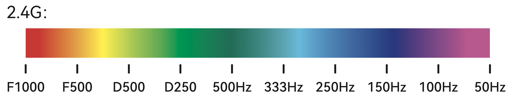

Rather than connected the TX to your computer, it's much quicker to just eject the SD card from the TX and insert it into your laptop.

The SD card was named "NO NAME" so, I renamed it "EdgeTX".

Note: the card is formatted as _FAT16_ - the one that came in my Boxer was a tiny 256MB card (anything less than 32GB is hard to find through retail channels these days). Remember that _FAT16_ is limited to 32GB so, if buying a replacement card, there's no point getting one bigger than 32GB.

Copy, the current contents to a backup folder and then delete everything on the SD card.

If you already have any custom scripts or models, you can copy them from the `SCRIPTS` and `MODELS` folders, that you backed up, at the end of the process.

* Go to [EdgeTX releases](https://github.com/EdgeTX/edgetx/releases), find the latest non pre-release version (v2.8.5 at the time of writing), go to the _Assets_ section and download `edgetx-firmware-vX.X.X.zip`.
* Go to [EdgeTX SD card releases](https://github.com/EdgeTX/edgetx-sdcard/releases), find the corresponding version of the SD card contents (v2.8.0 at the time of writing) and download the `bw128x64.zip` (the setup suitable for the 128x64 B&W display of the Boxer).
* Go to [EdgeTX SD card sounds releases](https://github.com/EdgeTX/edgetx-sdcard-sounds/releases) and find the corresponding sound pack version, i.e. v2.8.0 in my case. Expand the _Assets_ section and download the `edgetx-sdcard-sounds-en-X.X.X.zip` version (the default English sound pack, there are lots of others for different languages and for different English voices).

So, now you have three ZIP files, something like this:

* `edgetx-firmware-v2.8.5.zip`
* `bw128x64.zip`
* `edgetx-sdcard-sounds-en-2.8.0.zip`

```
$ mkdir edgetx-zips
$ cd edgetx-zips
$ mv ~/Downloads/edgetx-firmware-v2.8.5.zip .
$ mv ~/Downloads/edgetx-sdcard-sounds-en-2.8.0.zip .
$ mv ~/Downloads/bw128x64.zip .
$ mkdir sd-card
$ cd sd-card
$ unzip ../bw128x64.zip 
$ cd FIRMWARE
$ unzip -x ../../edgetx-firmware-v2.8.5.zip boxer-cbac106.bin
$ cd ..
$ unzip ../edgetx-sdcard-sounds-en-2.8.0.zip 
$ ls SOUNDS
README.txt  en
```
Notes:

* The sounds should have ended unpacked into a subfolder of `SOUNDS` called `en`.
* The `edgetx-firmware` firmware ZIP contains firmwares for many different TXes, I extracted the Boxer one (I'm not sure what the `cbac106` part of the name means).

I'd already setup two models so, at this point I copied them from my backup into the new setup:

```
$ cd edgetx-backup-20230812
$ cd MODELS
$ cp model04.yml model05.yml ../edgetx-zips/sd-card/MODELS
```

I ejected and reinserted the SD card in the Boxer and powered it up in bootloader mode.

I.e. push the T1 and T4 trim buttons (see diagram above) inwards towards each other with one hand and with your other hand press and release the power button (don't keep it held down like you do when normally starting the TX) and then release the T1 and T4 buttons.

It should show the _Bootloader_ screen and the _Write Firmware_ option should be selected so, just press the scroll wheel. Press it again when it shows you the name of the firmware file that its found, and press it down slightly longer to start the writing process. This takes a few seconds. Press the scroll key one more time to return to the _Bootloader_ screen and click _Exit_.

### Calibration

The TX restarts and (in my case) warned about bad radio data (presumably old data from the previous release) and then went straight to the calibration page for the sticks.

If the calibration step doesn't automatically show up at this point then press the _SYS_ button, use the _PAGE_ buttons to page to the _HARDWARE_ page and select the _[Calibration]_ option.

Do this as shown in the second image in OL's [gimbal calibration section](https://oscarliang.com/setup-radiomaster-boxer/#Gimbal-Calibration), i.e. move the sticks up and down, left and right rather than in a circular potion and twist the S1 and S2 pots (see diagram above) all the way clockwise and all the way counter clockwise. Do this slowly and deliberartely - I did each movement twice, you'll see tha tthe stick or pot position may jump the first time you do a particular movement but follows your movement properly the second time you do it.

### Mode

After updating the firmware, I found I got throttle warning in situations where the left stick was clearly at 0.

It turned out that updating the firmware had caused the _Mode_ setting to switch to mode 1 (where the right stick is used to control the throttle).

So, I had to press the _SYS_ button, use the _PAGE_ buttons to page to the _RADIO SETUP_ page and scroll all the way down to the _Mode_ option and update it from 1 to 2.

### Basic settings

Press the _SYS_ button, page to the _RADIO SETUP_ page and:

* Set _Date_ and _Time_.
* Set _Batt range_ to 6.4V – 8.2V (assuming you're using two 18650 Li-ion batteries to power the TX).
* Down lower, in the _Alarms_ section, set _Battery low_ to 6.4V.
* In the _Backlight_ section, set _Mode_ to _Keys_.
* Set the _Country Code_ to `US`, `EU` or `JP` as appropriate.
* Make sure the _Mode_ (the very last setting) is set to 2.

If you notice the _Owner ID_ option - this isn't for your name, it's an option specific to FrSky ACCESS ISRM modules and not relevant.

Important: now, page to the _HARDWARE_ page and scroll down to the _ADC filter_ and untick it - this is a setting that's appropriate for RC planes without an FC but is not appropriate for anything with an FC (as the FC handles the ADR filtering and does a better job of it than the TX can do).

### Models

Note: the `*` to the left of a model name indicates that it's the currently selected model (TODO: maybe add a picture).

I created two models:

* Press the _MDL_ button, scroll to a free slot, click the scroll wheel and and select _Create model_.
* Page to the _SETUP_ page and:
  * Set _Model name_ to "Sim".
  * Scroll all the way down to the _Internel RF_ section and set its _Mode_ to _OFF_ (if it's not already off). Do the same for the _Mode_ in the _External RF_ section below. This makes sure the power hungry radio hardware isn't on when using this model with simulators like Liftoff.

Back on the main _MODELSEL_ page, click on the entry for the "Sim" model (with the scroll wheel) and select _Copy model_ and then scroll to a free slot and click the scroll wheel again.

Now, select this model (by clicking it with the scroll wheel and selecting _Select model_ so, it is now marked with the `*`), page to _SETUP_ and:

* Rename it to "QAV-R 2 DC" (the name of the quad frame or given it some more personalized name).
* Scroll down to _Internel RF_ section and set the _Mode_ to _CSRF 400k_.

When the model, that has the internal RF enabled, is selected, you'll hear the internal fan spinning up to keep it cool.

### Updating the TX's ELRS firmware

Sources: OL's [complete guide to ELRS flashing and set up](https://oscarliang.com/setup-expresslrs-2-4ghz/), OL's much shorter [update guide for the Radiomaster Zorro internal ELRS module](https://oscarliang.com/update-zorro-elrs-firmware/), JB's [getting started guide to ELRS for both TX and RX](https://www.youtube.com/watch?v=J3Hg2f7RL1A), JB's [speed-run version of his getting started guide](https://www.youtube.com/watch?v=MFFUsN9ZHSU), JB's [ELRS model match explanation](https://www.youtube.com/watch?v=3S6eUWCqvUY)

We updated the TX firmware, i.e. EdgeTX but the internal radio module that communicates with the quad has its own firmware called ExpressLRS (ELRS).

Go to [ExpressLRS Configurator releases](https://github.com/ExpressLRS/ExpressLRS-Configurator/releases) and download the latest version for the Mac (`ExpressLRS-Configurator-1.6.0.dmg` at the time of writing). Install the configuration, then find _ExpressLRS Configurator_ in your _Applications_ folder, right click is and select _Open_ (for the same reasons as outlined before for previous tools). For some reason it didn't start the first time I tried this but it worked fine on trying again.

* In the _Target_ section, select _RadioMaster 2.4GHz_ for _Device category_ and _RadioMaster Boxer Internal 2.4GHz TX_ as the _Device_.
* Select _EdgeTxPassthrough_ as the _Flashing Method_ (once you've set things up once, you can do later updates using the WiFi method).
* Under _Regulatory domains_ select _EU_CE_2400_ if you're in the EU otherwise select _ISM_2400_.
* Enter a _Custom binding phrase_, choose anything unique, you'll use the same phrase when setting up the quad RX and only a TX and RX that have the same binding phrase can talk to each other.

**Update:** I didn't want to set the TX up to connect to my home WiFi network but in the end I had to do this for the RX so (while not required for the TX), I went back and also:

* Ticked _HOME_WIFI_SSID_ and entered the name of my home WiFi network.
* Ticked _HOME_WIFI_PASSWORD_ and entered the relevant password.

Note: the binding phrase can be whatever length you want (as internally it's just stored as a hash).

Then turn on your TX, connect it to your laptop by USB and on the TX, select the _USB Serial (VCP)_ option.

Back in the _ExpressLRS Configurator_, press the _FLASH_ button and it should flash the update (with your passphrase and other settings) to your TX's RF module.

Once complete (this step is far quicker since the introduction of cloud builds in ELRS v3.3.0), the configurator encourages you to update your TX's ELRS lua script.

So, click the _DOWNLOAD LUA SCRIPT_ and save the `elrsV3.lua` file somewhere.

Disconnect your TX from your laptop and then reconnect it, this time selecting the _USB Storage (SD)_ mode. Open the drive corresponding to the TX's SD card (I called mine "EdgeTX" when setting things up above). Open the _SCRIPTS_ folder, then _TOOLS_ and copy the `elrsV3.lua` file, that you downloaded, into this folder. If there's was already an older ELRS script there make sure to remove it.

Eject the TX drive and disconnect the TX from your laptop. Press the TX's _SYS_ button and you should get to the _TOOLS_ page and see _ExpressLRS_ there now - this is the LUA script you just installed. Click it and (after a short loading step), scroll to the bottom and you should see the updated version shown there (`3.3.0 CE_LBT` in my case).

Note: to exit the _ExpressLRS_ LUA script, I had to long press the _RTN_ button - short pressing it just caused the script to reload.

Note: after the flashing step above my TX was unresponsive to button presses until I disconnected it from USB.

### Updating the RX's ELRS firmware

Just as we flashed the internal RF module on the TX by using EdgeTX passthru, we're going to connect to the FC and use BF passthru to flash the RX module.

Return to _ExpressLRS Configurator_. Assuming, you've just finished flashing the TX's RF module, press the _BACK_ button and return to the main _Configurator_ page.

* This time select _BETAFPV 2.4GHz_ as the _Device category_ and _BETAFPV SuperD 2.4GHz RX_ as the _Device_.
* Select _BetaflightPassthru_ as the _Flashing Method_.
* Leave the _Regulatory domains_ and _Custom binding phrase_ as before, i.e. use the same values as for your TX.
* Connect your FC to your laptop with USB (you don't also need battery power).
* In the _Actions_ section, it's supposed to automatically detect the serial port corresponding to your FC but I had to manually select the device clearly labelled as Betaflight in the dropdown list.
* Then press the _FLASH_ button.

At this point it complained `Wrong target selected your RX is 'HAPPYMODEL_EP_DUAL_2400_RX', trying to flash 'UNIFIED_ESP32_2400_RX'`.

And indeed, Happymodel has an extremely similar model - the [Happymodel EP1 Dual](https://www.happymodel.cn/index.php/2022/09/01/happymodel-ep1-dual-receiver-true-diversity-2-4ghz-expresslrs-rx/).

I don't know what the relationship between BetaFPV and Happymodel is but it seems to be a common thing for BetaFPV models to initially come with firmware labelled as being for Happymodel.

So, I went back to the main _Configurator_ page and ticked _Force Flash_ and pressed _FLASH_ again.

Again things failed, with output like this:

```
No CLI available. Already in passthrough mode?, If this fails reboot FC and try again!
...
.
.
.
.
```

And after output dots for a while, it gave up.

I tried various things, including trying to update it as if it were the Happymodel model that it's current firmware claimed it was and trying to update it via WiFi by connecting to it in access point mode (rather than connecting it to my home WiFi network which is what I eventually did).

**Update:** it may be that holding down the tiny boot button on the RX, as it's powered up, might have resolved things - see these [Betaflight passthru notes](https://www.expresslrs.org/software/updating/betaflight-passthrough/). However, in the end, despite initial reservations, I was satisfied with the WiFi approach described in the next section.

**Update 2:** the most bomb proof way to update an RX is to do the updating _before_ soldering it up to the FC using something like the BetaFPV ExpressLRS [recovery dongle](https://betafpv.com/products/expresslrs-recovery-dongle). The electronics of this dongle are completely generic - it's just equivalent to a 5V FTDI breakout, like this [one](https://www.sparkfun.com/products/9716) from Sparkfun. But the BetaFPV dongle is very cheap and, even better, comes with a pogo-pin adapter (needed for connecting to something like the RX without having to solder down connections). I have a pogo pin adapter (bought [here](https://www.aliexpress.com/item/4001197263516.html) on AliExpress) and an FTDI breakout - while a full FTDI breakout is a bit more capable (it also breaks out RTS and CTS), the combined cost is far more than the BetaFPV dongle. The boot button is definitely used when using this approach, see RC Video Review's [video](https://www.youtube.com/watch?v=AH6e-ItZCo0) on how to do things using the BetaFPV dongle.

### Updating via WiFi

In the end, I went down the route that I'd wanted to avoid initially.

Plug out your FC and reconnect it, the LED on the RX brieftly flashes different colors, then slowly flashes orange for about 60 seconds, then flashing green.

When it's flashing orange, it's waiting for a TX to connect, when it starts flashing green it's switched into WiFi upgrade mode.

Important: remember this when you're out in the field with your quad - if you power up the quad and then wait too long before also turning on your TX then it won't be able to connect to the RX because it's gong into this WiFi mode - just plug the quad out and in to force the RX to restart.

When the RX is in WiFi upgrade mode, look at the WiFi networks that your laptop can see, it should now be able to see _ExpressLRS RX_ - which is the RX. Change your laptop network to this one using the password `expresslrs` and it should ask you to join the network:

,

Switch to the _WIFI_ tab, click in the _WiFi SSID_ field and select your home network, then the password for your home network in the _WiFi password_ field and click _Confirm_.

It'll briefly show a dialog telling you that the RX will now connect to your home network and that you can connect to it then using the link <http://elrs_rx.local/>

Then it disconnects and you should reconnect your laptop to your home network (if it didn't just do that automatically).

Return to _ExpressLRS Configurator_ and switch the _Flashing Method_ to _WIFI_ and scroll down to the bottom of the _Configurator_ page and if all's gone well you should see something like this:


Click _SELECT_ for your device and then click _FLASH_.

The process took around 12 seconds with output like this:

```
Total   Spent    Left  Speed
  0     0    0     0    0     0      0      0 --:--:-- --:--:-- --:--:--     0
 15 1019k    0     0   15  162k      0   385k  0:00:02 --:--:--  0:00:02  387k
 24 1019k    0     0   24  246k      0   183k  0:00:05  0:00:01  0:00:04  183k
 33 1019k    0     0   33  337k      0   139k  0:00:07  0:00:02  0:00:05  139k'
...
 76 1019k    0     0   76  781k      0   106k  0:00:09  0:00:07  0:00:02 91931
 85 1019k    0     0   85  868k      0   103k  0:00:09  0:00:08  0:00:01 90'
100 1019k    0     0  100 1019k      0  93861  0:00:11  0:00:11 --:--:-- 73773
100 1019k    0     0  100 1019k      0  86093  0:00:12  0:00:12 --:--:-- 58210
100 1019k  100   114  100 1019k      9  85141  0:00:12  0:00:12 --:--:-- 49846

UPLOADING TO: http://192.168.0.235/update

UPLOAD SUCCESS
 [32mUpdate complete. Please wait for the LED to resume blinking before disconnecting power. [0m
```


The warning was a little confusing as the LED started flashing immediately, but a few seconds later the green _Success!_ message appeared which looked to be the end of the process.

Conclusion: I found this whole proces underwhelming. I had to redo various steps several times before they worked, the RX forgot the home WiFi network at least once (with it returning to access point mode) and it would sometimes switch out of WiFi upgrading mode (and return to flashing orange). This combined with having to wait a minute after restarting the RX made the process a bit exasperating.

### Enabling WiFi via the TX

Initially, I set up the TX so that it didn't connect to my home WiFi network. But after setting up the RX to connect like this, I went back (and as noted above) reflashed the TX with the details for my home WiFi network.

Once done, I could go to the _ExpressLRS_ LUA script on the TX, go down to _WiFi Connectivity_, click it and then click _Enable WiFi_, this pops up an odd little dialog showing `WiFi Running... [X]` where the `X` bit flickered madly. But once enabled the TX shows up in _ExpressLRS Configurator_:


The only way to exit the WiFi dialog on the TX seemed to be press _RTN_ and exit WiFi mode, it didn't seem to be possible to leave it running in the background.

Below _Enable WiFi_, is an _Enable Rx WiFi_ option - this can be used if the TX is connected to an RX to tell the RX to go into WiFi mode.

As with the RX, I didn't find the TX WiFi entirely reliable - sometimes it disappeared only to reconnect again a few seconds later.

Future updating
---------------

I hope future updating will go a bit more smoothly - I don't plan to try EdgeTX or BF passthru again. Instead, I'll push the TX into WiFi mode via the _ExpressLRS_ LUA script and either also use the LUA script to push the RX into WiFi mode or simply wait it to enter WiFi upgrading mode automatically after being left 60 seconds after powering up (without being connected to by the TX).

When connected to your WiFi network, you should be able to access the RX and the TX via your browser with these links:

* RX: <http://elrs_rx.local/>
* TX: <http://elrs_tx.local/>

Connecting TX and RX
--------------------

The whole point of this, in particular setting matching binding phrases on the TX and RX was to get the two to talk to each other.

With the TX already powered up, power up the quad (USB power is enough).

The LED on the RX should briefly alternate through its "rainbow" power on colors and then go a solid red or actually any color on the spectrum - the important thing is that its not blinking. The color indicates the current packet rate value:



Note: this diagram is one of the very few useful bits of information in the BetaFPV manual for the SuperD diversity RX.

If you look at the TX LCD, you'll now see a set of bars on the main screen to the right of the little block showing the current voltage of the TX battery, these show that it's connected to the TX. The bars are just a static icon - they don't go up or down to show signal strength.

**Update:** it's not an icon - if you move far enough away, you'll eventually see the biggest bar dissappear.

We'll actually change the rate later 

If you unplug the quad, the TX will announce "telemetry lost" and if you plug the quad back in it'll eventually announce "telemetry recovered". In the field "telemetry lost" would be a very bad thing and gnerally mean the quad has flown out of radio distance and you've lost control of it.

Note: if you move the TX too close to the RX, the TX may also report "telemetry lost" - this is because the signal is actually too strong and "flooding" the RX.

In the next section, we'll get to the _Receiver_ tab in _Betaflight Configurator_ and see somewhat more impressive evidence that the TX can now talk to the RX.

BF RX setup
-----------

When wiring the RX up to the FC, we made sure to wire it up to UART6 which is the BF default for the RX. If you go to the _Ports_ tab, you'll see _Serial RX_ is enabled for this UART:


If for some reason, the RX had to be connected to some other UART, then you'd have to disable _Serial RX_ for UART6 and enable it for the actual one being used.

### BF Receiver tab

Now, we're going to really see that the TX is talking to the RX and has the ability to control it.

Power up your TX, _then_ connect your quad to your laptop via USB and check that the LED on the RX has stopped blinking at that TX shows the little connected icon (the bars mentioned above).

Then connect to the FC with _Betaflight Configurator_, switch to the _Receiver_ tab and move the sticks on your TX about - you should see the movement reflected in the bars to _Roll_, _Pitch_, _Yaw_ and _Throttle_ and you should see the quad in the _Preview_ panel moving as you'd expect in response to the stick movements.

Now, move each stick all the way up and down and left and right. You might think, after the calibration process done earlier, that the sticks would move from the 1000 to 2000 values that BF wants. But they don't - most of mine moved from 989 to 2012.

So, on the TX, press the _MDL_ button, make sure the correct model is selected (i.e. has the `*` to the left of its name). Then page to the _OUTPUTS_ page and:

* Click _CH1_, select _Edit_, scroll to the _Min_ option and click again.
* Move the right stick to the bottom-left corner.
* While watching the _Roll_ bar in _BF Configurator_, adjust (i.e. scroll) the _Min_ value until the _Roll_ bar reaches 1000.
* Click to finish the adjustment of _Min_.

That's it, now, do push the right stick to upper-right corner and adjust the _Max_ value in the same way until the _Roll_ bar reaches 2000.

On my TX, the final _Min_ and _Max_ values were -97.8 and 97.7 respectively.

If you find the value shown in _BF Configurator_ jumping around when you push the stick into a corner, try releasing the stick and pushing it there again or instead of using a corner push it to one of the  center markers around the edge of the gimbal (or anywhere where things are stable, just as long as the stick is at maximum on the particular axis that's relevant).

Note: JB favors pushing towards the center markers while OL favors the corners.

Now, do the same for _CH2_, _CH3_ and _CH4_ - you don't have to know which channels maps to which stick, just select a channel, e.g. _CH2_, look at the &mu;s value in the upper-right corner and move each stick in turn when you see the &mu;s value change you know you've got the relevant stick. Push the stick to the lower-left and do the process above, i.e. adjust _Min_ and look to see which bar in _BF Configurator_ changes and adjust things until that bar reaches 1000. And so on.

**Update:** I don't think you even have to look at _BF Configurator_, you just have to look at the &mu;s value and adjust the _Min_ and _Max_ values so that this value shows 1000&mu;s for _Min_ and 2000&mu;s for _Max_ when the relevant stick is pushed to its minimum and maximum values. Given this, it seems it _should_ be possible for EdgeTX to do all this for you as part of the calibration process (and be specific to the TX rather than individual models).

Note: when adjusting the values on the TX, I found that typically e.g. 97.7 to 97.9 would map to 2000 so, I'd choose the value if the middle of this range, i.e. 97.8 for this example.

My final values were -97.8 and 97.7 for all channels.

#### Thresholds

Now, the endpoints have been corrected, the thresholds can be adjusted from their conservative values (that assume you may not have gone through the process above).

In _BF Configurator_, change:

* The _'Stick Low' Threshold_ from 1050 down to 1010.
* The _'Stick High' Threshold_ from 1900 up to 1990.

And, as always, remeber to hit _Save_.

### ELRS packet rate

See OL's section on [packet rate](https://oscarliang.com/setup-expresslrs-2-4ghz/#Packet-Rate) if you want more details.

On the TX, press the _SYS_, click the _ExpressLRS_ LUA script - you should see a little `C` if your TX is connected to your RX.

Now, click the _Packet Rate_ option and adjust the rate to 150Hz.

The TX should announce a few warnings before announcing "telemetry recovered" (meaning "all's good") and the RX should become a purple color (see the color to frequency diagram above).

Note: JB suggests going all the way down to 50Hz but when I tried that things seemed to work, _but_ the radio would never announce "telemetry recovered" and the `C` would never show up again. 50Hz was the only problematic frequency - no other frequency had this issue. So, I switched to the next lowest _normal_ rate, i.e. 150Hz - 100Hz and 333Hz are special [_full resolution switch configuration modes_](https://www.expresslrs.org/software/switch-config/#full-resolution-switch-configuration-modes) so ignore them (for more see the ExpressLRS [documentation](https://www.expresslrs.org/software/switch-config/#full-resolution-switch-configuration-modes)). I don't know if the 50Hz issue is specific to my RX or to my version of ELRS or something else.

Note: by default my _Packet Rate_ was set to _F1000_ - this has the fastest packet rate but the shortest range - we want the opposite (long range with no noticeable change in "feel" for anyone other than expert pilots).

Once the _Packet Rate_ is set, go down to the _Switch Mode_ option and make sure it's set to _Wide_ (for more on wide and hybrid, see the [switch mode chapter](https://www.youtube.com/watch?v=J3Hg2f7RL1A&t=2058s) of JB's "ExpressLRS definitive getting started guide").

Now, to to the _TX Power_ section, click it and adjust the _Max Power_ value. Mine showed _ERR_ initially and I suspect this was because the radio was configured with a higher power setting than the 100mW allowed in the EU.

I adjusted my _Max Power_ to the 100mW maximum allowed in the EU and JB suggests 250mW for the US (I believe 250mW is anyway the max for the internal ELRS module).

TODO: move this section somewhere more sensible above - it's in the middle of unrelated _BF Configurator_ stuff.

```
########################################################################
```

I've finished <https://oscarliang.com/setup-radiomaster-boxer/> and OL's Zorro guide.

But come back to <https://oscarliang.com/setup-expresslrs-2-4ghz/#Betaflight-Setup-for-ExpressLRS-Receiver> and make sure FAILSAFE etc. are done if they weren't part of JB's video.

Also look if there's any additional info in JB's three other guides linked to above in the ELRS section.

```
########################################################################
```

Presets
-------

[`30-pre-elrs-presets-etc.txt`](30-pre-elrs-presets-etc.txt) contains my configuration _before_ I started applying JB's suggested presets (32m 30s mark in video 3 of his 2022 build series).

#### ELRS Presets

In _Betaflight Configurator_, go to the _Presets_ tab, enter "ELRS" in the search field and select the preset for the frequency you chose (for me that was 150Hz, you might have chosen 50Hz if it worked for you).

Note: in the preset dialog, it includes the warning "make ABSOLUTELY SURE that the OpenTx or EdgeTx Hardware ADC Filter is un-checked!" We already took care of that when setting up the TX.

Then under options, I just chose _Serial, separated Rx_ and the _connection method_ and _Single Cell value_ under _Voltage readings_. I did not choose any of the _Fine-tuning_ options.

Then I clicked _Pick_ and then _Save and Reboot_.

This resulted in the following changes:

```
set feedforward_smooth_factor = 30
set report_cell_voltage = ON
```

At other frequencies, more things are changed, e.g. at 250MHz the same options result in:

```
set feedforward_smooth_factor = 45
set feedforward_averaging = 2_POINT
set feedforward_jitter_factor = 6
set report_cell_voltage = ON
```

Selecting _serial_ as the connection method resulted in no change (as serial was already the default).

By default `report_cell_voltage` is off but as JB points out, you want it on. See OL's [explanation](https://oscarliang.com/averaged-cell-voltage-crossfire/) for more details. In short, the telemetry value for the battery voltage by default gives you the total voltage, but turning this setting on gives you an average cell voltage. This means that as you get to the end of your flight, you'll always see the voltage nearing 3.5V, and know it's time to come into land, rather than seeing a value that depends on the number of cells in the battery you're currently using (around 14V when flying with a 4S battery or 21V with a 6S).

TODO: I suspect if one sets `report_cell_voltage` one gets _both_ the total and the average - see TODO in telemetry section below.

For details on what every single option affects, including the fine tuning ones for racing, freestyle etc., see [`elrs-preset-options.md`](elrs-preset-options.md).

It was only at this point that I noticed that _Pick_ just outlines a given preset in green - it's pressing _Save and Reboot_ that causes it to be marked with a star (and appear from then ahead of all the non-stared presets).

Rates
-----

Sources: OL's ["Demystifying FPV Drone Rates"](https://oscarliang.com/rates/) and JB's ["Find YOUR perfect rates! With science!"](https://www.youtube.com/watch?v=Ql62iRkLX3s) video.

If you go to the _PID Tuning_ tab in _BF Configurator_, switch to _Rateprofile Settings_, you'll see there's a dropdown called _Rate Types_.

Basically, this allows you to select between different ways of defining the curves you see in the _Rates Preview_ panel below.

If we ignore the throttle, you'll find, when you're flying, that the you'll spend most of your time making tiny movements around the center point of the sticks - you'll almost never push them to their extremes. In general (as a beginner), you'd like far more control towards the center of the sticks - and you can configure this through the curves. JB does a good job of explaining this in an intuitive manner in the "What are rates?" chapter of his "find your perfect rates" video (see link above).

Over time people have come up with what they feel are  more intuitive ways to specify the curves in terms of a set of numbers - these different approaches are what you find in the _Rate Types_ menu.

So, people have gotten used to different systems over time and may want to stick with them but basically _Betaflight_ rates was the classic system of expressing rates and then in BF 4.2 they introduced a more intuitive system called _Actual_ rates. So, it comes down to a choice between one or the other. As OL puts it:

> Betaflight Rates are slightly more complex [than Actual rates] as the three terms are interdependent, making them less intuitive to use. However, as the oldest rate system in Betaflight, many experienced pilots continue to rely on them.

JB has more on why _Betaflight_ are hard to work with and why _Actual_ rates are more intuitive in his ["what are ACTUAL RATES and how to convert them"](https://www.youtube.com/watch?v=m3A9xgRmcws).

So, if you're starting out, then _Actual_ rates seem the obvious choice and it's the system JB uses in all his videos since _Actual_ became available.

Nearly, everything I've done has fairly closely followed along with his [2022 drone build for beginners](https://www.youtube.com/playlist?list=PLwoDb7WF6c8neIAQBkchfiXf-C8KbzG5M) series.

But here, I'm going to do something different - he uses presets to quickly chose a set of canned rates - this may be quick but it's opaque and makes one think the process may be more complicated than it is.

So, instead, of a preset, find the _Rates Types_ dropdown, as described above and select _Actual_.

These are the rates you get if you try the presets that JB suggests:

_Headsup racing rates_


_JB rates_


As JB explains, as a beginner you're probably going to want something closer to the more precise racing rates than to the JB's own rates that allow for extreme freestyle moves.

After looking at these and watching his "pefect rates" video and looking into pages and videos on beginner rates, I went for this super conservative setup:


All you have to do is select _Actual_ as the _Rates Types_ and then enter the numbers shown for _ROLL_, _PITCH_ and _YAW_ - try adjusting them and see how they affects the curves.

And _Save_ - done.

These are the setting changes that result:

```
set pitch_expo = 76
set pitch_rc_rate = 10
set pitch_srate = 40
set roll_expo = 76
set roll_rc_rate = 10
set roll_srate = 40
set yaw_expo = 64
set yaw_rc_rate = 15
set yaw_srate = 35
```

As you can see, it's three numbers each for pitch, roll and yaw. The setting `rates_type` isn't changed as its default is `ACTUAL`.

Acro trainer mode
-----------------

OL explains the various BF flight modes in the [flight modes](https://oscarliang.com/betaflight-modes/#Flight-Modes) section of his guide to BF modes.

The ones we're interested in are:

* Acro mode - this is the no hand-holding mode that experienced pilots use.
* Angle mode - this is a much easier to fly self-levelling mode with various limits to ensure things don't get out of control and 
* Acro trainer mode - this is a form of acro mode with various limits that prevent flipping over and behaviors that are likely to end in a crash while learning.

Lot's of videos discourage you from using _angle_ mode as it's felt to teach you bad habits that you'll have to unlearn once you switch to acro but it's the safest thing for your first flights when you're still working out if everything is setup correctly.

The number of features that BF supported grew so large that including them all outgrew the memory available on many FCs. So, with BF 4.4 only a certain subset of features is included by default.

Acro trainer isn't one of these features so, if you want it you have to do the same steps as when updating the firmware. Except this time go to the _Build Configuraton_ section of the _Firmware Flasher_, click in the _Other Options_ section and add _Acro Trainer_ from the dropdown list of choices - and then flash the firmware as before.

**Important:** make sure _Full chip erase_ is disabled - if, like me, you ever flipped this to enabled in order to unbrick an invalid setup, then unflip it in order not to lose existing settings.

AUX switches
------------

Source: the ["NON-DJI ONLY: Set up Aux switches and Modes"](https://www.youtube.com/watch?v=5ke6LabvtGM&list=PLwoDb7WF6c8neIAQBkchfiXf-C8KbzG5M&index=3&t=2079s) chapter of JB's of the third video ("Configuration and Setup") in his "2022 Freestyle FPV Drone Build" series.

Turn on your TX, press _MDL_ and page to the _MIXES_ screen. In JB's video the channels after 1 to 4 (which are assigned to the sticks) are free. Oddly, on my setup, channels 5 to 10 were already assigned to switches `SA` to `SF`.

The EdgeTX interface is a bit confusing here, clicking an entry allows you to "drag" the switch associated with that entry either to a free slot or to an existing slot (in which case multiple switches become associated with a single channel and the value of the most recently flipped switch becomes the channels value).

Anyway, if you accidentally click an entry, just press _RTN_ to cancel dragging.

Instead, long click an entry to being up a set of options that includes _Edit_ and _Delete_ - the easiest thing is just to delete the entries 5 to 10 if, as I found, they've already been assigned default values.

The TX can transmit value on 12 channels (the number of available channels is a function of various factors but for us it's 12). The first four are already set up to communicate the stick values. And the remaining eight are free for us to associate with whatever we want. Here we're going to associate them with switch positions and then _BF Configurator_ we're going to associate those positions with various functions (like arming the quad).

So, the channels you see on the _MIXES_ screen map to the values you see in the _Receiver_ tab of _BF Configurator_ like so:

| EdgeTX | BF       |
|--------|----------|
| CH1    | Roll     |
| CH2    | Pitch    |
| CH3    | Yaw      |
| CH4    | Throttle |
| CH5    | AUX 1    |
| CH6    | AUX 2    |
| CH7    | AUX 3    |
| CH8    | AUX 4    |
| CH9    | AUX 5    |
| CH10   | AUX 6    |
| CH11   | AUX 7    |
| CH12   | AUX 8    |

Note: that roll, pitch etc. are mapped to those particular channels is just convention and it happens that the TX and _BF Configurator_ agree on the convention but some TX manufacturers assume a different convention and for these case you'd have to change the _Channel Map_ setting in _BF Configurator_ to match.

So, we're going to associate switches with with AUX 1 to 3, i.e. `CH5` to `CH8` in EdgeTX.

So, on the _MIXES_ page (assuming you've deleted any existing assignments for `CH5` and up) and:

* Go to `CH5`, click it (if the slot is free, you don't have to long click), go to _Source_, click it and press switch _SE_, click the scroll wheel again (to stop the _Source_ value blinking) and press _RTN_ twice to get back to the main _MIXES_ page.
* Then do the same for `CH6`, `CH7` and `CH8` but use switches _SF_, _SC_ and _SD_ respectively.

Note that _SC_ is a three position switch and _SD_ is a two position switch.

We've completed the setup on the TX side (just press _RTN_ a few times to get back to the main EdgeTX screen).

Now, open _BF Configurator_, go to the _Receiver_ tab and try using switches _SE_, _SF_, _SC_ and _SD_ and see that the values of the expected AUX channels also change between 1000 and 2000 (or in the case of _SC_ the middle position maps to ~1500).

Then switch to the _Modes_ tab and go to _ARM_, click its _Add Range_ button - see the little yellow marker below the bar, initially its at 1500, click the _SE_ switch in and out and see the marker move about. Now, with _SE_ pressed in, so the marker is at 2000, drag the yellow bar so the center of the bar is above the marker (or, as 2000 is too near the upper end of the scale, as near as possible).

Note: you can adjust the size of the yellow bars - reducing their size would make sense if you wanted to associate lots of positions on a single channel with different modes but isn't needed here.

Now, go to _BEEPER_ and do the same, this time pressing _SF_ (you don't have to keep it pressed while dragging the yellow bar - you just need to know where the marker will be when it's pressed).

Now, go to _FLIP OVER AFTER CRASH_ and set it to be enabled when _SD_ is down.

Now, go to _ANGLE_ and flip the _SC_ switch to its down position and place the yellow bar. Finally, go to _ACRO TRAINER_ (which will only be listed if you reflashed the firmware, as discussed above, with _Acro Trainer_ added as an option) and flip _SC_ not to its middle position and place the yellow bar.

Press _Save_ after setting up the modes and then enable the _Hide unused modes_ toggle.

Now, try pressing _SE_ and the other switches, you should see the _ARM_ go red when you press _SE_ (but with "(DISABLED)" shown as you can only really arm once various checks are passed, including not being connected to USB), _ANGLE_ and _ACRO TRAINER_ should go yellow as you flip _SC_ and _FLIP OVER AFTER CRASH_ and _BUZZER_ when you press _SD_ and _SF_ respectively.

as you might have noticed, _SC_ is associated with two flight modes (and when no flight mode is explicitly selected BF defaults to _ACRO_) so:

* _ACRO_ flight mode is used when _SC_ is up (this position isn't mapped to any mode so, BF uses the default).
* _ACRO TRAINER_ flight mode is used when it's in its middle position,
* _ANGLE_ flight mode is used when it's down.

Make sure to flip _SC_ all the way down to _ANGLE_ mode for your first flights.

TODO: get some screenshots of what you see in the goggles when you arm/disarm, change flight modes or switch on the buzzer.

### Beeper

If you power the quad from your charger (or a battery), you can also test the beeper.

Press down the _SF_ button and it should make a very loud beeping sound that will help you find it when it crashes.

Note: up until this point I hadn't removed the "REMOVE SEAL AFTER WASHING" sticker on the beeper (washing is done as part of the production process after soldering in order to remove flux). Removing it makes a surprising difference to the loudness of the beep.

### AUX 1

Normally, you're free to assign AUX channels to whatever function you want. However, you must assign ARM to AUX 1 (and the armed state must be set to ~2000) - as we did above.

This is because the RX wants to know the armed state and assumes it's associated with AUX 1. See the [mode section](https://www.expresslrs.org/quick-start/pre-1stflight/#modes) of the ELRS first-flight checklist for an explanation of why using another channels is a bad idea and for more details, including further assumptions like unarmed being ~1000 and armed being ~2000. This ELRS documentaion notes that there are only between 1 and 4 bits available per AUX channel - that's not case for us as we're using _wide_ switch mode (this was covered when doing the main ELRS setup).

**Question:** why does the RX look at this channel, surely the FC can communicate the armed state to the RX using CRSF?

### AUX 11 and 12

In our setup, there are only eight useable AUX channels, but in the _Receiver_ tab, you'll see that _AUX 11_ and _AUX 12_ may be around 1940 and 2010 respectively (these are the values they have when my Radiomaster Boxer TX is about 1m away from the BetaFPV SuperD ELRS RX) and the values may be jiggling around.

Generally, it's the TX that then generates the value you see for a given channel. However, for _AUX 11_ or _AUX 12_, it's the RX generating theses values - it's using them to indicate link quality (LQ) and received signal strength (RSSI) respectively.

Using AUX channels is essentially a backup way to make these values available and only of interest to users of the DJI system (who don't want to [root](https://oscarliang.com/fpv-wtf-root-hack-dji/) them so, they can take advantage of full BF OSD support). The RX talks to the FC, using a protocl called CRSF, and communicates LQ and RSSI (and lots of other information) to the FC this way. For everyone, except users of unrooted DJI goggles, it's this data, rather than the AUX channel data, that's displayed as the _Link Quality_ and _RSSI dBm_ values in the OSD.

Note: there are actually two RSSI values - _RSSI dBm_ and the confusingly named _RSSI Value_ - the second is a historical oddity and should be ignored whenever you have a choice between the two (e.g. when setting up the values displayed in your OSD).

For everyone, except users of DJI goggles, go to the _Receiver_ tab in _BF Configurator_ and make sure:

* The _RSSI_ADC_ toggle is set to disabled.
* _Disabled_ is selected in the _RSSI Channel_ dropdown.

For even more information on LQ and RSSI and how they related to each other, see the ELRS page on [signal health](https://www.expresslrs.org/info/signal-health/). However, the "RSSI Value OSD field" section is a bit confusing - it seems to suggest that setting _RSSI Channel_ to _Disabled_ in _BF Configurator_ is not recommnded - this is _just for DJI users_ who have to use one of these channels if they want LQ or RSSI information in their googles.

DJI setup
----------

We've largely been following JB's "2022 Freestyle FPV Drone Build" but at this point, he also covers setting up things for DJI and even though DJI is a digital system and we're also using a digital system (Walksnail) there's no additional useful information in the DJI specific chapters.

OSD part 2
----------

After the DJI sections, JB gets on to setting up the OSD for analog. Oddly, this section is more relevant to Walksnail that the corresponding DJI one. This is because the DJI system is more locked down and can't take advantage of the full _BF_ OSD support whereas Walksnail is more open and can take advantage of all the features that _BF_ already supported for analog systems.

However, we've already set up the OSD, driven by OL's guides (TODO: <link-here>). So, nearly all of JB's analog OSD chapter can be ignored BUT at 55m 28s he discusses the meaning and limits for e.g. battery cell voltage and link quality and corecting the ELRS RSSI warning.

### Battery voltage

We already setup single cell battery voltage above and now JB notes that once you see it hitting 3.5V it's time to come home.

Note: 3.5V is also the value OL recommends in the ["when to land"](https://oscarliang.com/lipo-battery-guide/#When-to-Land) section of LiPo battery guide. He also has a whole ["Monitor Battery Voltage & Decide When to Land"](https://oscarliang.com/monitor-measure-battery-voltage-alarm-drone/) page where he discusses monitoring the voltage _and current_ via FC, OSD and TX and the related alarms.

Note: OL states that the 3.5V rule applies for all cell counts except 1S. 1S suffer extreme voltage sag and so, it's normal to keep flying them until 3.2V (they'll recover to 3.5V after resting for 10 to 15 mins).

### RSSI OSD alarm

When setting up the OSD, JB sets `osd_rssi_dbm_alarm` to -110.

You can see what this 110 value means on OL's ["LQ and RSSI explained for ELRS" page](https://oscarliang.com/lq-rssi/). The 110 value is at the limit of what OL considers safe for 50Hz.

OL suggests a universal value of 95 which is conservative and safe for all ELRS packet rates.

Basically, you just take the dBm value shown for your packet rate in OL's [lowest RSSI section](https://oscarliang.com/lq-rssi/#The-Lowest-RSSI), and add 10 as a safety margin. So, e.g. for 150Hz the value is -112dBm, this becomes (-112 + 10), i.e. -102.

I went to the _CLI_ tab and set the value to -100 for my 150Hz setup:

```
set osd_rssi_dbm_alarm = -100
save
```

Setup (almost) complete
-----------------------

JB then covers VTX tables for an analog VTX. This isn't relevant for Walksnail or other HD system (thankfully the digital systems are much smarter/convenient/safer when it comes to VTX channel selection).

So, at this stage, the setup of _FC_ and the other components is complete.

The last chapter (in JB's "Configuration and Setup" video) covers some minor points - setting how flat on the ground the quad has to be before the FC will let you arm and using the motors as beepers.

As we've got a real beeper, we don't need to configure the motors to act as beepers (which one could do using the _Dshot Beacon Configuration_ panel on the _Configuration_ tab).

But, if you want, go to the _Configuration_ tab and, in the _Arming_ panel, change the _Maximum ARM Angle_ from 25 to 180 so, you can arm even when your quad is at a very odd angle. Then _Save and Reboot_.

That's it - now it's time to finish assembly and finally fly the quad.

The final config can be found [here](ready-to-fly.txt).

Final assembly
--------------

In the end, I decided not to install the Mambe interference shield. If it hadn't required soldering to a GND connection on the FC:

[xxx](images/mamba-isolation-to-fc.webp) TODO: clip and convert to PNG.

Question: if you used an Flywoo insulation board could you put this directly above the ESC with no o-rings?

**Note:** the stack is already at it's limit - a insulation board and interference would only add 1mm but would it push things over the limit - the lock nuts are already only just on.

---

Many stores, advertise low-profile locknuts, I bought some low-profile ones and some normal-profile ones from online FPV stores, both came in in a bag with no branding. I also bought a pack of branded normal-profile ones from a local hardware store.

My calipers report:

* 3.66mm for the low-profile ones.
* 4.05mm for the no-brand normal-profile ones.
* 3.94mm for the branded low-profile ones.

So, there's a negligible 0.3mm difference between the so called low-profile ones and the branded normal-profile ones.

In the end, I used the branded ones bought in a hardware store as I thought they were the least likely to be made of [chinesium](https://www.reddit.com/r/Chinesium/).

I screwed them down with a 5.5mm socket driver. It'd be cool to have some feedback on torque and how many turns you've made to make installing it easier to install all four identically.

I tigthened them to the point such that I could still push down on the FC and get a small gap (less than 1mm)  between nut and gummy.

No threadlocker was used with these - they're locknuts and don't need additional "help".

---

Of the screws that came with the frame, I had left:

* 2 12mm screws.
* 12 8mm screws.
* 8 14mm screws.

I decided to use the 14mm scews for screwing down the top plate.

And used the two 12mm scews for the two standoffs just behind the stack, where the bolt has to go through several layers of carbon fiber, and 8mm screws for all the other standoffs.

I used threadlocker - of course - but applied a drop to the end of the standoffs rather than to the screws (which made things less messy when poking the screws through the carbon fiber plates).

---

Attached buzzer with 2mm wide zip ties.

---

Make sure arrow on camera is pointing upward.

Initially, I'd thought the little rubber micro-to-mini camera adapters that came with the frame weren't relevant.

But the Avatar camera is micro format (i.e. 19mm wide rather than the 28mm of a mini camera).

So, I had to screw the camera to these adapters rather than the side plate.

It was quite tiresome to line up the adapters on both sides - in the end a 12mm gap between the bottom plate and the bottom edge of the adapters seemed about right.

Of the shorter screws that came with the camera, I still had 4mm and 5mm screws - the 5mm are too long.

I **didn't** use thread locker.

And the 4mm have to be used with a washer (between the screw head and the adapter rather than between camera and adapter).

Without the washers the screw heads sink into the rubber and even fully tightened the camera can still move around.

With the washers, I found it odd that the screws didn't have to be scewed down particularly tight before the camera became locked in place.

So, don't try and tighten up these screws until they stop moving (my usual strategy).

Make sure to angle the camera at a good beginner angle - i.e. between 5&deg; and 10&deg;

Once you install the rubber camera adapters on the standoffs, you can no longer install the carbon fiber camera side plates as they're designed to touch up against the standoffs and the adapters prevent this.

---

I tied down the telemetry cable to one of the stadoffs with a zip tie.

---

Before installing the top plate, I did a final check with bench power supply and TX connected that all looked good in _BF_.

Then I used the two zip ties that came with the frame

These were 2.5mm zip ties (it turns out the size refers to the width of the head, not the width of the tie).

I put the 8mm screws in a little bowl, applied a little threadlocker to the top of each standoff and then screwed down the top plate.

Note: as the standoffs were now airtight at the other end, the threadlocker sat as little bubbles of glue on the ends of the standoffs - I had to poke thru them with a tooth pick (cleaning it after each pop or it didn't work) to make them descend into the standoffs.

---

I cut off about 1cm from the heatshrink for the GPS as it seemed too long but actually it shrinks down a lot - if doing again position it so it extends a bit more on the cable side than the other side.

Due to how the connectors are placed on the board there's not much "bottom" to stick to - I put a thin slice of double sided tape and then stuck down a square on the top plate and stuck the GPS down on that.

As always the difficulty of removing the backing from VHB tape makes me wonder if it's worth the trouble.

Note: JB comments on how hard it is to get the backing off VHB tape and says he just keeps a lifted up section of backing so, he peels back the backing _before_ cutting a piece from the roll. See 9m 40s mark [here](https://www.youtube.com/watch?v=y9-aq4CAZqo&t=580s) (he's using clear VHB tape).

Zip tied GPS cable to standoff.

---

I used the 1mm Ummagrip Lite and stuck it to the top of the battery pad that came with the frame - because the top screws heads aren't recessed so I thought putting the 3mm Ummagrip down directly on the frame would be fiddly and I'd have to cut out holes in it for the screw heads.

Initially, impression is that the Ummagrip grips better to the battery than it sticks to the rubber of the battery pad - so it tends to lift off the underlying battery pad when removing the battery.

JB makes a big deal of using how Ummagrip is a must-have and how having his frame ship without one really annoys him in [this video](https://youtu.be/wC9NkVwgO4E?t=471) at the 7m 51s mark.

So, I'm still inclinded to think Ummagrip is the way to go - and find it weird that non-slip mats aren't the norm these days as they seemed fairly standard in the large quad days.

---

I attached the landing pads.

---

I used two Ethix V2 230mm battery straps to tie down the battery - 230mm felt as long as needed.

Strapping the battery lead safely to the side of the battery (with the balance lead tucked behind it) didn't seem the big issue that's sometime made of it.

---

There was more space between the top of the stack and the top plate than I expected. More than enough space for the 1 or 2mm that a isolation setup would have added. But slightly taller screws for the stack would have been good/necessary.

TODO: is this still the case once one takes the battery straps into account? Probably.

Propeller
---------

Sources: JB's ["How to install quadcopter props correctly"](https://www.youtube.com/watch?v=nc1QG_Njo7Y) and ["Props-In (Standard) vs. Props-Out (Reversed)"](https://www.youtube.com/watch?v=bZL-BBl9JnE).

Standard motor direction:


Like the locknuts at the top of the stack, the propeller nuts are locknuts and _don't_ require threadlocker (so, the stack locknuts, the propeller locknuts and the camera screws are the only ones where I didn't use threadlocker).

It's easy:

* Work out top and bottom for each propeller.
* Work out which ones are R or CW (yes - reverse is CW and standard is CCW).
* Mount the reverse ones on the forward-left and back-right motors and the standard ones on forward-right and back-left.

The upper side of the propeller is always the side that's got embossed text on it (and the under side has no text).

Each blade has a higher and a lower edge - the higher edge is the leading edge and you want this one to be leading as it turns and the other to be trailing.

So, look at the picture above and confirm that once you've attached the propellers, you can see the embossed text on the blades, i.e. they're right way up, and, looking at the arrows showing motor direction, that the higher edges on each propeller will be leading as the motor turns.

On my standard propellers, one blade has the text 51466, the next V2 and the next the Gemfan logo. The reverse ones are almost identical except the text is 51466R on one of them.

TODO: include nice picture from above point of view pointing out the position of raised leading edge on each prop.

I thought I wouldn't really need the wrench but my biggest hex-socket driver was 5,5mm and the prop nuts are 8mm.

VTX pit switch
--------------

As above, and set `CH9` to _SA_. In the _Modes_ tab, find _USER1_ and move the yellow bar over the marker when it's in the _off_ position, i.e. at ~1000. This feels back-to-front to me, for all the other modes the yellow bar was moved to a position where it marked a feature being _enabled_ but I guess for the pit switch, you can think of its off position as being the position where its changing behavior (disabling the VTX when it with otherwise always be enabled).

Click _Save_ and done.

It works really nicely - note that it takes about 15s between flipping the switch and the VTX completing boot-up and transmitting the first images to the goggles.

Magnetometer (AKA compass)
--------------------------

GPS is one of the default BF options. But for magnetometers, you have to go to the _Firmware Flasher_ and add _Magnetometers_ (and also _Acro Trainer_ as it doesn't remember options we set before). For me, this took a long time - look at the _Cloud Build Status_ progress bar to see that something is actually happening.


**Important:** even though I didn't have _Full chip erase_, this update still lost all my settings - making it all the clearer that you should always backup your settings before flashing.

There are various YouTube videos on using CLI settings to set up the magnetometer but after the firmware flashing process (and restoring the existing settings), my magnetometer showed up automatically:


You **must** calibrate the magnetometer - without calibration it's worse than useless as it'll be highly inaccurate.

Connect the quad with a long USB cable (you want as few encumerances as possible so unplug the bench power supply if connected) and make sure you have plenty of room to move.

Go to the _Setup_ tab and click _Calibrate Magnetometer_ - the button will become disabled and you have 30 seconds in which to rotate the quad through 360&deg; on its three axes.

I.e. pick the quad up and rotate thru 360&deg; on the axis running from its tail to its nose, i.e. the roll axis. Then do the same for the pitch axes and finally for the yaw axis.

If you don't complete the moves within the 30 seconds then repeat the process until you do. If you complete them before the 30 seconds is up then just continue rotating on different axes until the 30 seconds is up.

Once, the magnetometer is added, you may notice more little jiggling movements in the quad shown on the _Setup_ tab.

Ideally, you should recalibrate before each flight. And with a battery connected rather than USB power, it's certainly easier to rotate in through 360&deg;

But how do you enable calibration without having BF connected? By using the [stick controls](https://betaflight.com/docs/development/Controls). If you look at the diagram of stick controls, you'll see you just have to:

* Push the left stick to upper-right.
* And push the right stick to bottom-center.

There's no visual feedback that you've entered calibration mode - but you'll hear a beep after the 30 second calibration period that tells you the process is finished.

TODO: is there an OSD option to tell you that a stick control has been activated? I couldn't have one. It'd be way better if it even just beeped at the start of the process (as well as at the end).

TODO: there's a stick position to save settings but I don't think this is needed for calibration (as in the _Configurator_ _Setup_ tab there's no _Save_ button). Can I confirm this.

Note: arming is one of the stick controls but if you've bound arming to a switch, you can't also use stick controls to arm.

Once the magnetometer is set up, you can add the _Compass bar_ element to your OSD _if you want_, this gives you a cool compass direction bar like the one you see in Liftoff.

Adding the magnetometer resulted in no setting changes but doing the calibration resulted in:

```
set mag_calibration = -1230,-58,658
```

Clearly, this setting is specific to my setup, don't copy it!

GPS setup
---------

Source: OL's [GPS setup guide](https://oscarliang.com/gps-mini-quad/).

The GPS is connected to UART4 in our setup. So, in the _Ports_ tab, go to the _Sensor Input_ cell for the _UART4_ row and select _GPS_ from the dropdown. And then click _Save and Reboot_.

Then in the _Configuration_ tab, go to the _GPS_ panel and you should already find:

* The _GPS_ toggle is enabled.
* _UBLOX_ is selected as the protocol.
* The _Auto Config_ toggle is enabled - this will only actually work for m10q modules once _BF_ 4.5 is released.

So, just toggle _Auto Baud_ to enabled and click _Save and Reboot_.

It takes about 20s after rebooting for the GPS icon to become enabled (but became far quicker on subsequent restarts):


I think this is enough confirmation that the GPS is alive, but I also went to the CLI tab and entered `gpspassthrough` and saw the expected binary gibberish - *warning:* this data overwhelmed the _Configuration_ and this was one of the first times I had to force quit it (and unplug and reconnect GPS to push the FC out of passthru mode).

**Update:** again `TELEMETRY` got disabled - so, I strongly suspect this is connected to resets during passthru. So, again fixed with:

```
feature TELEMETRY
save
```

If you go to the _Setup_ tab, you can see a _GPS_ panel - if you're inside, it'll never see anything - so, ideally go out onto a balcony or into a garden (if you have either - I don't).

Note: on your OSD, it displays GPS coordinates to 7 decimal places but if you look at the table at the end of OL's guide, you'll see there's no point in anything beyond 5 decimal places as this type of GPS unit is at best accurate to between 1 and 2m. If you go to the _OSD_ tab, you can go from 7 places to 4 (unfortunately, 5 isn't an option).

If you try _Discover new_ on your TX, it finds 5 new GPS related sensors (initally, I thought _Hdg_ might be from the magnetometer but it doesn't update - so, I suspect it's from the GPS and will only work once it has satelites).

### GPS failsafe

Source: <https://oscarliang.com/setup-gps-rescue-mode-betaflight/>

On the _MIXES_ page, I made _SB_ (three-position switch of the left) the _Source_ for _CH10_ and _S1_ (the left pot) the _Source_ for _CH11_.

In _Configurator_, in the _Modes_ tab, I set up _GPS RESCUE_ to use _AUX 6_, i.e. _CH10_, and extended the right side of the yellow bar to cover both the middle and down positions of _SB_ so, any position other than up enabled _GPS RESCUE_.

And I setup _FAILSAFE_ to use _AUX 7_, i.e. _CH11_ - I clicked the _Add Range_ button twice, and set _AUX 7_ for both ranges, and moved the yellow bar to the left for the first one and to the right for the second so that twisting S1 either way away from its center point would enable _FAILSAFE_.

The _FAILSAFE_ mode is just a safer alternative to switching your TX on and off to test failsafe behavior but once you've tested things you should remove it again - it's not good to have a switch that if accidentally bumped disables your TX and triggers the quads failsafe behavior.

As always, remember to hit _Save_.

Now, toggle on the _Enable Expert Mode_ (upper-right corner to the left of the _Update Firmware_) so, the _Failsafe_ tab becomes visible.

Go to the _Failsafe_ tab and in the _Stage 2 - Settings_ section change the _Failsafe Procedure_ from _Drop_ to _GPS Rescue_ and click _Save and Reboot_ - when reconnected toggle off _Enable Expert Mode_.

Then when out flying, fly the quad at least 15m away (15m is one of the limits in the _GPS Rescue_ settings) and then twiddle _S1_ to enable failsafe and see that it does the right thing (note how the various steps are announced via the OSD). If it doesn't behave as you want or expect, you can fine tune the _GPS Rescue_ settings using OL's page as a guide to what they all mean.

**Remember** to remove _S1_ from _MIXES_ and _FAILSAFE_ from _Modes_ later.

In other situations than failsafe, where you want the quad to return to home without having to pilot it home, just use the _SB_ swtich to enable _GPS Rescue_ manually.

It was at this point, when saving my settings that I found that the `aux` entries are a little odd:

```
aux 2 27 6 900 1300 0 0
    A B  C
```

`B` appears to be the mode, e.g. _ARM_, and `C` is the AUX channel (starting at 0) and `A` is the order in which you see the modes when you've got _Hide unused modes_ toggled on.

So, if you add new modes, like _GPS Rescue_ then your diff changes completely for `aux` as e.g. the existing `aux 2` entry becomes `aux 5` because two new modes were enabled which appear in-between in _Configurator_.

Recalibrate
-----------

Now, you're probably fully setup - remember to recalibrate the accelerometer and magnetometer.

TODO:

* I'm not sure it's worth doing much with the m10q until <https://github.com/betaflight/betaflight/pull/12799> ships - see 4.5 mileston <https://github.com/betaflight/betaflight/milestones>

---

Installing Windows x64 as a VM worked extremely poorly (and I couldn't get U-Center 2 to run for more than a few minutes in such a setup).

However, running Windows for ARM64 worked surprisingly well.

I did things as described in <https://www.youtube.com/watch?v=za2CyrxKYFs> - for more see [`utm-vm-notes.md`](utm-vm-notes.md).

U-Center 2 installed without problem (when you start it first, it redirects you to login via the u-blox website and for this you first have to register).

The Betaflight Configurator installer version (the `.exe`) complained that this app was only suitable for x64 Windows machines but the portable version (`.zip`) worked without any obvious issue (not true - i t did hang ocassionally).

Actually, I didn't need BF in the VM. I could do all the BF stuff below on my Mac, then shut it down and then go to the VM and in the VMware Fusion Player menu bar, just go to _Virtual Machine / USB & Bluetooth_ and select _Connect STMmicroelectronics STM32H743_.

Source: JB's ["Why Betaflight 4.4 GPS Sucks, and How To Fix It"](https://www.youtube.com/watch?v=5fBDqeAoqvI) video (which should really be called why "BF support for the newer m10 u-blox GPS modules sucks and will do until 4.5 is released").

Plugging in the quad via USB-C, while VMware Fusion Player, was running worked perfectly - it asked if I wanted to connect the USB device to my Mac or to the VM - I selected the VM and BF running within the VM could see it without any issue.

In the _Ports_ tab, I flipped the _Sensor Input_ cell for _UART4_ from _GPS / AUTO_ to _GPS / 115200_. And _Save and Reboot_.

And in the _Configuration_ tab, in the _GPS_ panel, I toggled _Auto Baud_ to disabled. And _Save and Reboot_.

Note: there's no need to turn off _Auto Config_ - it simply doesn't work for M10 modules (until _BF_ 4.5 is available).

Then in the CLI tab, I just entered `gpspassthrough` (which is a simpler than the `serialpassthrough` that JB uses as you don't have to specify a UART and baud rate as BF already know which UART is being used for the GPS and what baud rate its using).

After entering `gpspassthrough`, immediately click the _Disconnect_ button (otherwise the _Configurator_ gets overwhelmed trying to dump the GPS data to the CLI console).

Then connect the USB to the VM (see a few lines above), then in U-Center 2, click the _Device_ icon (looks like a microchip) and:

* In the _COM port_ field select the only COM port shown - that has to be BF (now operating in passthru mode).
* Leave _Enable autobauding_ ticked.
* Click _Add device_.

If all goes well, you'll see "Receving data (115,200)" as shown on the left below. And if you switch from the _Views_ tab to the _Consoles_ tab, you can see the data that's being received (you see the raw binary data in the lower-right panel and the decoded messages in the upper-right panel):


This is all the data that the GPS module would usuaully be communicating to the FC - and if you were outside it would be communicating the acquisition of satelites, current location etc.

Click the _+_ icon, beside the _Views_ tab, to add a new blank tab, then click the other _+_ icon, the one upper-left in a black circle, and select _Message View_.

Then in the tree view of the new view, expand _UBX / MON / VER_ and then to the right flip from _Tree View_ to _Table View_ (_Tree View_ looks nicer but I couldn't work out how to expand the table columns shown there so I could see the full values of the various fields):


So, you can see:

* This is a SAM-M10Q module.
* It has firmware version SPG 5.10 (stored in ROM).
* It is using protocol version (`PROTVER`) 34.10

If you were interested in how to communicate with the module, you can look at the M10 5.10 interface [PDF for protocol version 34.10](https://content.u-blox.com/sites/default/files/u-blox-M10-SPG-5.10_InterfaceDescription_UBX-21035062.pdf).

If you go to the _Documents & resources_ section of the u-blox page for the [SAM-M10Q module](https://www.u-blox.com/en/product/sam-m10q-module?legacy=Current#Documentation-&-resources) and expand the _Release Note_ section, you should see the 5.10 release notes.

If this were a non-ROM based module, you might also see a _Firmware Update_ section and be able to download a newer firmware (that could then be installed via U-Center 2 - see the [Sparkfun instructions](https://learn.sparkfun.com/tutorials/how-to-upgrade-firmware-of-a-u-blox-gnss-receiver/all) for how to do this using the older version 1 of U-Center - this gives you the general idea and things are similar-ish in version 2).

Go to the AssistNow [product page](https://www.u-blox.com/en/product/assistnow), click _Sign in_ (upper-right corner), select _Sign in to u-blox_ and use the login details you created when installing U-Center. Oddly, on logging in, it takes you to their main portal page so, return to the AssistNow page and click the _AssistNow service evaluation_ button.

Fill in the details and set the _Permanent expiry token_ field to _No_ (selecting _Yes_ would involve talking to a sales representitive). It took a few minutes for the token to arrive and it's only valid for 90 days (as it's for evaluation purposes).

---

Source: ["M10 GPS 3D Fix Enhancement"](https://iflight-rc.eu/en-ch/blogs/news/m10-gps-3d-fix-enhancement) iFlight blog post.

In the VM, download [`M10_115200_config.ucf`](https://drive.google.com/file/d/1G0_jd9WnVG30PEvGIsJL6wtevVywxZuS/view) (it's a 67 line plain text JSON file that they've stored on Google Drive).

You've already added your device (see image above) so, press the _Device configuration_ button. Then click the _Import_ button (below _Saved configurations_ on the left of the dialog that pops up) and download the `M10_115200_config.ucf` you just downloaded.

Now, click _Send_ (if you look in the JSON file, you'll see that the JSON entries correspond to the shown _Configuration changes_ although in the JSON file, the keys have hex names like `0x10230001` rather than the human-readable ones shown here).

For me, only the RAM and BBR entries went green on pressing send - the three FLASH entries all went red. But I carried on.

Close the _Device configuration_ dialog, exit U-Center 2 and reopen it, click _Devices_ and _Add device_, select the COM port but this time untick _Enable autobauding_ and select 115,200 as the baud rate before clicking _Add device_.

And again, click _Device configuration_ - this time the `M10_115200_config` will already be there below _Saved configurations_, click it and press _Send_ again (again the FLASH entries failed).

Again close the _Device configuration_ dialog and this time click the _Tools and services_ icon (it looks like a wrench and is the third icon down on the left-hand side).

And click _AssistNow Offline_ and in the resulting dialog, enter the token you received by email. Once you hit _Save settings_, the option in the _MGA data selection_ section become available.

Tick all the checkboxes below both _GNSS for ANO_ and _GNSS for ALM_ but leave everything else as it is. The click _Download_ - it downloads a tiny 68KB file.

Then scroll to the bottom of the dialog and click the _Transfer with reset and aiding_ button. It takes a while to transfer the 200+ blocks to the GPS module.

Close the transfer dialog and now switch the _Storage for Ano data_ radiobutton choice from _Host_ to _Flash_ and click _Transfer with reset and aiding_ again.

It NAKed - again there seems to be an issue with flash and this GPS module. [ I checked that it wasn't anything weird like the device had gone out of `gpspassthrough` mode at the end of the first upload, it hadn't and was still accessible - I could switch back to _Host_ and upload again without issue. ]

It's unclear to be if anything was achieved by this process as there's clearly no long term flash memory on this particular module but there is a battery so, perhaps this keeps data alive long term.

But even after disconnecting it and reconnecting it (so, it was without power and had to restart), it found 14 satellites despite just sitting on my window sill (which has a balcony directly above it and surrounding buildings and so a fairly limited view of the sky) within less than a minute. And the _GPS_ panel on the _Setup_ tab showed a true 3D fix:


And if I typed in the coordinate shown, e.g. "41.4033, 2.1740" then it was pretty close to where it should be - though _BF_ only displays 4 decimal places which is only precise to ~10m.

As before the `TELEMETRY` got lost, so:

```
feature TELEMETRY
save
```

GPS failsafe in Betaflight needs a default of 8 satellites.

Note: after going away for more than a week, it took the GPS less than a minute to acquire 9 satellites and less that 2 minutes to acquire 14 (in the same less than ideal window-sill location as before).

And it took less than 10 seconds to reacquire about 14 satellites when plugged out and in (with a reasonable delay before plugging back in).

ELRS checklist
--------------

Above, we covered `osd_rssi_dbm_alarm`, setting _RSSI_ADC_ and _RSSI Channel_ to disabled and setting AUX 1 as your arm channel.

If you've got all these things done then you've completed everything relevant in the ELRS ["Before First Flight"](https://www.expresslrs.org/quick-start/pre-1stflight) checklist.

Telemetry
---------

Press _MDL_, page backward to _TELEMETRY_ (it's the second last page so, paging backward is quicker). Go down to the _Sensors_ section and click _Discover new_.

It'll discover a whole list of telemetry data items that are transmitted back to the TX by the RX. Click _stop_ to tell it so stop trying to discover further items.

Note: the telemetry data transmitted via the RX to your TX isn't the only telemetry data channel - similar data is transmitted via the VTX to your goggles. In an FPV setup, you can't see the TX while you're flying so it's telemetry data is, relatively speaking, less important (but you can still hear audio warnings from the TX).

Somehow, the `feature TELEMETRY` got disabled (perhaps it was automatically disabled for one of the passthru operations and never got correctly reset). Re-enable it in the CLI tab with:

```
feature TELEMETRY
```

Or go to the _Receiver_ tab in _BF Configurator_ and enable it there.

Now, if you retry the discover option (see above), it will discover many more sensors.

In my final setup (including GPS), it finds 23 sensors.

---

Press page forward to get to the _DISPLAY_ page - this is the page where you can choose which telemetry items  you want to display when you press the _TELE_ button.

Note: you can actually display pretty much anything on these pages, e.g. whether switch SA is currently in the up or down positions, not just telemetry data.

You can layout up to four screens of telemetry data. By default only the first page is setup to display anything:

```
Screen 1 Nums
 ---     ---
 Batt    Time
 ---     ---
 ---     ---
```

`Nums` means that values on `Screen 1` will be displayed as numbers.

Values can also be displayed as bars or the screen can be reserved for the output of a script, currently the only script, that comes with EdgeTX, is the [`gplusl.lua`](https://github.com/EdgeTX/edgetx-sdcard/blob/master/sdcard/bw212x64/SCRIPTS/TELEMETRY/gplusl.lua) which can display the GPS coordinates and the corresponding [plus code](https://en.wikipedia.org/wiki/Open_Location_Code).

`Batt` is the TX's battery and `Time` is obvious enough.

`Batt` is displayed anyway in the title bar of the main telemetry screen and time isn't terribly useful.

So, I laid out things like so:

```
Screen 1 Nums
 RxBt    Bat%
 RQly    Sats
 FM-     ---
 ---     ---
Screen 2 Script glusl
```

Note: `RQly-` and `RQly+` and similar `-` and `+` versions of the value are the min and max seen values for the particular item.

`RQly` is a link quality measurement (of packets transmitted from TX to RX) going from 0 to 100 (with 100 being the best) - if the TX is very close to the RX, this value will actually improve initially as you move away.

`RxBt` is the quad's battery voltage and `Bat%` is (I believe) the percentage full for the quad's battery (based on voltage rather than a knowledge of the battery's mAh value).

`Sats` is the number of satelites currently acquired by the GPS - you want at least 8 to meet the default GPS failsafe requirement (needed to acquire a good home position).

`FM` is (I believe) flight mode - but while unarmed, it just shows as `!ERR*` - check that is shows as something more useful when armed.

Screen 2 is set up to display the output of the `glusl` LUA script - this shows the GPS location in decimal notation and also as a plus code - both of which can be typed into Google Maps.

The telemetry screens will continue to display the last values recevied if the radio connection to the quad is lost so, you can use the GPS coordinates to track down your quad (though the values are lost if you turn the TX off and on).

Once set up, you can see all these values by pressing _RTN_ until you get back to the main screen, then press _TELE_ and use the page back and forward buttons to page between screen 1 and 2.

Arming
------

Warnings are displayed in the center of the OSD display in your goggles (if set up as described previously).

If the quad won't arm then the reason will be displayed here.

E.g. my quad wouldn't arm and the reason was `MSP` which means it thinks it's still connected to _Configurator_ - even though I'd unplugged USB it was necessary to plug the battery out and in to get it to forget this completely.

You can find the explanations for `MSP` and the other arming prevention errors [here](https://betaflight.com/docs/wiki/archive/Arming-Sequence-And-Safety#description-of-arming-prevention-flags) on the _BF_ wiki.

Buzzer
------

Kind of cool is that it looks like you can do without a buzzer altogether and use the motors to beep - see <https://oscarliang.com/esc-beacon-lost-model-alarm/>

As OL notes (and JB in his comment near the top of the comments section on [this video](https://www.youtube.com/watch?v=3LL2caB3r88)), beeping too loud and too long can be very bad for your motors.

BF bluetooth
------------

If you look at the ports shown above, you'll see UART0 is called UART VCP and is actually used for the connection between BF and your laptop. UART1 is used for the VTX - which we've already covered. UART6 is for the RX.

So, what about UART2? It's shown with _Configuration/MSP_ enabled. It turns out that if your FC has a Bluetooth module then it uses this UART.

If you enable Bluetooth on your phone and download the [SpeedyBee app](https://www.speedybee.com/speedy-bee-app/), you'll be able to use it to connect to your FC and do many of the same things that you can with _Betaflight Configurator_. This can be useful if you're out in the field without a laptop and a USB connection.

As with all things Bluetooth, it can be a bit flaky - sometimes I have to restart the quad to be able to reconnect again after disconnecting.


